# Java

### 封装与隐藏

高内聚即类的内部数据操作细节不允许外部干涉；低耦合即仅对外暴露少量方法用于使用。

隐藏对象内部的复杂性，只对外公开简单的接口。

权限修饰符 `public、protected、default(缺省)、private` 置于类的成员定义前，用来限定对象对该类成员的访问权限。**对于 class 的权限修饰只可以用 public 和 default(缺省)。**

| 修饰符       | 类内部 | 同一包 | 不同包子类 | 同一工程 |
|:--------- | --- | --- | ----- | ---- |
| private   | Yes |     |       |      |
| 缺省        | Yes | Yes |       |      |
| protected | Yes | Yes | Yes   |      |
| public    | Yes | Yes | Yes   | Yes  |

[属性赋值](https://www.bilibili.com/video/BV1Kb411W75N?p=230&spm_id_from=pageDriver)的先后顺序为默认初始化、显式初始化、构造器中赋值、对象方法或属性的赋值。

构造器的作用在于<u>创建对象</u>、<u>初始化对象的属性</u>。如果没有显示的定义类的构造器的话，则系统默认提供一个空参的构造器。但若显示的定义了类的构造器后，系统不再提供默认的空参构造器。一个类中定义的多个构造器彼此构成重载。一个类中至少会有一个构造器。

```java
// 定义构造器的格式: 权限修饰符 类名(形参列表){}
public class PersonTest {

    public static void main(String[] args) {
        //创建类的对象:new + 构造器
        Person p = new Person();    //Person()这就是构造器

        p.eat();

        Person p1 = new Person("zs");
        System.out.println(p1.name);
    }
}
class Person{
    //属性
    String name;
    int age;

    //构造器
    public Person(){
        System.out.println("Person()......");
    }

    public Person(String n){
        name = n;
    }

    public Person(String n,int a){
        name = n;
        age = a;
    }

    //方法
    public void eat(){
        System.out.println("eat eat");
    }

    public void study(){
        System.out.println("study study");
    }
}
```

JavaBean 是一种 Java 语言写成的可重用组件。是指<u>类是公共的</u>、<u>有一个无参的公共的构造器</u>、<u>有属性且有对应的 get、set 方法</u>的标准 Java 类。用户可以使用 JavaBean 将功能、处理、值、数据库访问和其他任何可以用Java代码创造的对象进行打包，且开发者可以通过内部的 JSP页面、Servlet、其他 JavaBean、applet 程序或者应用来使用这些对象。用户可以认为 JavaBean 提供了一种随时随地的复制和粘贴的功能，而不用关心任何改变。

这里注意的是，构造器的权限修饰默认和类的权限修饰一致。类有 public，则构造器也有。

```java
// Customer.java
public class Customer {

    private int id;
    private String name;

    public Customer(){

    }

    public void setId(int i){
        id = i;
    }

    public int getId(){
        return id;
    }

    public void setName(String n){
        name = n;
    }

    public String getName(){
        return name;
    }
}
```

[UML 类图](https://zhuanlan.zhihu.com/p/109655171)

<u>关键字 this </u>用来修饰、调用属性、方法和构造器。this 可以理解为当前对象，或当前正在创建的对象。那么在类的方法中，可以使用 "this.属性" 或 "this.方法" 的方式调用当前对象属性和方法。通常情况选择直接省略 "this"，在方法的形参和类的属性同名的特殊情况下，必须显式的使用 "this.变量" 的方式表明此变量是属性而非形参。同理也在类的构造器中。

在类的构造器中可以显式的使用 "this(形参列表)" 的方式，调用本类中重载的其他的构造器。构造器中不能通过 "this(形参列表)" 的方式调用自身。若一个类中声明了 n 个构造器，则最多有 n -1 个构造器使用 "this(形参列表)"。"this(形参列表)" 必须声明在类的构造器的首行。在类的一个构造器中，最多只能声明一个 "this(形参列表)"。

```java
public class PersonTest {

    public static void main(String[] args) {
        Person p1 = new Person();

        p1.setAge(1);
        System.out.println(p1.getAge());

        p1.eat();
        System.out.println();

        Person p2 = new Person("zs" ,20);
        System.out.println(p2.getAge());
    }
}
class Person{

    private String name;
    private int age;

    public Person(){
        this.eat();
        String info = "Person 初始化时，需要考虑如下的 1,2,3...(共 n 行代码)";
        System.out.println(info);
    }

    public Person(String name){
        this();
        this.name = name;
    }

    public Person(int age){
        this();
        this.age = age;
    }

    public Person(String name,int age){
        this(age);    //调用构造器的一种方式
        this.name = name;
//        this.age = age;
    }

    public void setNmea(String name){
        this.name = name;
    }

    public String getName(){
        return this.name;
    }

    public void setAge(int age){
        this.age = age;
    }

    public int getAge(){
        return this.age;
    }

    public void eat(){
        System.out.println("人吃饭");
        this.study();
    }

    public void study(){
        System.out.println("学习");
    }
}
```

<u>关键字 import </u>常用于导入。在源文件中显式的使用 import 结构导入指定包下的类、接口。声明在包的声明和类的声明之间。如果需要导入多个结构则并列写出即可。可以用 "xxx.*" 的方式，表示导入 xxx 包下的所有结构。如果导入的类或接口是 java.lang 包下的，或者是当前包下的，可以省略此 import 语句。在代码中使用不同包下的同名的类，那么就需要使用类的全类名的方式指明调用的是哪个类。若已导入 java.a 包下的类，还需使用 a 包的子包下的类，仍然需要导入。import static 组合的使用是指调用指定类或接口下的静态的属性或方法。

```java
import java.util.*;
import account2.Bank;

public class PackageImportTest {

    public static void main(String[] args) {
        String info = Arrays.toString(new int[]{1,2,3});

        Bank bank = new Bank();

        ArrayList list = new ArrayList();
        HashMap map = new HashMap();

        Scanner s = null;    

        System.out.println("hello");

        UserTest us = new UserTest();

    }
}
```

package 关键字的使用是为了更好的实现项目中类的管理，提供包的概念。使用 package 声明类或接口所属的包，声明在源文件的首行。包属于标识符，遵循标识符的命名规则。每 "." 一次就代表一层文件目录。

```java
// JDK 中主要的包介绍
1.java.lang----包含一些 Java 语言的核心类，如 String、Math、Integer、System 和 Thread，提供常用功能
2.java.net----包含执行与网络相关的操作的类和接口。
3.java.io----包含能提供多种输入/输出功能的类。
4.java.util----包含一些实用工具类，如定义系统特性、接口的集合框架类、使用与日期日历相关的函数。
5.java.text----包含了一些 java 格式化相关的类
6.java.sql----包含了 java 进行 JDBC 数据库编程的相关类/接口
7.java.awt----包含了构成抽象窗口工具集（abstractwindowtoolkits）的多个类，这些类被用来构建和管理应用程序的图形用户界面(GUI)。B/S  C/S
```

### 继承性

多个类中存在相同的属性和方法时，可以将此些内容抽取到单独的一个类中，那么无需在多个类中重复的再定义这些属性和行为，只需继承那个类即可。

继承性存在的理由是减少代码冗余、便于功能拓展、为后续多态性提供前提。

```java
class A extends B{}
// A 子类、派生类、subclass
// B 父类、超类、基类、superclass
```

特别提出的是，一旦子类继承父类后，子类就获取父类中声明的结构、属性、方法，包括父类中声明为 private 的属性和方法。由于父类中的私有声明，子类不能直接调用父类的结构也仅是因为封装性的影响，一般父类提供出 get、set 方法即可。

```java
/*
 * 为描述和处理个人信息，定义类 Person
 */
public class Person {

    String name;
    private int age;

    public Person(){

    }

    public Person(String name,int age){
        this.name = name;
        this.age = age;
    }

    public void eat(){
        System.out.println("吃饭");
        sleep();
    }

    private void sleep(){
        System.out.println("睡觉");
    }

    public int getAge() {
        return age;
    }

    public void setAge(int age) {
        this.age = age;
    }

}
/*
 * 为描述和处理学生信息，定义类 Student
 */
public class Student extends Person {

//    String name;
//    int age;
    String major;

    public Student(){

    }

    public Student(String name,int age,String major){
        this.name = name;
//        this.age = age;
        setAge(age);
        this.major = major;
    }

//    public void eat(){
//        System.out.println("吃饭");
//    }
//    
//    public void sleep(){
//        System.out.println("睡觉");
//    }

    public void study(){
        System.out.println("学习");
    }

    public void show(){
        System.out.println("name:" + name + ",age = " + getAge());
    }

}
/*
 * 测试类
 */
public class ExtendsTest {

    public static void main(String[] args) {
        Person p1 = new Person();
//        p1.age = 1;
        p1.eat();
        System.out.println("********************");

        Student s1 = new Student();
        s1.eat();
//        s1.sleep();
        s1.name = "Tom";

        s1.setAge(10);
        System.out.println(s1.getAge());

    }
}
```

一个类可以被多个类继承；Java 中类的单继承性即一个类只能有一个父类。

子父类是相对的。子类直接继承的父类称为直接父类；间接继承的父类称为间接父类。

子类继承父类后，就获取了直接父类以及所有间接父类中声明的属性和方法。

如果没有显式的声明一个类的父类的话，则此类继承于 java.lang.Object 类。所有的 java 类（除 java.lang.Object 类之外）都直接或间接地继承于 java.lang.Object 类。这也就意味着，所有的 java 类具有 java.lang.Object 类声明的功能。

#### 方法的重写 override/overwrite

子类继承父类以后，可以对父类中的方法进行覆盖操作。重写以后，当创建子类对象并通过子类对象去调用子父类中<u>同名同参数方法</u>时，执行的是子类重写父类的方法，即在程序执行时，子类的方法将覆盖父类的方法。

##### 面试题：区分方法的重载与重写/覆盖

方法的重写 Overriding 和重载 Overloading 是 Java 多态性的不同表现。

重写 Overriding 是父类与子类之间多态性的一种表现，重载 Overloading 是一个类中多态性的一种表现。

如果在子类中定义某方法与其父类有相同的名称和参数，该方法被重写  Overriding。子类的对象使用这个方法时，将调用子类中的定义，对它而言父类中的定义如同被<u>屏蔽</u>了。

如果在一个类中定义了多个同名的方法，其或有不同的参数个数或有不同的参数类型，则称为方法的重载 Overloading。

```java
public class Person {

    String name;
    int age;

    public Person(){

    }

    public Person(String name,int age){
        this.name = name;
        this.age = age;
    }

    public void eat(){
        System.out.println("吃饭");
    }

    public void walk(int distance){
        System.out.println("走路，走的距离是：" + distance + "公里");
        show();
    }

    private void show(){
        System.out.println("我是一个人。");
    }

    public Object info(){
        return null;
    }

    public double info1(){
        return 1.0;
    }
}
public class Student extends Person{

    String major;

    public Student(){

    }

    public Student(String major){
        this.major = major;
    }

    public void study(){
        System.out.println("学习，专业是:" + major);
    }

    //对父类中的eat()进行了重写
    public void eat(){
        System.out.println("学生应该多吃有营养的。");
    }

    public void show(){
        System.out.println("我是一个学生。");
    }

    public String info(){
        return null;
    }

    //不是一个类型，所以报错。
//    public int info1(){
//        return 1;
//    }

    //可以直接将父类的方法的第一行粘过来，直接写方法体
//    public void walk(int distance){
//        System.out.println("重写的方法");
//    }

    //直接输入父类的方法名，Alt + /，选择即可生成
    @Override
    public void walk(int distance) {
        System.out.println("自动生成");
    }
}
public class PersonTest {
    public static void main(String[] args) {
        Student s = new Student("计算机科学与技术");
        s.eat();
        s.walk(10);    
        s.study();
    }
}
```

约定俗成子类中的叫重写的方法，父类中的叫被重写的方法。

子类重写的方法的方法名和形参列表必须和父类被重写的方法的方法名、形参列表相同；子类重写的方法使用的访问权限不能小于父类被重写的方法的访问权限；特殊情况是子类不能重写父类中声明为 private 权限的方法。

父类被重写的方法的返回值类型是 void，则子类重写的方法的返回值类型只能是 void；父类被重写的方法的返回值类型是 A 类型，则子类重写的方法的返回值类型可以是 A 类或 A 类的子类；父类被重写的方法的返回值类型如果是基本数据类型 (eg: double)，则子类重写的方法的返回值类型必须是相同的基本数据类型 (double)。

子类方法抛出的异常不能大于父类被重写的方法抛出的异常；

子类与父类中同名同参数的方法必须同时声明为非 static 的（重写），或者同时声明为 static （非重写）。因为 static 方法是属于类的，子类无法覆盖父类的方法。

##### 面试题：父类的一个方法定义成 private 访问权限，在子类中将此方法声明为 default 访问权限，那么这样还叫重写吗？(NO)

#### super 关键字

super 理解为 "父类的"，用来调用属性、方法、构造器。可以在子类的方法或构造器中，通过 `super.属性|方法` 显式的调用。但是通常情况下，习惯去省略这个 `super.`。特殊情况是当子类和父类中定义了同名的属性时，要想在子类中调用父类中声明的属性，则必须显式的使用 `super.属性` 的方式表明调用的是父类中声明的属性；或者当子类重写了父类中的方法后，想在子类的方法中调用父类中被重写的方法时，必须显式的使用 `super.方法` 的方式表明调用的是父类中被重写的方法。

同时，可以在子类的构造器中显式使用 `super(形参列表)` 的方式，调用父类声明中指定构造器。需要注意的是 `super(形参列表)` 的使用，必须声明在子类构造器的首行！所以在类的构造器中，针对于 `this(形参列表)` 或 `super(形参列表)` 只能二选一，不能同时出现。若在构造器的首行，既没有显式的声明 `this(形参列表)` 或 `super(形参列表)`，则默认的调用的是父类中的空参构造器 `super()`。

在类的多个构造器中，至少有一个类的构造器使用了 `super(形参列表)`，调用父类中的构造器。

```java
public class Person {

    String name;
    int age;
    int id = 1003;    //身份证号

    public Person(){
        System.out.println("我无处不在");
    }

    public Person(String name){
        this.name = name;
    }

    public Person(String name,int age){
        this(name);
        this.age = age;
    }

    public void eat(){
        System.out.println("人，吃饭");
    }

    public void walk(){
        System.out.println("人，走路");
    }
}
public class Student extends Person{

    String major;
    int id = 1002;    //学号

    public Student(){

    }

    public Student(String name,int age,String major){
//        this.age = age;
//        this.name = name;
        super(name,age);
        this.major = major;
    }

    public Student(String major){
        this.major = major;
    }

    public void eat(){
        System.out.println("学生多吃有营养的食物");
    }

    public void Study(){
        System.out.println("学生，学习知识。");
        this.eat();
        //如果，想调用父类中被重写的，不想调用子类中的方法，可以：
        super.eat();
        super.walk();//子父类中未重写的方法，用"this."或"super."调用都可以
    }
    public void show(){
        System.out.println("name = " + this.name + ",age = " + super.age);
        System.out.println("id = " + this.id);    
        System.out.println("id = " + super.id);
    }
}
public class SuperTest {
    public static void main(String[] args) {

        Student s = new Student();
        s.show();

        s.Study();

        Student s1 = new Student("Ton",21,"IT" );
        s1.show();

        System.out.println("***********************");
        Student s2 = new Student();
    }
}
```

#### 子类对象实例化过程

从结果上看，子类继承父类以后，就获取了父类中声明的属性或方法；创建子类的对象中，在堆空间里就会加载所有父类中声明的属性。

从过程上看，当通过子类的构造器创建子类对象时，一定会直接或间接的调用其父类构造器，直到调用了 java.lang.Object 类中空参的构造器为止。正因为加载过所有的父类结构，所以才可以看到内存中有父类中的结构，子类对象可以考虑进行调用。

虽然创建子类对象时，调用了父类的构造器，但自始至终就创建过一个对象，即为 new 的子类对象。

### 多态性 Polymorphism

多态性即一个事物的多种态性。对象的多态性就是父类的引用指向子类的对象或者说子类的对象赋值给父类的引用。多态的使用常见于虚拟方法调用。有了对象多态性以后，在编译期只能调用父类声明的方法，但在执行期实际执行的是子类重写父类的方法。简而言之，编译时看左边父类的引用（父类中不具备子类特有的方法），运行时看右边子类的对象（实际运行的是子类重写父类的方法）。若编译时类型和运行时类型不一致，就出现了对象的多态性。

多态性的使用前提是<u>类的继承关系</u>以及方法的重写。值得注意的，对象的多态性只适用于方法，不适用于属性，因为属性编译和运行都看左边父类的引用。

```java
/*
 * 面试题:多态是编译时行为还是运行时行为？如何证明？
 * 运行时行为,证明见如下
 */
import java.util.Random;

class Animal  {
    protected void eat() {
        System.out.println("animal eat food");
    }
}
class Cat  extends Animal  {
    protected void eat() {
        System.out.println("cat eat fish");
    }
}
class Dog  extends Animal  {
    public void eat() {
        System.out.println("Dog eat bone");
    }
}
class Sheep  extends Animal  {
    public void eat() {
        System.out.println("Sheep eat grass");
    }
}
public class InterviewTest {
    public static Animal getInstance(int key) {
        switch (key) {
        case 0:
            return new Cat ();
        case 1:
            return new Dog ();
        default:
            return new Sheep ();
        }
    }
    public static void main(String[] args) {
//        Random.nextInt()方法生成一个随机的 int 值,该值介于 [0,n) 的区间.
        int key = new Random().nextInt(3);
        System.out.println(key);
        Animal animal = getInstance(key);
        animal.eat();
    }
}
/*
 * 多态性应用举例
 */
public class AnimalTest {
    public static void main(String[] args) {
        AnimalTest test = new AnimalTest();
        test.func(new Dog());
        test.func(new Cat());
    }
    public void func(Animal animal){ // Animal animal = new Dog();
        animal.eat();
        animal.shout();
    }
    //如果没有多态性就会写很多如下的方法去调用
    public void func(Dog dog){
        dog.eat();
        dog.shout();
    }
    public void func(Cat cat){
        cat.eat();
        cat.shout();
    }
}
```

#### 向下转型

```java
public class Person {
    String name;
    int age;
    public void eat(){
        System.out.println("Humans need to eat food.");
    }
    public void walk(){
        System.out.println("Humans can walk upright.");
    }    
}
public class Man extends Person{
    boolean isSmoking;
    public void earnMoney(){
        System.out.println("Men need money to support their families.");
    }
    public void eat() {
        System.out.println("man need to eat food.");
    }
    public void walk() {
        System.out.println("man can walk upright.");
    }
}
public class Woman extends Person{
    boolean isBeauty;
    public void goShopping(){
        System.out.println("woman willing to spend money on shopping.");
    }
    public void eat(){
        System.out.println("woman need to eat food.");
    }
    public void walk(){
        System.out.println("woman can walk upright.");
    }
}
public class PersonTest {
    public static void main(String[] args) {
        Person p1 = new Person();
        p1.eat();
        Man man = new Man();
        man.eat();
        man.age = 25;
        man.earnMoney();

        System.out.println("************************");
//        对象的多态性:父类的引用指向子类的对象
        Person p2 = new Man();
//        多态的使用:当调用子父类同名同参数方法时,实际调用的是子类重写父类的方法---虚拟方法调用
        p2.eat();
        p2.walk();
//        不能调用子类所特有的方法、属性,是由于编译时的p2是Person类型
//        p2.earnMoney(); undefined

        p2.name = "Tom";
//        p2.isSmoking = true;
//        有了对象的多态性后,内存中实际上是加载子类特有的属性和方法.但由于变量声明为父类类型,导致编译时只能调用父类中声明的属性和方法.子类的属性和方法不能调用.

//        如何才能调用子类所特有的属性和方法？- 使用强制类型转换符,即向下转型
        Man m1 = (Man) p2;
        m1.earnMoney();
        m1.isSmoking = true;

//        使用强转时出现ClassCastException异常
//        Woman wcce = (Woman) p2;
//        wcce.goShopping();


//        instanceof关键字的使用
//        为避免在向下转型时出现 ClassCastException 异常，在进行向下转型之前先进行 instanceof 的判断,一旦返回 true,就进行向下转型.如果返回 false 就不进行向下转型.
        if (p2 instanceof Woman) {
            Woman w1 = (Woman) p2;
            w1.goShopping();
            System.out.println("**********Woman Yes**********");
        }
        if (p2 instanceof Man) {
            Man m2 = (Man) p2;
            m2.earnMoney();
            System.out.println("**********Man Yes**********");
        }
        if (p2 instanceof Person) {
            System.out.println("**********Person Yes**********");
        }
        if (p2 instanceof Object) {
            System.out.println("**********object Yes**********");
        }    
//        向下转型的常见问题
//        1:编译时通过,运行时不通过
//        Person p3 = new Woman();
//        Man m3 = (Man)p3;
//        Person p4 = new Person();
//        Man m4 = (Man)p4;

//        2:编译通过,运行时也通过
//        Object obj = new Woman();
//        Person p = (Person)obj;

//        3:编译不通过
//        Man m5 = new woman();    
//        String str = new Date();
//        Object o = new Date();
//        String str1 = (String)o;
    }
}
```

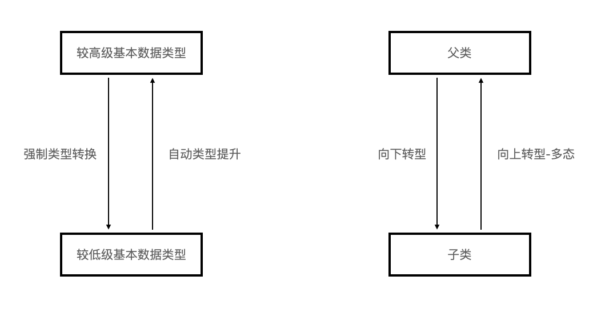

```java
// 1.若子类重写了父类方法,就意味着子类里定义的方法彻底覆盖了父类里的同名方法,系统将不可能把父类里的方法转移到子类中
// 2.对于实例变量则不存在这样的现象,即使子类里定义了与父类完全相同的实例变量,这个实例变量依然不可能覆盖父类中定义的实例变量
public class FieldMethodTest {
    public static void main(String[] args){
        Sub s= new Sub();
        System.out.println(s.count); // 20
        s.display(); // 20
        Base b = s;
        // ==:对于引用数据类型来讲比较的是两个引用数据类型变量的地址值是否一样
        System.out.println(b == s);    // true
        System.out.println(b.count); // 10
        b.display(); // 20
    }
}
class Base {
    int count= 10;
    public void display() {
        System.out.println(this.count);
    }
}
class Sub extends Base {
    int count= 20;
    public void display() {
        System.out.println(this.count);
    }
}
```

#### Object 类

Object 类是所有 Java 类的根父类。如果在类的声明中未使用 extends 关键字指明其父类，则默认父类为 java.lang.Object 类。Object 类中的功能、属性、方法就具有通用性。值得注意的是 Object 类只声明了一个空参的构造器。

```java
equals() / toString() / getClass() / hashCode() / clone() / finalize()
wait()、notify()、notifyAll()
```

#### == 操作符与 equals 方法

== 运算符

* 可以使用在基本数据类型变量和引用数据类型变量中
* 都是基本数据类型变量就是比较两个变量保存的数据是否相等，类型不一定要相同。
* 引用数据类型就是比较两个对象的地址值是否相同，即引用是否指向同一对象实体。
* == 符号使用时，必须保证符号左右两边的变量类型一致。

equals 方法

* equals 是一个方法，而非运算符，只能适用于引用数据类型。

* Object 类中定义的 `equals()` 和 == 的作用是相同的，比较两个对象的地址值是否相同，即两个引用是否指向同一个对象实体。
  
  ```java
  public boolean equals(Object obj){
    return (this == obj);
  }
  ```

* String、Date、File、包装类等都重写了 Object 类中的 `equals()` 方法。不再是比较两个引用的地址是否相同，而是比较两个对象的 “实体内容” 是否相同，也是重写的原则。

```java
package com.polymorphism.basis;

import java.sql.Date;

public class EqualsTest {
    public static void main(String[] args) {

//        基本数据类型
        int i = 10;
        int j = 10;
        double d = 10.0;
        System.out.println(i == j);    // true
        System.out.println(i == d); // true

//        boolean b =true;
//        System.out.println(i == b);

        char c = 10;
        System.out.println(i == c); //true

        char c1 = 'A';
        char c2 = 65;
        System.out.println(c1 == c2); //true

        //引用数据类型
        Person cust1 = new Person("Tom" ,21);
        Person cust2 = new Person("Tom" ,21);
        System.out.println(cust1 == cust2); // false

        String str1 = new String("BAT");
        String str2 = new String("BAT");
        System.out.println(str1 == str2); // false
        System.out.println("*************************");
        System.out.println(cust1.equals(cust2)); // false
        System.out.println(str1.equals(str2)); // true

        Date date1 = new Date(23432525324L);
        Date date2 = new Date(23432525324L);
        System.out.println(date1.equals(date2)); // true
    }
}
```

##### 重写 equals 方法的原则

* 对称性：若 `x.equals(y)` 返回 true，那么 `y.equals(x)` 也应返回 true。
* 自反性：`x.equals(x)` 必须返回 true。
* 传递性：如果 `x.equals(y)` 返回是 true，且 `y.equals(z)` 返回是 true，那么 `z.equals(x)` 也应该返回是 true。
* 一致性：如果 `x.equals(y)` 返回是 true，只要 x 和 y 内容一直不变，不管重复 `x.equals(y)` 多少次，返回都是 true。
* 任何情况下，`x.equals(null)`，永远返回是 false；`x.equals(和x不同类型的对象)` 永远返回是 false。

```java
    int it = 65;
    float fl= 65.0f;
    System.out.println("65和65.0f是否相等？" + (it == fl)); //true
    char ch1 = 'A'; 
    char ch2 = 12;
    System.out.println("65和'A'是否相等？" + (it == ch1)); // true
    System.out.println("12和ch2是否相等？" + (12 == ch2)); // true 
    String str1 = new String("hello");
    String str2 = new String("hello");
    System.out.println("str1和str2是否相等？"+ (str1 == str2)); // false
    System.out.println("str1是否equals str2？"+(str1.equals(str2))); // true
    System.out.println("hello" == new java.util.Date()); // 编译不通过
```

```java
public class OrderTest {
    public static void main(String[] args) {
        Order order1 = new Order(1001,"AA");
        Order order2 = new Order(1001,"BB");    
        System.out.println(order1.equals(order2));    // false
        Order order3 = new Order(1001,"BB");
        System.out.println(order2.equals(order3)); // true
    }
}

class Order{
    private int orderId;
    private String orderName;
    public int getOrderId() {
        return orderId;
    }
    public void setOrderId(int orderId) {
        this.orderId = orderId;
    }
    public String getOrderName() {
        return orderName;
    }
    public void setOrderName(String orderName) {
        this.orderName = orderName;
    }
    public Order(int orderId, String orderName) {
        super();
        this.orderId = orderId;
        this.orderName = orderName;
    }
    public boolean equals(Object obj){
        if(this == obj){            
            return true;
        }
        if(obj instanceof Order){
            Order order = (Order)obj;
//            正确的
//            最后判断类的所有属性是否相等,其中String类型和Object类型可以用相应的equals()来判断
            return this.orderId == order.orderId && this.orderName.equals(order.orderName);
//            错误的
//            return this.orderId == order.orderId && this.orderName == order.orderName;
        }
        return false;
    }
}
```

#### toString

当输出一个引用对象时，实际上就是调用当前对象的 `toString()`。像 String、Date、File、包装类等都重写了 Object 类中的 `toString()` 方法。使得在调用 `toString()` 时，返回"实体内容"信息。自定义类如果重写 `toString()` 方法，当调用此方法时，返回对象的"实体内容"。

```java
public String toString() {
    return getClass().getName() + "@" + Integer.toHexString(hashCode());
}
```

```java
import java.util.Date;
public class ToStringTest {
    public static void main(String[] args) {
        Person cust1 = new Person("zs" ,21);
        System.out.println(cust1.toString()); // com.polymorphism.basis.Person@2a139a55
        System.out.println(cust1); // com.polymorphism.basis.Person@2a139a55 ---> Person[name = Tom,age = 21]
        String str = new String("MM");
        System.out.println(str); // MM
        Date date = new Date(45362348664963L);
        System.out.println(date.toString()); // Wed Jun 24 12:24:24 CST 3407

    }
}
```

#### 包装类 Wrapper

Java 提供了8种基本数据类型对应的包装类，使得基本数据类型的变量具有类的特征。对应 byte、short、int、long、float、double、boolean、char 分别为 Byte、Short、Integer、Long、Float、Double、Boolean、Character。其中 Byte、Short、Integer、Double 的父类是 Number。

##### 包装类与基本数据类型相互转换

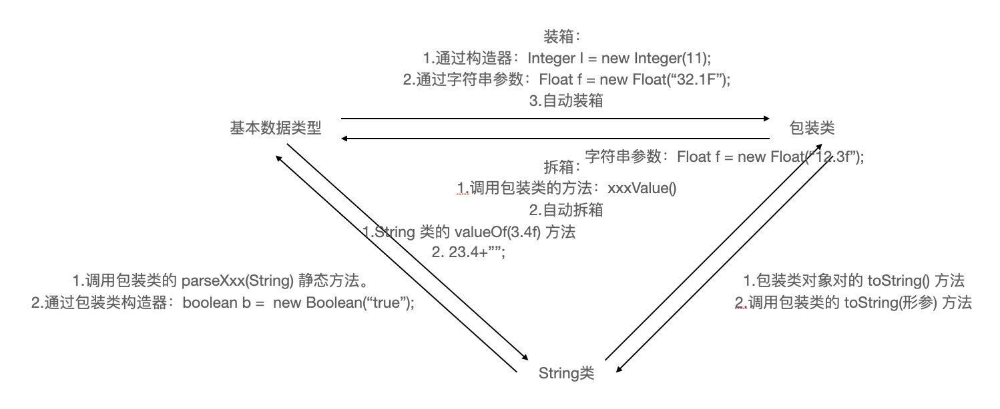

```java
import org.junit.Test;

public class WrapperTest {

//    String类型 -> 基本数据类型,调用包装类的parseXxx()
    @Test
    public void test5(){
        String str1 = "123";
        int num2 = Integer.parseInt(str1); 
        System.out.println(num2 + 1); // 124
        String str2 = "true";
        Boolean b1 = Boolean.parseBoolean(str2);
        System.out.println(b1);    // true
    }
//    基本数据类型、包装类 -> String类型,调用String重载的valueOf(Xxx xxx)
    @Test
    public void test4(){
        int num1 = 10;
        //方式1:连接运算
        String str1 = num1 + "";
        System.out.println(str1);
        //方式2:调用 String 的 valueOf(Xxx xxx)
        float f1 = 12.3f;
        String str2 = String.valueOf(f1); // "12.3"
        Double d1 = new Double(12.4);
        String str3 = String.valueOf(d1);
        System.out.println(str2); // "12.3"
        System.out.println(str3); // "12.4"
    }

    /*
     * JDK 5.0 新特性:自动装箱与自动拆箱
     */
    @Test
    public void test3(){
//        int num1 = 10;
//        //基本数据类型 --》 包装类的对象
//        method(num1); // Object obj = num1
//        自动装箱:基本数据类型 -> 包装类
        int num2 = 10;
        Integer in1 = num2; // 自动装箱

        boolean b1 = true;
        @SuppressWarnings("unused")
        Boolean b2 = b1; // 自动装箱
        //自动拆箱：包装类 --》 基本数据类型
        System.out.println(in1.toString()); // 10
        @SuppressWarnings("unused")
        int num3 = in1;
    }

    public void method(Object obj){
        System.out.println(obj);
    }

//    包装类 -> 基本数据类型:调用包装类的 xxxValue()
    @Test
    public void test2() {
        Integer in1 = new Integer(12);
        int i1 = in1.intValue();
        System.out.println(i1 + 1); // 13
        Float f1 = new Float(12.3f);
        float f2 = f1.floatValue();
        System.out.println(f2 + 1); // 13.3
    }

//    基本数据类型 -> 包装类,调用包装类的构造器
    @SuppressWarnings("unused")
    @Test
    public void test1() {
        int num1 = 10;
//        System.out.println(num1.toString());
        Integer in1 = new Integer(num1);
        System.out.println(in1.toString()); // 10
        Integer in2 = new Integer("123");
        System.out.println(in2.toString()); // 123
//        报异常
//        Integer in3 = new Integer("123abc");
//        System.out.println(in3.toString());
        Float f1 = new Float(12.3f);
        Float f2 = new Float("12.3");
        System.out.println(f1); // 12.3
        System.out.println(f2); // 12.3
        Boolean b1 = new Boolean(true);
        Boolean b2 = new Boolean("true");
        Boolean b3 = new Boolean("true123");
        System.out.println(b3); // false
        Oorder oorder = new Oorder();
        System.out.println(oorder.isMale); // false
        System.out.println(oorder.isFemale); // null
    }
}

class Oorder{
    boolean isMale;
    Boolean isFemale;
}
```

```java
import org.junit.Test;
/*
 * 如下两个题目输出结果相同吗？各是什么：
 *         Object o1= true? new Integer(1) : new Double(2.0);
 *         System.out.println(o1);//
 * 
 *         Object o2;
 *         if(true)
 *             o2 = new Integer(1);
 *        else 
 *            o2 = new Double(2.0);
 *        System.out.println(o2);//
 *
 */
public class InterViewTest {

    @Test
    public void test(){
        Object o1= true? new Integer(1) : new Double(2.0);
        System.out.println(o1);// 1.0
    }

    @Test
    public void test2(){
        Object o2;
        if(true)
            o2 = new Integer(1);
        else 
            o2 = new Double(2.0);
        System.out.println(o2);// 1
    }

    @Test
    public void method1() {
        Integer i = new Integer(1);
        Integer j = new Integer(1);
        System.out.println(i == j); //false

        //Integer内部定义了一个IntegerCache结构，IntegerCache中定义Integer[]
        //保存了从-128-127范围的整数。如果我们使用自动装箱的方式，给Integer赋值的范围在其中时，
        //可以直接使用数组中的元素，不用再去new了。目的，提高效率。

        Integer m = 1;
        Integer n = 1;
        System.out.println(m == n);//true

        Integer x = 128;//相当于new了一个Integer对象
        Integer y = 128;//相当于new了一个Integer对象
        System.out.println(x == y);//false

    }
}
```

#### 单元测试方法

选中当前项目工程，右键依次选择 build path、configure build path ...、Libraries、add Library、JUnit4，并创建一个 Java 类进行单元测试。此时的 Java 类要求该类是公共的，且此类提供一个公共的无参构造器。在此类中声明单元测试方法权限是 public，没有返回值与形参。需注意，此单元测试方法上需要声明注解 @Test，且需调用 import org.junit.Test;。在声明好单元测试方法以后，就可以在方法体内测试代码。左键双击单元测试方法名，再右键选择 run as 指向 JUnit Test。如果执行结果无错误，则显示是一个绿色进度条，反之错误即为红色进度条。

```java
import org.junit.Test;

public class JUnit {
    int num = 10;

    //第一个单元测试方法
    @Test
    public void testEquals(){
        String s1 = "MM";
        String s2 = "MM";
        System.out.println(s1.equals(s2));

        //ClassCastException的异常
//        Object obj = new String("GG");
//        Date date = (Date)obj;

        System.out.println(num);
        show();
    }

    public void show(){
        num = 20;
        System.out.println("show()...");
    }

    //第二个单元测试方法
    @Test
    public void testToString(){
        String s2 = "MM";
        System.out.println(s2.toString());
    }
}
```

### 关键字 static

当编写一个类时，其实就是在描述其对象的属性和行为，而并没有产生实质上的对象，只有通过 new 关键字才会产生出对象，这时系统才会分配内存空间给对象，其方法才可以供外部调用。<u>有时候希望无论是否产生了对象或无论产生了多少对象的情况下，某些特定的数据在内存空间里只有一份。</u>

例如所有的人都有个国家名称，部分人类都共享这个国别，不必在每一个人的实例对象中都单独分配一个用于代表国家名称的变量。

static 可以用来修饰属性、方法、代码块、内部类，不能修饰构造器。在使用 static 修饰属性后，类中的属性就有了静态属性和非静态属性（实例变量）的区别。实例变量从字面理解就是说每个实例对象都独立的拥有一套非静态属性。静态变量（**类变量**）会使所有的实例对象都公用一个静态属性，当修改一个静态变量时，所有的实例对象的此静态变量都会被改变。

静态变量随着类的加载而加载。可以通过"类.静态变量"的方式进行调用，所以静态变量的加载要早于对象的创建。由于类只会加载一次，则静态变量在内存中也只会存在一次。存在方法区的静态域中。

类中有类变量没有实例变量，对象中既有类变量，也有实例变量。类可以调用类变量；对象既可以调用类变量，也可以调用实例变量。

```java
System.out.Math.PI;
```

使用 static 修饰的方法也称静态方法，随着类的加载而加载。可通过 "类.静态方法" 而调用。在静态方法中，只能调用静态方法或属性，因为生命周期一致。非静态方法中既可以调用非静态的方法和属性，又可以调用静态的方法和属性。值得注意的是静态方法内不能使用 this 关键字和 super 关键字。

开发中操作静态属性的方法，通常设置为 static 的；工具类中的方法，习惯上声明为 static 的。比如：Math、Arrays、Collections ...

### 单例 Singleton 设计模式

设计模式是在大量的实践中总结和理论化之后优选的代码结构、编程风格、以及解决问题的思考方式。设计模免去我们自己再思考和摸索。就像是经典的棋谱，不同的棋局，我们用不同的棋谱。”套路”

所谓类的单例设计模式，就是采取一定的方法保证在整个的软件系统中，对**某个类只能存在一个对象实例**。并且该类只提供一个取得其对象实例的方法。如果我们要让类在一个虚拟机中只能产生一个对象，我们首先必须将类的**构造器的访问权限设置为 private**，这样，就不能用 new 操作符在类的外部产生类的对象了，但在类内部仍可以产生该类的对象。因为在类的外部开始还无法得到类的对象，**只能调用该类的某个静态方法以返回类内部创建的对象，静态方法只能访问类中的静态成员变量，所以，指向类内部产生的该类对象的变量也必须定义成静态的。**

由于单例模式只生成一个实例，**减少了系统性能开销**，当一个对象的产生需要比较多的资源时，如读取配置、产生其他依赖对象时，则可以通过在应用启动时直接产生一个单例对象，然后永久驻留内存的方式来解决。

```java
// 饿汉式
// 坏处是对象加载时间过长,好处是线程安全.
package com.designMode.basis;

public class SingletonTest {
    public static void main(String[] args) {    
        Hungry Hungry1 = Hungry.getInstance();
        Hungry Hungry2 = Hungry.getInstance();
        System.out.println(Hungry1 == Hungry2);
    }
}

// 单例的饿汉式
class Hungry{
    // 1.私有化类的构造器
    private Hungry(){
    }
    // 2.内部创见类的对象,且必须声明为静态
    private static Hungry instance = new Hungry();
    // 3.提供公共的静态的方法,返回类的对象
    public static Hungry getInstance(){
        return instance;
    }
}
```

```java
// 懒汉式
// 好处在于延迟对象的创建;目前为不安全写法,后续修改
package com.designMode.basis;

public class SingletonTest2 {
    public static void main(String[] args) {
        Sluggard Sluggard1 = Sluggard.getInstance();
        Sluggard Sluggard2 = Sluggard.getInstance();
        System.out.println(Sluggard1 == Sluggard2);
    }
}

class Sluggard{
    // 1.私有化类的构造器
    private Sluggard(){
    }
    // 2.声明当前类的未初始化静态对象
    private static Sluggard instance = null;
    // 3.声明 public、static 的返回当前类对象的方法
    public static Sluggard getInstance(){
        if(instance == null){
            instance = new Sluggard();            
        }
        return instance;
    }
}
```

单例模式的应用场景常见于便于同步的网站计数器、应用程序日志应用、数据库连接池、项目中读取配置文件的类、windows Task Manager & Mac Activity Monitor。

### main 方法的语法

由于 Java 虚拟机需要调用类的 `main()` 方法，所以该方法的访问权限必须是 public，又因为 Java 虚拟机在执行 `main()` 方法时不必创建对象，所以该方法必须是 static 的。又因静态的 `main()` 方法不能直接访问该类中的非静态成员，故必须创建该类的一个实例对象后才能通过这个对象去访问类中的非静态成员。接收一个 String 类型的数组参数，能使该数组保存执行 Java 命令时传递给所运行类的参数。

### 代码块

代码块是用来初始化类、对象的，若需要修饰代码块，只能使用 static，故又分为静态、非静态代码块。

静态代码块内部可以有输出语句，<u>随着类的加载而执行一次</u>，常用来初始化类的信息。若一个类中存在多个静态代码块，则按照声明顺序先后执行。在静态代码块中只能调用静态的属性、方法，不能调用非静态的结构。

非静态代码块内部也可以有输出语句，<u>随着对象的创建而执行</u>，但每创建一个对象就会执行一次非静态代码块，故更多用来对对象属性进行初始化。若一个类中存在多个非静态代码块，依旧按声明先后顺序执行。非静态代码块可调用静态、非静态的属性和方法。

```java
package com.designMode.basis;

// 总结:由父类到子类，静态先行
class Root{
    static{
        System.out.println("Root 的静态初始化块");
    }
    {
        System.out.println("Root 的普通初始化块");
    }
    public Root(){
        System.out.println("Root 的无参数的构造器");
    }
}
class Mid extends Root{
    static{
        System.out.println("Mid 的静态初始化块");
    }
    {
        System.out.println("Mid 的普通初始化块");
    }
    public Mid(){
        System.out.println("Mid 的无参数的构造器");
    }
    public Mid(String msg){
        //通过 this 调用同一类中重载的构造器
        this();
        System.out.println("Mid 的带参数构造器，其参数值："
            + msg);
    }
}
class Leaf extends Mid{
    static{
        System.out.println("Leaf 的静态初始化块");
    }
    {
        System.out.println("Leaf 的普通初始化块");
    }    
    public Leaf(){
        //通过 super 调用父类中有一个字符串参数的构造器
        super("anonymous flag");
        System.out.println("Leaf 的构造器");
    }
}
public class LeafTest{
    public static void main(String[] args){
        new Leaf();
        new Leaf();
    }
}
```

```java
package com.designMode.basis;

class Father {
    static {
        System.out.println("1");
    }
    {
        System.out.println("2");
    }
    public Father() {
        System.out.println("3");
    }
}

public class Son extends Father {
    static {
        System.out.println("4");
    }
    {
        System.out.println("5");
    }
    public Son() {
        System.out.println("6");
    }
    public static void main(String[] args) { // 由父及子 静态先行
        System.out.println("7");
        System.out.println("***");
        new Son();
        System.out.println("***");
        new Son();
        System.out.println("***");
        new Father();
//      147*2356*2356*23
    }
}
```

### 成员变量赋值的执行顺序

默认初始化 => 显式初始化 / 代码块中赋值 => 构造器中初始化 => "对象.属性|方法"的方式。

### 关键字 final

final 可以用来修饰类、方法、变量这三种结构。若 final 用来修饰一个类，则此类不能被其他类所继承，常见有 String 类、System 类、StringBuffer 类；若修饰一个方法，则被标记的方法不能被子类重写，见 Object 类的 `getClass()`；若修饰一个变量，则此时变量就是一个常量。

在 final 修饰属性时，常考虑的位置有显式初始化、代码快初始化、构造器初始化。在 final 修饰局部变量，尤其是形参的时候，表明此形参是一个常量，当调用此方法给形参赋一个实参后，就只能在方法体使用此形参，不能重新赋值。

```java
// final 修饰类,其中属性可以改变
public class Something {
    public static void main(String[] args) {
        Other o = new Other();
        new Something().addOne(o);
    }
    public void addOne(final Other o) {
        // o = new Other();
        o.i++;
    }
}
class Other {
    public int i;
}
// --- 分割线 ---
public class Something {
    public int addOne(final int x) {
//      错误
        return ++x; // return x + 1;
    }
}
```

### 抽象类与抽象方法

随着继承层次中一个个新子类的定义，类变得越来越具体，而父类则更一般，更通用。类的设计应该保证父类和子类能够共享特征。有时将一个父类设计得非常抽象，<u>以至于没有具体的实例</u>，这样的类叫做**抽象类**。在航运公司 Vehicle 类定义两个方法分别计算运输工具的燃料效率和行驶距离，那么应在 Truck 和 RiverBarge 中对应不用的计算方法。

抽象 abstract 关键字可以用来修饰类、方法。被 abstract 修饰的类称为抽象类，此类不能实例化；抽象类中一定有构造器，便于子类实例化时调用。被修饰的方法即为抽象方法，此方法只有方法声明，没有方法体。包含抽象方法的类一定是抽象类，但抽象类中可以没有抽象方法。若子类继承抽象类，并重写了所有的抽象方法，则此类是一个"实体类"。

abstract 不能用来修饰变量、代码块、构造器，也不能用来修饰私有方法、静态方法、final 的方法、final 的类。

```java
package com.designMode.basis;

public class PersonTest {
    public static void main(String[] args) {

        method(new Student()); // 匿名对象

        Worker worker = new Worker(); 
        method1(worker); // 非匿名的类非匿名的对象

        method1(new Worker()); // 非匿名的类匿名的对象

//        创建了一个匿名子类的对象:p
        Person p = new Person(){
            @Override
            public void eat() {
                System.out.println("吃东西");
            }
            @Override
            public void breath() {
                System.out.println("呼吸空气");
            }
        };
        method1(p);

//        创建匿名子类的匿名对象
        method1(new Person(){

            @Override
            public void eat() {
                System.out.println("吃零食");
            }

            @Override
            public void breath() {
                System.out.println("云南的空气");
            }
        });
    }

    public static void method1(Person p){
        p.eat();
        p.walk();
    }

    public static void method(Student s){

    }
}

abstract class Creature{
    public abstract void breath();
}

abstract class Person extends Creature{
    String name;
    int age;

    public Person(){

    }

    public Person(String name,int age){
        this.name = name;
        this.age = age;
    }

    //不是抽象方法
//    public void eat(){
//        System.out.println("人吃饭");
//    }

    //抽象方法
    public abstract void eat();

    public void walk(){
        System.out.println("人走路");
    }
}

class Student extends Person{
    public Student(String name,int age){
        super(name,age);
    }
    public Student(){

    }
    public void eat(){
        System.out.println("学生应该多吃有营养的。");
    }
    @Override
    public void breath() {
        System.out.println("学生应该呼吸新鲜的无雾霾空气");
    }
}

class Worker extends Person{
    @Override
    public void eat() {
    }
    @Override
    public void breath() {
    }
}
```

### 多态应用 TemplateMethod 模板方法设计模式

抽象类体现的就是一种模板模式的设计，抽象类作为多个子类的通用模板，子类在抽象类的基础上进行扩展、改造，但子类总体上会保留抽象类的行为方式。

当功能内部一部分实现是确定的，一部分实现是不确定的。这时可以把不确定的部分暴露出去，让子类去实现。换句话说，**在软件开发中实现一个算法时，整体步骤很固定、通用，这些步骤已经在父类中写好了。但是某些部分易变，易变部分可以抽象出来，供不同子类实现。这就是一种模板模式。**

```java
package com.designMode.basis;

/*
 * 抽象类的应用:模板方法的设计模式
 */
public class TemplateTest {
    public static void main(String[] args) {
        SubTemlate t = new SubTemlate();
        t.sendTime();
    }
}
abstract class Template{
    //计算某段代码执行所需花费的时间
    public void sendTime(){
        long start = System.currentTimeMillis();
        code();    // 不确定易变的部分
        long end = System.currentTimeMillis();
        System.out.println("花费的时间为:" + (end - start));
    }
    public abstract void code();
}

class SubTemlate extends Template{
    @Override
    public void code() {
        for(int i = 2;i <= 1000;i++){
            boolean isFlag = true;
            for(int j = 2;j <= Math.sqrt(i);j++){
                if(i % j == 0){
                    isFlag = false;
                    break;
                }
            }
            if(isFlag){
                System.out.println(i);
            }
        }
    }
}
```

### 接口 interface

有时必须从几个类中派生出一个子类，继承它们所有的属性和方法。但是 Java 不支持多重继承。需使用接口得到多重继承的效果。另一方面，有时必须从几个类中抽取出一些共同的行为特征，而其之间又没有 is-a 的关系，仅仅是具有相同行为特征而已。就像鼠标、键盘、打印机、扫描仪、充电器、MP3 机、手机、数码相机、移动硬盘等都支持 USB 连接。

**继承是一个"是不是"的关系；而接口实现则是"能不能"的关系，本质是契约、标准、规范。**

接口 interface 是抽象方法和常量值定义的集合。其特点有用 interface 来定义；接口中的所有成员变量都默认是由 public static final 修饰的；其中的所有抽象方法都默认是由 public abstract 修饰的；接口中没有构造器；采用多继承机制。

接口和类是并列的两个结构。定义接口主要是定义接口中的成员，在 JDK7 及以前只能定义全局常量 public static final 和抽象方法 public abstract；JDK8 后，除了全局常量和抽象方法之外，还可以定义静态方法、默认方法。主要注意的是，接口中不能定义构造器，这也意味着接口不能实例化。

接口通过让类去实现 implements 的方式来使用。如果实现类覆盖了接口中的所有方法，则此实现类就可以实例化。如果实现类没有覆盖接口中所有的抽象方法，则此实现类仍为一个抽象类。

Java 类可以实现多个接口，这意味着弥补了 Java 单继承性的局限性。接口与接口之间是继承，而且可以多继承。接口的具体使用，体现多态性。主要用途就是被实现类实现。

```java
class AA extends BB implementd CC,DD,EE...
```

```java
package com.designMode.basis;

/*
 * 接口的使用
 */
public class USBTest {
    public static void main(String[] args) {

        Computer com = new Computer();
        //1. 创建了接口的非匿名实现类的非匿名对象
        Flash flash = new Flash();
        com.transferData(flash); 
        //2. 创建了接口的非匿名实现类的匿名对象
        com.transferData(new Printer());
        //3. 创建了接口的匿名实现类的非匿名对象
        USB phone = new USB(){
            @Override
            public void start() {
                System.out.println("手机开始工作");
            }
            @Override
            public void stop() {
                System.out.println("手机结束工作");
            }            
        };
        com.transferData(phone);
        //4. 创建了接口的匿名实现类的匿名对象
        com.transferData(new USB(){
            @Override
            public void start() {
                System.out.println("mp3 开始工作");
            }
            @Override
            public void stop() {
                System.out.println("mp3 结束工作");
            }
        });
    }
}

class Computer{
    public void transferData(USB usb){//USB usb = new Flash();
        usb.start();
        System.out.println("具体传输数据的细节");
        usb.stop();
    }

}

interface USB{
    //常量:定义了长、宽
    void start();
    void stop();
}

class Flash implements USB{
    @Override
    public void start() {
        System.out.println("U 盘开始工作");
    }
    @Override
    public void stop() {
        System.out.println("U 盘结束工作");
    }
}
class Printer implements USB{
    @Override
    public void start() {
        System.out.println("打印机开启工作");
    }
    @Override
    public void stop() {
        System.out.println("打印机结束工作");
    }
}
```

### 常用类

#### 字符串相关类

Java 中的所有字符串字面值都作为此类的实例实现，String 是一个不可继承的 final 类，代表不不可变的字符序列。字符串为常量，用双引号包裹，创建后不能被更改。String 对象的字符内容是存储在一个字符数组 value[] 中的。

```java
public final class String
  implements java.io.Serializable, Comparable<String>, CharSequence {}...
  private final char value[];
  private int hash; // Default to 0
```

通过字面量的方式（区别于 new）给一个字符串复制，此时的字符串值声明在方法区里字符串常量池中。常量池不会存储两个相同内容的字符串，即有则复用。

关于 String 的两种实例化方式字面量和 new 与构造器，字符串常量存储在字符串常量池目的在于共享，而字符串非常量对象存储在堆中。

```java
public class StringTest {
    public static void test1(){
//    方法区里 0x1212 是 abc
        String s1 = "abc"; // 栈中s1:0x1212
        String s2 = "abc"; // 栈中s2:0x1212
        System.out.println(s1 == s2); // 比较两者地址值 => true
//    String:代表不可变的字符序列,简称:不可变性
//        1.当对字符串重新赋值时,需要重写指定内存区域赋值,不能使用原有的value进行赋值
//        2.当对现有的字符串进行连接操作时,也需要重新指定内存区域赋值,不能使用原有的value进行赋值
//        3.当调用String的replace()方法修改指定字符或字符串时,也需要重新指定内存区域赋值,不能使用原有的value进行赋值
        s1 = "aaa";
        System.out.println("s1: " + s1 + ";" + " s2: " + s2); // s1: aaa; s2: abc
        String s3 = "abc";
        s3 += "def";
        System.out.println("s2: " + s2 + ";" + " s3: " + s3); // s2: abc; s3: abcdef
        String s4 = "abc";
        String s5 = s4.replace('a','A');
        System.out.println("s4: " + s4 + ";" + " s5: " + s5); // s4: abc; s5: Abc

        String s6 = new String("javaEE");
        String s7 = new String("javaEE");
        System.out.println(s6 == s7); // false

//      p1和p2在堆中地址不同,但其中的name属性值指向的是方法区同一位置,只因都是实例化赋值
        Person p1 = new Person("Tom",12);
        Person p2 = new Person("Tom",12);

        System.out.println(p1.name.equals(p2.name)); // true
        System.out.println(p1.name == p2.name); // true
        System.out.println(p1 == p2); // false
    }

    public static void test2(){
        String s1 = "javaEE";
        String s2 = "hadoop";
        String s3 = "javaEEhadoop";
        String s4 = "javaEE" + "hadoop";
        String s5 = s1 + "hadoop";
        String s6 = "javaEE" + s2;
        String s7 = s1 + s2;

        System.out.println(s3 == s4); // true
        System.out.println(s3 == s5); // false
        System.out.println(s3 == s6); // false
        System.out.println(s5 == s6); // false
        System.out.println(s3 == s7); // false
        System.out.println(s5 == s6); // false
        System.out.println(s5 == s7); // false
        System.out.println(s6 == s7); // false

        String s8 = s5.intern(); // 返回值得到的s8使用的常量值中已经存在的“javaEEhadoop”
        System.out.println(s3 == s8); // true
    }
    public static void main(String[] args) {
        test1();
        test2();
    }
}
class Person {
    String name;
    int age;
    public Person(String name, int age) {
        this.name = name;
        this.age = age;
    }
    public Person() {
    }
}
```

`String s = new String("xxx")` 在内存中创建了两个对象，一个是对空间中 new 结构，另一个是 char[] 对应的常量池的数据。

若右边赋值有其他变量名参与，不是直接字面量参与，此时都不是在常量池，需要在堆空间开辟，可以看作都是 new 出新的空间。

```java
public class StringTest1 {
    String str = new String("good");
    char[] ch = { 't', 'e', 's', 't' };

    public void change(String str, char ch[]) {
        str = "test ok";
        ch[0] = 'b';
    }
    public static void main(String[] args) {
        StringTest1 ex = new StringTest1();
        ex.change(ex.str, ex.ch);
        System.out.println(ex.str); // good
        System.out.println(ex.ch); // best
    }
}
```

### 枚举与注解

当需要定义一组常量时建议使用枚举类。在 JDK1.5 之前需要自定义枚举类，JDK 1.5 新增的 enum 关键字可以用于定义枚举类。枚举类的对象是有限个，确定的。若枚举只有一个对象, 则可以作为一种单例模式的实现方式。

#### 自定义枚举类

枚举类对象的属性不应允许被改动, 所以应该使用 private final 修饰。其次枚举类的使用 private final 修饰的属性应该在构造器中为其赋值。若枚举类显式的定义带参数的构造器, 则在列出枚举值时也必须对应的传入参数。

```java
/**
 * 枚举类
 */
public class SeasonTest {
    public static void main(String[] args) {
        Season spring = Season.SPRING;
        System.out.println(spring);
        System.out.println(Season.SUMMER);
    }
}
// 自定义枚举类
class Season{
    // 声明Season对象的属性 => private final
    private final String seasonName;
    private final String seasonDesc;

    // 私有化类的构造器并给对象属性赋值
    private Season(String seasonName,String seasonDesc){
        this.seasonName = seasonName;
        this.seasonDesc = seasonDesc;
    }

    // 提供当前枚举类的多个对象
    public static final Season SPRING = new Season("春","a");
    public static final Season SUMMER = new Season("夏","b");
    public static final Season AUTUMN = new Season("秋","c");
    public static final Season WINTER = new Season("冬","d");

    // 其他诉求 => 获取枚举类对象的属性
    public String getSeasonName() {
        return seasonName;
    }

    public String getSeasonDesc() {
        return seasonDesc;
    }

    // 其他诉求 => 提供toString()
    @Override
    public String toString() {
        return "Season{" +
                "seasonName='" + seasonName + '\'' +
                ", seasonDesc='" + seasonDesc + '\'' +
                '}';
    }
}
```

#### 使用enum关键字

使用 enum 定义的枚举类默认继承了 java.lang.Enum 类，因此不能再继承其他类。枚举类的构造器只能使用 private 权限修饰符。枚举类的所有实例必须在枚举类中显式列出，以 "," 分割，";" 结束。列出的实例系统会自动添加 public static final 修饰。最后，必须在枚举类的第一行声明枚举类对象。在 JDK 1.5 中可以在 switch 表达式中使用 Enum 定义的枚举类的对象作为表达式, case 子句可以直接使用枚举值的名字, 无需添加枚举类作为限定。

```java
/**
 * 枚举类
 */
public class SeasonTest {
    public static void main(String[] args) {
        Season spring = Season.SPRING;
        System.out.println(spring);
        System.out.println(Season.SUMMER);
    }
}
// 自定义枚举类
class Season{
    // 声明Season对象的属性 => private final
    private final String seasonName;
    private final String seasonDesc;

    // 私有化类的构造器并给对象属性赋值
    private Season(String seasonName,String seasonDesc){
        this.seasonName = seasonName;
        this.seasonDesc = seasonDesc;
    }

    // 提供当前枚举类的多个对象
    public static final Season SPRING = new Season("春","a");
    public static final Season SUMMER = new Season("夏","b");
    public static final Season AUTUMN = new Season("秋","c");
    public static final Season WINTER = new Season("冬","d");

    // 其他诉求 => 获取枚举类对象的属性
    public String getSeasonName() {
        return seasonName;
    }

    public String getSeasonDesc() {
        return seasonDesc;
    }

    // 其他诉求 => 提供toString()
    @Override
    public String toString() {
        return "Season{" +
                "seasonName='" + seasonName + '\'' +
                ", seasonDesc='" + seasonDesc + '\'' +
                '}';
    }
}
```

#### Enum类中的常用方法

| 方法                | 说明                                                                                                |
|---------------------|-----------------------------------------------------------------------------------------------------|
| values()            | 返回枚举类型的对象数组 => 遍历所有的枚举值                                                          |
| valueOf(String str) | 把一个字符串转为对应的枚举类对象；要求字符串必须是枚举类对象的“名字”，否则 IllegalArgumentException |
| toString()          | 返回当前枚举类对象常量的名称                                                                        |

```java
// == 常用方法 ==
        // values() => 返回所有的枚举类对象构成的数组
        EnumSeason[] values = EnumSeason.values();
        for(int i = 0;i < values.length;i++){
            System.out.println(values[i]);
        }
        System.out.println("****************************");
        Thread.State[] values1 = Thread.State.values();
        for(int i = 0;i < values1.length;i++){
            System.out.println(values1[i]);
        }

        // valueOf(String objName) => 返回枚举类中对象名是objName的对象
        EnumSeason winter = EnumSeason.valueOf("WINTER");
        // 如果没有objName的枚举类对象则抛异常 => IllegalArgumentException
//        EnumSeason winter = EnumSeason.valueOf("WINTER1");
        System.out.println(winter);
```

#### 注解的理解

从 JDK 5.0 开始, Java 增加了对元数据 MetaData 的支持, 也就是注解 Annotation。注解其实就是代码里的特殊标记, 这些标记可以在编译, 类加载, 运行时被读取, 并执行相应的处理。通过使用 Annotation, 开发者可以在不改变原有逻辑的情况下, 在源文件中嵌入一些补充信息。代码分析工具、开发工具和部署工具可以通过这些补充信息进行验证或者进行部署。Annotation 可以像修饰符一样被使用, 常见于修饰包、类、构造器、方法、成员变量、参数、局部变量的声明，这些信息被保存在 Annotation 的 "name=value" 对中。

在 JavaSE 注解的使用目的比较简单，常见于标记过时的功能，忽略警告等。在 JavaEE/Android 中注解占据更重要的角色，可用来配置应用程序的任何切面，代替 JavaEE 旧版中所遗留的繁冗代码和 XML 配置等。未来的开发模式都是基于注解的，JPA 是基于注解的，Spring2.5 以上都是基于注解的，Hibernate3.x 以后也是基于注解的，现在的 Struts2 有一部分也是基于注解的了，注解是一种趋势，一定程度上可以说框架等于注解、反射加上设计模式。

#### Annotation的使用示例

使用 Annotation 时要在其前面增加 @ 符号, 并把该 Annotation 当成一个修饰符使用。用于修饰所支持的程序元素。

<u>在生成文档相关的注解时</u>，@author 标明开发该类模块的作者，多个作者之间使用 "," 分割；@version 标明该类模块的版本；@see 参考转向相关主题；@since 从历史版本开始增加；@param 对方法中某参数的说明，无参可略；@return 对方法返回值的说明，void 可略；@exception 对方法可能抛出的异常进行说明，没有用 throws 显式抛出的异常就省略。

<u>在编译时进行格式检查时</u>，@Override 限定重写父类方法, 只能用于方法；@Deprecated 表示所修饰的元素、类、方法等已过时；@SuppressWarnings 抑制编译器警告。

<u>跟踪代码依赖性，实现替代配置文件功能时</u>，Servlet3.0 提供注解，使得不再需要在 web.xml 文件中进行 Servlet 的部署；spring 框架中关于“事务”的管理。

```java
@SuppressWarnings({ "unused", "rawtypes" })
```

#### 自定义注解

定义新的 Annotation 类型使用 **@interface** 关键字。自定义注解自动继承 **java.lang.annotation.Annotation** 接口。注解的成员变量在 Annotation 定义中以无参数方法的形式来声明。其方法名和返回值定义了该成员的名字和类型，称为配置参数。类型只能是八种基本数据类型、String 类型、Class 类型、enum 类型、Annotation 类型、上述类型的数组。可以在定义 Annotation 的成员变量时为其指定初始值，指定成员变量的初始值可使用 **default** 关键字。如果只有一个参数成员，建议使用参数名为 value。如果定义的注解含有配置参数，那么使用时必须指定参数值，除非有默认值，格式是 "参数名=参数值"。如果只有一个参数成员，且名称为value，那么可以省略 "value="。没有成员定义的 Annotation 称为标记，包含成员变量的 Annotation 称为元数据 Annotation。自定义注解必须配上注解的信息处理流程才有意义。

```java
public @interface MyAnnotation {
    String value();
}
// @MyAnnotation(value = "hello")
```

#### 基本的元注解的使用

JDK 的元 Annotation 用于修饰其他 Annotation 定义。JDK5.0 提供了4个标准的 meta-annotation 类型分别是 Retention、Target、Documented、Inherited。

@Retention 只能用于修饰一个 Annotation 定义, 用于指定该 Annotation 的生命周期，其包含一个 RetentionPolicy 类型的成员变量, 使用 @Rentention 时必须为该 value 成员变量指定值。

| 指定值                  | 说明                                                                                   |
|-------------------------|----------------------------------------------------------------------------------------|
| RetentionPolicy.SOURCE  | 在源文件中有效（即源文件保留），编译器直接丢弃这种策略的注释。                         |
| RetentionPolicy.CLASS   | 在 class 文件中有效（即 class 保留），当运行 Java 程序时, JVM 不会保留注解。           |
| RetentionPolicy.RUNTIME | 运行时有效（即运行时保留），当运行 Java 程序时, JVM 会保留注释。可通过反射获取该注释。 |

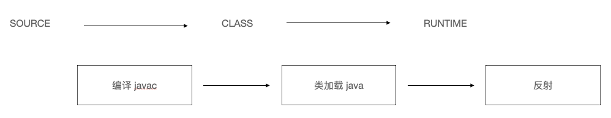

@Target 用于指定被修饰的 Annotation 能用于修饰哪些程序元素，其也包含一个名为 value 的成员变量。

| 取值           | 说明                    |
|----------------|-------------------------|
| CONSTRUCTOR    | 描述构造器              |
| FIELD          | 描述域                  |
| LOCAL VARIABLE | 描述局部变量            |
| METHOD         | 描述方法                |
| PACKAGE        | 描述包                  |
| PARAMETER      | 描述参数                |
| TYPE           | 描述类、接口、enum 声明 |

@Documented 用于指定被该元 Annotation 修饰的 Annotation 类将被 javadoc 工具提取成文档。默认情况下，javadoc 是不包括注解的。定义为 Documented 的注解必须设置 Retention 值为 RUNTIME。

@Inherited 被它修饰的 Annotation 将具有继承性。若某个类使用了被 @Inherited 修饰的 Annotation, 则其子类将自动具有该注解。实际应用中使用较少。

#### 利用反射获取注解信息

JDK 5.0 在 java.lang.reflect 包下新增了 AnnotatedElement 接口，该接口代表程序中可以接受注解的程序元素。当一个 Annotation 类型被定义为运行时 Annotation 后，该注解才是运行时可见，当 class 文件被载入时保存在 class 文件中的 Annotation 才会被虚拟机读取
程序可以调用 AnnotatedElement 对象的如下方法来访问 Annotation 信息。

#### jdk8可重复注解与类型注解

Java 8 对注解处理提供了两点改进，可重复的注解以及可用于类型的注解。此外反射也得到了加强，在 Java8 中能够得到方法参数的名称，简化标注在方法参数上的注解。

总结实现重复注解步骤。首先在 MyAnotation 上声明 @Repeatable，成员值为 MyAnnotations.class。其次保证 MyAnnotation 和 MyAnnotations 的生命周期与修饰结构一致。最后即可在需要重复注解处使用即可。

```java
import java.lang.annotation.Retention;
import java.lang.annotation.RetentionPolicy;
import java.lang.annotation.Target;
import static java.lang.annotation.ElementType.*;

@Retention(RetentionPolicy.RUNTIME)
@Target({TYPE, FIELD, METHOD, PARAMETER, CONSTRUCTOR, LOCAL_VARIABLE})
// java8 前用法
public @interface MyAnnotations {
    MyAnnotation[] value();
}
```

```java
import java.lang.annotation.*;
import static java.lang.annotation.ElementType.*;

// 在需要重复注解的注解上增加 @Repeatable(xxxs.class)
@Repeatable(MyAnnotations.class)
// xxx和xxxs生命周期必须一致
@Retention(RetentionPolicy.RUNTIME)
// xxx和xxxs可修饰结构必须一致
@Target({TYPE, FIELD, METHOD, PARAMETER, CONSTRUCTOR, LOCAL_VARIABLE,TYPE_PARAMETER,TYPE_USE})
public @interface MyAnnotation {

    String value() default "hello";

}
```

```java
public class AnnotationTest {
    public static void main(String[] args) {
    }
}
// java8之后
@MyAnnotation(value = "hi")
@MyAnnotation(value = "abc")

// java8之前
//@MyAnnotations({@MyAnnotation(value = "hi"),@MyAnnotation(value = "abc")})
class Person{

}
```

JDK1.8 之后，元注解 @Target 的参数类型 ElementType 枚举值多出 TYPE_PARAMETER、TYPE_USE。此前注解只能是在声明的地方所使用，Java8 开始，注解可以应用在任何地方。ElementType.TYPE_PARAMETER 表示该注解能写在类型变量的声明语句中（如泛型声明）。ElementType.TYPE_USE 能写在使用类型的任何语句中。

```java
...
// 相当于注解可修饰泛型的类型
class Generic<@MyAnnotation T>{ // TYPE_PARAMETER
    public void show() throws @MyAnnotation RuntimeException{ // 修饰异常情况信息 => TYPE_USE
        ArrayList<@MyAnnotation String> list = new ArrayList<>();
        // 修饰强转的类型 => TYPE_USE
        int num = (@MyAnnotation int) 10L;
    }
}
...
```

### 集合

集合、数组都是对多个数据进行存储操作的结构，简称 Java 容器。此时的存储主要是指内存层面的存储，不涉及到持久化的存储。

数组在存储数据时，<u>长度</u>以及<u>数据类型</u>在初始化完成就会确定，对提供的增删改插操作方法非常有限，同时由于底层存在操作后移动元素的问题，效率不高。

Java 集合可分为 `Collection` 和 `Map` 两种体系。

* `Collection` 接口：单列数据，定义了存取一组对象的方法的集合。
  * `List`：元素有序、可重复的集合。ArrayList、LinkedList、Vector。
  * `Set`：元素无序、不可重复的集合。HashSet、LinkedHashSet、TreeSet。
* `Map` 接口：双列数据，保存具有映射关系 "key-value 对" 的集合。HashMap、LinkedHashMap、TreeMap、Hashtable、Properties。

#### Collection 接口

Collection 接口是 List、Set 和 Queue 接口的父接口，其内定义的方法既可用于操作 Set 集合，也可用于操作 List、Queue 集合。JDK 不提供此接口的任何直接实现，而是提供更具体的子接口 Set 和 List 实现。在 Java5 之前，Java 集合会丢失容器中所有对象的数据类型，把所有对象都当成 Object 类型处理；从 JDK 5.0 增加**泛型**以后，集合才可以记住容器中对象的数据类型。

```java
import org.junit.Test;
import java.util.*;

/**
 * Collection接口中的方法的使用
 */
public class CollectionTest {

    @Test
    public void test1(){
        Collection coll = new ArrayList();

        // add(Object e) => 将元素e添加到集合coll中
        coll.add("AA");
        coll.add("BB");
        coll.add(123);  // 自动装箱
        coll.add(new Date());

        // size() => 获取添加的元素的个数
        System.out.println(coll.size()); // 4

        // addAll(Collection coll1) => 将coll1集合中的元素添加到当前的集合中
        Collection coll1 = new ArrayList();
        coll1.add(456);
        coll1.add("CC");
        coll.addAll(coll1);

        System.out.println(coll.size()); // 6
        System.out.println(coll); // [AA, BB, 123, Sat Apr 02 18:45:59 CST 2019, 456, CC]

        //clear() => 清空集合元素
        coll.clear();

        //isEmpty() => 判断当前集合是否为空
        System.out.println(coll.isEmpty()); // true

        coll.add(new Person("zs",21));
        coll.add(new String("Tom"));
        coll.add(false);

        // contains(Object obj) => 判断当前集合中是否包含obj
        boolean contains = coll.contains(123);
        System.out.println(contains); // false
        System.out.println(coll.contains(new String("Tam"))); // false
        // 在判断时会调用obj对象所在类的equals()
        System.out.println(coll.contains(new Person("zs",21))); // 未重写false => 重写后true

        // containsAll(Collection coll1) => 判断形参coll2中的所有元素是否都存在于当前集合中
        Collection coll2 = Arrays.asList("CC",456);
        System.out.println(coll1.containsAll(coll2)); // true

        // hashCode() => 返回当前对象的哈希值
        System.out.println(coll.hashCode()); // 119682751

        // 集合 --->数组 => toArray()
        Object[] arr = coll.toArray();
        for(int i = 0;i < arr.length;i++){
            System.out.println(arr[i]);
        }

        // 数组 --->集合 => 调用Arrays类的静态方法asList()
        List<String> list = Arrays.asList(new String[]{"AA", "BB", "CC"});
        System.out.println(list); // [AA, BB, CC]

        List arr1 = Arrays.asList(123, 456);
        System.out.println(arr1); // [123, 456]

        // 这里视作放入一个数组
        List arr2 = Arrays.asList(new int[]{123, 456});
        System.out.println(arr2.size()); // 1

        List arr3 = Arrays.asList(new Integer[]{123, 456});
        System.out.println(arr3.size()); // 2
    }
}
```

```java
import java.util.Objects;

public class Person {
    private String name;
    private int age;

    public Person() {
        super();
    }

    public Person(String name, int age) {
        this.name = name;
        this.age = age;
    }

    public String getName() {
        return name;
    }

    public void setName(String name) {
        this.name = name;
    }

    public int getAge() {
        return age;
    }

    public void setAge(int age) {
        this.age = age;
    }

    @Override
    public boolean equals(Object o) {
        if (this == o) return true;
        if (o == null || getClass() != o.getClass()) return false;
        Person person = (Person) o;
        return age == person.age && Objects.equals(name, person.name);
    }

    @Override
    public int hashCode() {
        return Objects.hash(name, age);
    }
}
```

#### Iterator 迭代器接口

设计模式的一种 Iterator 对象称为迭代器，<u>主要用于遍历 Collection 集合中的元素</u>。GOF 给迭代器模式的定义为，<u>提供一种方法访问一个容器 container 对象中各个元素，而又不需暴露该对象的内部细节</u>。**迭代器模式，就是为容器而生**。

Collection 接口继承了 java.lang.Iterable 接口，该接口有一个 `iterator()` 方法，那么所有实现了 Collection 接口的集合类都有一个 `iterator()` 方法，用以返回一个实现 Iterator 接口的对象。

**Iterator 仅用于遍历集合**，其本身并不提供承装对象的能力。如果需要创建 Iterator 对象，则必须有一个被迭代的集合。**集合对象每次调用 `iterator()` 方法都得到一个全新的迭代器对象**，<u>默认游标都在集合的第一个元素之前</u>。

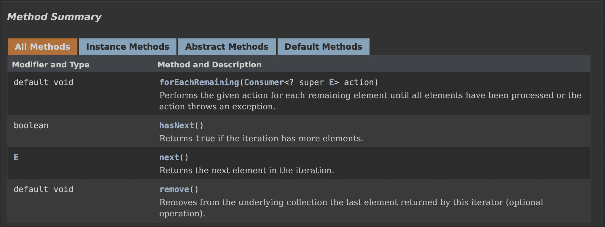

```java
import org.junit.Test;

import java.util.ArrayList;
import java.util.Collection;
import java.util.Iterator;

/**
 * 集合元素的遍历操作 => 使用迭代器Iterator接口
 */
public class IteratorTest {

    @Test
    public void test(){
        Collection coll = new ArrayList();
        coll.add(123);
        coll.add(456);
        coll.add(new Person("zs",21));
        coll.add(new String("Tom"));
        coll.add(false);

        Iterator iterator = coll.iterator();

        while(iterator.hasNext()){
            Object obj = iterator.next();
            if("Tom".equals(obj)){
                // 内部定义了remove(),可以在遍历的时候,删除集合中的元素.此方法不同于集合直接调用remove()
                iterator.remove();
            }
        }

        //遍历集合
        iterator = coll.iterator();
        // hasNext() => 判断是否还有下一个元素
        while(iterator.hasNext()){
            // next() => 指针下移;将下移后集合位置上的元素返回
            System.out.println(iterator.next());
        }

//        错误方式一：会跳过迭代元素
//        while(iterator.next() != null){
//            System.out.println(iterator.next());
//        }

//        错误方式二：集合对象每次调用iterator()方法都得到一个全新的迭代器对象，默认游标都在集合的第一个元素之前。
//        while(coll.iterator().hasNext()){
//            System.out.println(coll.iterator().next());
//        }
    }
}
```

* Iterator可以删除集合的元素，但是是遍历过程中通过迭代器对象的remove方法，不是集合对象的remove方法。
* **如果还未调用next()或在上一次调用next方法之后已经调用了remove方法，再调用remove都会报IllegalStateException**。

#### foreach 循环遍历集合或数组

Java 5.0 提供 foreach 循环迭代访问 Collection 和数组。遍历操作不需获取 Collection 或数组的长度，无需使用索引访问元素。遍历集合的底层调用 Iterator 完成操作。

```java
for(Object obj: objs){ // (要遍历的元素类型 遍历后自定义元素的名称: 要便利的结构名称)
    system.out.println(obj.getName())
}
```

#### List 接口

鉴于 Java 中数组用来存储数据的局限性，通常使用 Collection 子接口 List 替代数组。<u>List 集合类中元素有序且可重复，集合中的每个元素都有其对应的顺序索引</u>。List 容器中元素都对应一个整数型的序号记载其在容器中的位置，可以根据序号存取容器中的元素。JDK API 中 List 接口的实现类常用的有 ArrayList、LinkedList 和 Vector。

ArrayList 作为 List 接口的主要实现类，虽线程不安全的，但是效率高；底层使用 `Object[] elementData` 存储。使用 LinkedList 对于频繁的插入、删除操作，效率比 ArrayList 高，其底层使用双向链表存储。Vector 作为 List 接口的古老实现类；线程安全的，效率低；底层使用 `Object[] elementData` 存储。

* ArrayList 的源码分析

ArrayList 是List 接口的典型实现类、主要实现类。本质上 ArrayList 是对象引用的一个”变长”数组。

```java
// jdk7
ArrayList list = new ArrayList(); // 底层创建了长度是10的Object[]数组elementData
list.add(123); // elementData[0] = new Integer(123);
...
list.add(11); // 如果此次的添加导致底层elementData数组容量不够则扩容。
// 默认情况下，扩容为原来的容量的1.5倍，同时需要将原有数组中的数据复制到新的数组中。
// 结论：建议开发中使用带参的构造器：ArrayList list = new ArrayList(int capacity)

// jdk8
ArrayList list = new ArrayList(); // 底层Object[] elementData初始化为{}.并没有创建长度为10的数组
list.add(123); // 第一次调用add()时，底层才创建了长度10的数组，并将数据123添加到elementData[0]
...
// 后续的添加和扩容操作与jdk 7 无异。
// jdk7中的ArrayList的对象的创建类似于单例的饿汉式，而jdk8中的ArrayList的对象的创建类似于单例的懒汉式，延迟了数组的创建，节省内存。
```

* LinkedList 的源码分析

对于频繁的插入或删除元素的操作，建议使用 LinkedList 类，效率较高。LinkedList 为双向链表，内部没有声明数组，而是定义了 Node 类型的 first 和 last，用于记录首末元素。同时，定义内部类 Node 作为 LinkedList 中保存数据的基本结构。

```java
LinkedList list = new LinkedList(); // 内部声明了Node类型的first和last属性，默认值为null
list.add(123); // 将123封装到Node中，创建了Node对象。
// 其中，Node定义为：体现了LinkedList的双向链表的说法
private static class Node<E> {
    E item;
    Node<E> next;
    Node<E> prev;
    Node(Node<E> prev, E element, Node<E> next) {
        this.item = element;
        this.next = next;     //next变量记录下一个元素的位置
        this.prev = prev;     //prev变量记录前一个元素的位置
    }
}
```

* Vector 的源码分析

Vector 是一个 JDK1.0 的古老集合。大多数操作与 ArrayList 相同，区别之处在于 Vector 是线程安全的。在各种 list 中，最好把 ArrayList 作为缺省选择。当插入、删除频繁时，使用 LinkedList；Vector 总是比 ArrayList 慢，所以尽量避免使用。

Vector 源码层面在 jdk7 和 jdk8 中通过 `Vector()` 构造器创建对象时，底层都创建了长度为10的数组。在扩容方面，默认扩容为原来的数组长度的2倍。

```java
public Vector(int initialCapacity) { this(initialCapacity, 0); }
// Constructs an empty vector so that its internal data array has size 10 and its standard capacity increment is zero
public Vector() { this(10); }
public Vector(int initialCapacity, int capacityIncrement) {
    super();
    if (initialCapacity < 0)
        throw new IllegalArgumentException("Illegal Capacity: " + initialCapacity);
        this.elementData = new Object[initialCapacity];
        this.capacityIncrement = capacityIncrement;
}
```

List 除从 Collection 集合继承的方法外，还添加了一些根据索引来操作集合元素的方法。

```java
import org.junit.Test;

import java.util.*;

/**
 * List 接口的常用方法
 */
public class ListTest {
    /**
     *
     * void add(int index, Object ele):在index位置插入ele元素
     * boolean addAll(int index, Collection eles):从index位置开始将eles中的所有元素添加进来
     * Object get(int index):获取指定index位置的元素
     * int indexOf(Object obj):返回obj在集合中首次出现的位置
     * int lastIndexOf(Object obj):返回obj在当前集合中末次出现的位置
     * Object remove(int index):移除指定index位置的元素，并返回此元素
     * Object set(int index, Object ele):设置指定index位置的元素为ele
     * List subList(int fromIndex, int toIndex):返回从fromIndex到toIndex位置的子集合
     *
     * 总结：常用方法
     * 增：add(Object obj)
     * 删：remove(int index) / remove(Object obj)
     * 改：set(int index, Object ele)
     * 查：get(int index)
     * 插：add(int index, Object ele)
     * 长度：size()
     * 遍历：① Iterator迭代器方式
     *      ② 增强for循环
     *      ③ 普通的循环
     */

    @Test
    public void test3(){
        ArrayList list = new ArrayList();
        list.add(123);
        list.add(456);
        list.add("AA");

        //方式一：Iterator迭代器方式
        Iterator iterator = list.iterator();
        while(iterator.hasNext()){
            System.out.println(iterator.next());
        }

        System.out.println("***************");

        //方式二：增强for循环
        for(Object obj : list){
            System.out.println(obj);
        }

        System.out.println("***************");

        //方式三：普通for循环
        for(int i = 0;i < list.size();i++){
            System.out.println(list.get(i));
        }
    }

    @Test
    public void tets2(){
        ArrayList list = new ArrayList();
        list.add(123);
        list.add(456);
        list.add("AA");
        list.add(new Person("Tom",12));
        list.add(456);
        // int indexOf(Object obj) => 返回obj在集合中首次出现的位置。如果不存在，返回-1.
        int index = list.indexOf(4567);
        System.out.println(index);

        // int lastIndexOf(Object obj) => 返回obj在当前集合中末次出现的位置。如果不存在，返回-1.
        System.out.println(list.lastIndexOf(456));

        // Object remove(int index) => 移除指定index位置的元素，并返回此元素
        Object obj = list.remove(0);
        System.out.println(obj);
        System.out.println(list);

        // Object set(int index, Object ele) => 设置指定index位置的元素为ele
        list.set(1,"CC");
        System.out.println(list);

        // List subList(int fromIndex, int toIndex) => 返回从fromIndex到toIndex位置的左闭右开区间的子集合
        List subList = list.subList(2, 4);
        System.out.println(subList);
        System.out.println(list);
    }

    @Test
    public void test(){
        ArrayList list = new ArrayList();
        list.add(123);
        list.add(456);
        list.add("AA");
        list.add(new Person("Tom",12));
        list.add(456);

        System.out.println(list);

        // void add(int index, Object ele) => 在index位置插入ele元素
        list.add(1,"BB");
        System.out.println(list); // [123, BB, 456, AA, com.xxxzs.collection.Person@27e0db, 456]

        // boolean addAll(int index, Collection eles) => 从index位置开始将eles中的所有元素添加进来
        List list1 = Arrays.asList(1, 2, 3);
        list.addAll(list1);
        System.out.println(list); // [123, BB, 456, AA, com.xxxzs.collection.Person@27e0db, 456, 1, 2, 3]
        list.add(list1);
        System.out.println(list); // [123, BB, 456, AA, com.xxxzs.collection.Person@27e0db, 456, 1, 2, 3, [1, 2, 3]]
        System.out.println(list.size()); // 10

        // Object get(int index) => 获取指定index位置的元素
        System.out.println(list.get(2)); // 456
    }
}
```

谈谈 ArrayList/LinkedList/Vector 的异同？ArrayList 底层是什么？扩容机制？Vector 和 ArrayList 的最大区别是?

相对线程安全的 Vector，ArrayList 是实现了基于动态数组的数据结构，LinkedList 基于链表的数据结构，虽线程不安全，但执行效率更高。对于随机访问 get 和 set，ArrayList 优于 LinkedList，因后者要移动指针。对于新增和删除操作 add 和 remove，LinkedList 较占优势，因 ArrayList 要移动数据。Vector 和 ArrayList 几乎是完全相同，唯一区别在于 Vector 是同步类 synchronized 属于强同步类，开销比 ArrayList 要大，故访问要慢。正常情况下多数的程序员使用 ArrayList 而不是 Vector，因为同步完全可以自行控制。Vector 每次扩容请求其大小的2倍空间，而 ArrayList 是1.5倍。Vector 还有一个子类 Stack。

```java
import org.junit.Test;

import java.util.ArrayList;
import java.util.List;

public class ListEver {
    /**
     * 区分List中remove(int index)和remove(Object obj)
     * 总结：index为集合的下标，而object表示的是集合中的数据
     */

    @Test
    public void testListRemove() {
        List list = new ArrayList();
        list.add(1);
        list.add(2);
        list.add(3);
        updateList(list);
        System.out.println(list);//
    }

    private void updateList(List list) {
//        list.remove(2);
        list.remove(new Integer(2));
    }
}
```

#### Set 接口

Set 接口是 Collection 的子接口，且没有提供额外的方法。Set 集合不允许包含相同的元素，如果试把两个相同的元素加入同一个 Set 集合中，则添加操作失败。**Set 判断两个对象是否相同不是使用 `==` 运算符，而是根据 `equals()` 方法**。

Set 接口存储无序的、不可重复的数据。HashSet 作为 Set 接口的主要实现类，线程不安全却可以存储 null 值。LinkedHashSet 作为 HashSet 的子类，在遍历其内部数据时可以按照添加的顺序进行遍历，对于频繁的遍历操作，LinkedHashSet 效率高于 HashSet。TreeSet 可以按照添加对象的指定属性进行排序。

Set 的无序性不等于随机性。<u>存储的数据在底层数组中并非按照数组索引顺序添加，而是根据数据哈希值决定。</u>不可重复性保证添加的元素按照 `equals()` 判断时不能返回 true，即相同的元素只能添加一个。

```java
import org.junit.Test;

import java.util.HashSet;
import java.util.Iterator;
import java.util.Set;

public class SetTest {
    @Test
    public void test(){
        Set set = new HashSet();
        set.add(123);
        set.add(456);
        set.add("zzz");
        set.add("full");
        set.add(new Person("zs",21));
        set.add(new Person("zs",21));
        set.add(129);

        Iterator iterator = set.iterator();
        while(iterator.hasNext()){
            System.out.println(iterator.next());
        }
    }
}
```

* HashSet 中元素的添加过程

HashSet 是 Set 接口的典型实现，大多数时候使用 Set 集合时都使用这个实现类。HashSet 按 Hash 算法来存储集合中的元素，因此具有很好的存取、查找、删除性能。

HashSet 不能保证元素的排列顺序且不是线程安全的，集合元素可以是 null；底层也是数组，初始容量为16，当如果使用率超过0.75，（16*0.75=12）就会扩大容量为原来的2倍。（16扩容为32，依次为64,128…等）。HashSet 集合判断两个元素相等的标准是两个对象通过 `hashCode()` 方法比较相等，并且两个对象的 `equals()` 方法返回值也相等。

对存放在 Set 容器中的对象，对应类一定要重写 `equals()` 和 `hashCode(Object obj)` 方法以实现对象相等规则。即“**相等的对象必须具有相等的散列码**”。

HashSet 中添加元素 a，首先调用其所在类的 `hashCode()` 方法计算元素 a 的哈希值，此哈希值接着通过算法计算出在 HashSet 底层数组中的存放位置即索引位置，并判断数组此位置上是否已有元素。若此位置没有其他元素，则元素 a 添加成功；如果此位置上有其他元素 b 或以链表形式存在的多个元素，则比较元素 a 与元素 b 的 hash 值，若 hash 值不相同，则元素 a 添加成功；如果 hash 值相同，则需要调用元素 a 所在类的 `equals()` 方法，返回 true 则元素 a 添加失败，返回 false 则元素 a 添加成功。对于添加成功的情况，元素 a 与已经存在指定索引位置上数据以链表的方式存储。在 JDK7 中元素 a 放到数组中，指向原来的元素；而在 JDK8 中原来的元素在数组中指向元素 a。总结为<u>七上八下，底层为数组与链表</u>。

* hashCode 和 equals 的重写

在程序运行时，同一个对象多次调用 `hashCode()` 方法应该返回相同的值。当两个对象的 `equals()` 方法比较返回 true 时，这两个对象的 `hashCode()` 方法的返回值也应相等。对象中用作 `equals()`  方法比较的 Field，都应该用来计算 `hashCode` 值。

往 Set、Map 接口的实现类对象中存放 Java 中的包装类对象 String、Integer... 可以直接存取，而若存放自定义类对象，需要重写 `hashCode()` 和 `equals()` 方法，才能正确的存放和获取对象。在不重写上述两种方法时，在自定义对象传参一致的情况下，在两次 new 出的实例会因为 hashCode 不同而得到堆内存中两个不同的对象。两个截然不同的实例可能在逻辑上是相等，但根据 `Object.hashCode()` 方法，它们仅仅是两个对象。因此违反了“**相等的对象必须具有相等的散列码**”的原则。

若只重写`hashCode()`，而不重写`equals()`，执行过程虽然可以得到相等的 hashCode，但是底层存储的结构可能是数组与链表的组合，那么相同的索引位置可能会在一条链表上，即使待比较两者的索引相同，也只能说明处于同一条链上，但并不能证明两者就是相同的。同理只重写 `equals()` 方法没有重写 `hashCode()`，待比较两者的 hashCode 不同直接导致在底层结构中的索引位置不同，自然就不能正确的存放与获取。

重写的 `hashCode()` 只关心指定属性是否相同，只要值相同则调用 `Objects.hashCode()`得到的哈希值就是相同的，其在底层存储结构中的索引就相同。`equals()` 首先判断两个对象的引用是否相同，相同则表示两者就是同样的对象，直接返回 true。如果两者的引用不同则继续判断传入的对象是否为 null 或者两者的类型是否相同，不同返回 false ，即根本就不是同一类型对象；否则将传入的对象强转为待比较的对象类型，调用 `Obejcts.equals()` 进行比较，如果两者的类型相同，传入的对象不为 null，且比较的属性也相同，那么证明就是相同的。

<u>为什么用 Eclipse/IDEA 复写 hashCode 方法时有31这个数字？</u>这是因为选择系数的时候要选择尽量大的系数。因为如果计算出来的 hash 地址越大，所谓的“冲突”就越少，查找起来效率也会提高（减少冲突）。并且31只占用5bits，相乘造成数据溢出的概率较小。现在很多虚拟机里面都有做相关优化（提高算法效率），31可以由 `i*31== (i<<5)-1` 来表示。31是一个素数，素数作用就是若用一个数字来乘以这个素数，那么最终出来的结果只能被素数本身和被乘数还有1来整除。

* LinkedHashSet 的使用

不允许集合元素重复的 LinkedHashSet 是 HashSet 的子类，LinkedHashSet 是根据元素的 hashCode 值来决定元素的存储位置，但同时使用双向链表维护元素的次序，这使得元素看起来是以插入顺序保存。LinkedHashSet 插入性能略低于 HashSet，但在迭代访问 Set 里的全部元素时有很好的性能，这是因为 LinkedHashSet 在添加数据的同时，每个数据还维护了两个引用，记录此数据前一个数据和后一个数据。

* TreeSet 的使用

TreeSet 是 SortedSet 接口的实现类，可以确保集合元素处于排序状态，底层使用**红黑树**结构存储数据。新增方法 `Comparator comparator()`、`Object first()|last()`、`Object lower|higher(Object e)`、`SortedSet subSet(fromElement, toElement)`、`SortedSet headSet|tailSet(toElement)`。

TreeSet 具有自然排序和定制排序的两种排序方法，默认情况 TreeSet 采用自然排序。相比于 List 具有更快的查询速度。

在自然排序中，TreeSet 会调用集合元素的 compareTo 方法来比较元素大小关系并将集合元素按升序排列。若试图把一个对象添加到 TreeSet 时，则该对象的类必须实现 Comparable 接口。实现 Comparable 的类必须实现 `compareTo(Object obj)` 方法，即两个对象应通过此方法的返回值比较大小。

向 TreeSet 中添加元素时，只有第一个元素无须比较 `compareTo()` 方法，后面添加的所有元素都会调用 `compareTo()` 方法进行比较。**因为只有相同类的两个实例才会比较大小，所以向 TreeSet 中添加的应该是同一个类的对象**。对于 TreeSet 集合而言，判断两个对象是否相等的唯一标准是通过 `compareto(Object obj)` 方法比较返回值。当需要把一个对象放入 TreeSet 中重写该对象对应的 equals 方法应保证结果 true 与 compareTo 比较结果0一致。

自然排序比较两个对象是否相同的标准为 `compareTo()` 返回0，不再是 `equals()`；定制排序比较两个对象是否相同的标准为 `compare()` 返回0，不再是 `equals()`。

若元素所属的类没有实现 `Comparable` 接口，又不希望按照升序的方式排列元素或希望按照其它属性大小进行排序，则考虑使用定制排序。定制排序要通过 `Comparator` 接口来实现。需要重写 `compare(T o1,T o2)` 方法。

利用 `int compare(T o1,T o2)` 方法，比较 o1 和 o2 的大小。如果方法返回正整数，则表示 o1 大于 o2；如果返回0，表示相等；返回负整数，表示 o1 小于 o2。

要实现**定制排序**，需要将实现 `Comparator` 接口的实例作为形参传递给  TreeSet 的构造器。此时仍然只能向 TreeSet 中添加类型相同的对象。否则发生 `ClassCastException` 异常。使用定制排序判断两个元素相等的标准是通过 Comparator 比较两个元素返回了0。

```java
import org.junit.Test;

import java.util.Comparator;
import java.util.Iterator;
import java.util.TreeSet;

/**
 * 向TreeSet中添加的数据，要求是相同类的对象。
 */
public class TreeSetTest {
    @Test
    public void test() {
        // 默认排序
        TreeSet set = new TreeSet();

        //失败：不能添加不同类的对象
//        set.add(123);
//        set.add(456);
//        set.add("AA");
//        set.add(new User("Tom",12));

        //举例一：
//        set.add(34);
//        set.add(-34);
//        set.add(43);
//        set.add(11);
//        set.add(8);

        //举例二：
        set.add(new User("Tom",12));
        set.add(new User("Jerry",32));
        set.add(new User("Jim",2));
        set.add(new User("Mike",65));
        set.add(new User("Jack",33));
        set.add(new User("Jack",56));

        Iterator iterator = set.iterator();
        while(iterator.hasNext()){
            System.out.println(iterator.next());
        }
    }

    @Test
    public void tets2(){
        // 定制排序
        Comparator com = new Comparator() {
            //按照年龄从小到大排列
            @Override
            public int compare(Object o1, Object o2) {
                if(o1 instanceof User && o2 instanceof User){
                    User u1 = (User)o1;
                    User u2 = (User)o2;
                    return Integer.compare(u1.getAge(),u2.getAge());
                }else{
                    throw new RuntimeException("输入的数据类型不匹配");
                }
            }
        };

        TreeSet set = new TreeSet(com);
        set.add(new User("Tom",12));
        set.add(new User("Jerry",32));
        set.add(new User("Jim",2));
        set.add(new User("Mike",65));
        set.add(new User("Mary",33));
        set.add(new User("Jack",33));
        set.add(new User("Jack",56));


        Iterator iterator = set.iterator();
        while(iterator.hasNext()){
            System.out.println(iterator.next());
        }
    }
}
```

```java
public class User implements Comparable{
    private String name;
    private int age;

    public User() {
    }

    public User(String name, int age) {
        this.name = name;
        this.age = age;
    }

    public String getName() {
        return name;
    }

    public void setName(String name) {
        this.name = name;
    }

    public int getAge() {
        return age;
    }

    public void setAge(int age) {
        this.age = age;
    }

    @Override
    public String toString() {
        return "User{" +
                "name='" + name + '\'' +
                ", age=" + age +
                '}';
    }

    @Override
    public boolean equals(Object o) {
        System.out.println("User equals()....");
        if (this == o) return true;
        if (o == null || getClass() != o.getClass()) return false;

        User user = (User) o;

        if (age != user.age) return false;
        return name != null ? name.equals(user.name) : user.name == null;
    }

    @Override
    public int hashCode() { //return name.hashCode() + age;
        int result = name != null ? name.hashCode() : 0;
        result = 31 * result + age;
        return result;
    }

    //按照姓名从大到小排列,年龄从小到大排列
    @Override
    public int compareTo(Object o) {
        if (o instanceof User) {
            User user = (User) o;
//            return this.name.compareTo(user.name);  //按照姓名从小到大排列
//            return -this.name.compareTo(user.name);  //按照姓名从大到小排列
            int compare = -this.name.compareTo(user.name);  //按照姓名从大到小排列
            if(compare != 0){   //年龄从小到大排列
                return compare;
            }else{
                return Integer.compare(this.age,user.age);
            }
        } else {
            throw new RuntimeException("输入的类型不匹配");
        }
    }
}
```

* Set 面试题

```java
// 在List内去除重复数字值，要求尽量简单
import org.junit.Test;

import java.util.ArrayList;
import java.util.Collection;
import java.util.HashSet;
import java.util.List;

public class InterviewTest {
    public static List duplicateList(List list) {
        HashSet set = new HashSet();
        set.addAll(list);
        return new ArrayList(set);
    }
    @Test
    public void test2(){
        List list = new ArrayList();
        list.add(new Integer(1));
        list.add(new Integer(2));
        list.add(new Integer(2));
        list.add(new Integer(4));
        list.add(new Integer(4));
        List list2 = duplicateList(list);
        for (Object integer : list2) {
            System.out.println(integer);
        }
    }
}
```

#### Map 接口

Map 存储双列数据，即 key-value 对，作为 Map 的主要实现类，虽线程是不安全的，但效率高，可以存储 null 的 key 和 value。LinkedHashMap 保证在遍历 map 元素时，可以按照添加的顺序实现遍历，原因是在原有的 HashMap 底层结构基础上添加了一对指针，指向前一个和后一个元素，故在频繁的遍历操作时此类执行效率高于 HashMap。TreeMap 保证按照添加的 key-value 对进行排序，实现排序遍历。此时考虑 key 的自然排序或定制排序，其底层使用红黑树。Hashtable 作为古老的实现类，尽管线程安全，但效率低；不能存储 null 的 key 和 value。Properties 常用来处理配置文件，其存储元素 key 和 value 都是 String 类型。HashMap的底层在 JDK7 及其之前为数组与链表，JDK8后为数组、链表与红黑树。

* Map 中存储的 key-value 特点

Map 与 Collection 并列存在。用于保存具有映射关系的数据 key-value。Map 中的 key 和 value 都可以是任何引用类型的数据。Map 中的 key  用 Set 来存放，不允许重复，即同一个 Map 对象所对应的类，须重写 `hashCode()` 和 `equals()` 方法。常用 String 类作为 Map 的“键”。key 和 value 之间存在单向一对一关系，即通过指定的 key 总能找到唯一的、确定的 value。Map 中的 value 是无序的、可重复的，使用 Collection 存储所有的 value，但其所在类需重写 equals。一个键值对构成一个无序、不可重复的 Entry 对象，使用 Set 存储。

* HashMap

HashMap 是 Map 接口使用频率最高的实现类，键和值允许使用 null，与 HashSet 一样不保证映射的顺序。所有的 key 构成的集合是无序、不可重复的 Set。所以 key 所在的类要重写 `equals()` 和 `hashCode()`。所有的 value 构成的集合是无序可重复的 Collection，故 value 所在的类要重写 `equals()`。一个 key-value 构成一个 entry，所有 entry 构成的集合是无序不可重复的 Set。HashMap 判断两个 key 相等的标准是两个 key 通过 `equals()` 方法返回 true，且 hashCode 值也相等。HashMap 判断两个 value 相等的标准是两个 value 通过 `equals()` 方法返回 true。

在 JDK7 及以前版本，HashMap 底层是数组和链表结构；JDK8 后是数组、链表与红黑树。

JDK7 实例化一个 HashMap 时，系统会创建一个长度为 Capacity 的 Entry 数组，这个长度在哈希表中称为容量 Capacity，在此数组中放置元素的位置称之为"桶" bucket，每个"桶"都有各自的索引，故可根据索引快速查找 bucket 中的元素。每个 bucket 中存储一个 Entry 对象，且此元素可以带一个引用变量用于指向下一元素，由此就有概率生成一个 Entry 链，且新添加的元素作为链表的 head。

向 HashMap 里添加 `entry(key, value)` 首先应需根据 key 所在类的 hashCode 计算出 entry 中 key 的哈希值，依据哈希值得到在底层 Entry 数组里的存储位。若该位无元素，则 entry 添加成功；若该位置存在元素或链表，则需要通过循环依次比较新加入 entry 中 key 的哈希值和已存在的 entry 的 hash 值，彼此之间 hash 值不同则添加成功；如果 hash 值相同就继续比较二者是否 equals，若返回值为 true 则使用新 entry 里的 value 替换 equals 为 true 的原有 entry 的 value。若遍历一遍后所有的 equals 都返回 false，则新 entry 仍添加成功，新 entry 指向原有的 entry 元素。

当 HashMap 中的元素越来越多的时候，hash 冲突的几率也就越来越高，因数组的长度是固定的。为提高查询效率，要对 HashMap 的数组进行扩容，而在数组扩容之后原数组中的数据必须重新计算其在新数组中的位置，这就是最消耗性能的 resize。

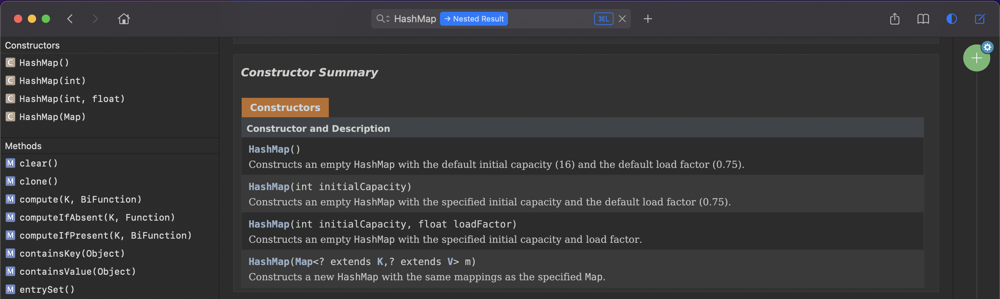

当 HashMap 中的元素个数超过 `数组大小*loadFactor` 时，就会进行数组扩容，loadFactor 的默认值 DEFAULT_LOAD_FACTOR 为0.75。默认情况，数组 DEFAULT_INITIAL_CAPACITY 为16，那么当 HashMap 中元素个数超过临界值 threshold 16\*0.75=12的时候，就把数组的大小扩展一倍，为2*16=32，然后重新计算每个元素在数组中的位置，这是一个非常消耗性能的操作，所以如果已经预知 HashMap 中元素的个数，那么预设元素的个数能够有效的提高 HashMap 的性能。

JDK8 实例化 HashMap 时，会初始化 initialCapacity 和 loadFactor，在 put 第一对映射关系时，会创建一个长度为 initialCapacity 的 Node 数组，此数组存放元素的位置也称"桶"，每个 bucket 中存储的元素就是 Node 对象，Node 对象可以带一个引用变量 next   指向下一个元素，故一个桶中可能生成一个 Node 链或 TreeNode 对象，而每个 TreeNode 对象可以有两个叶节点 left 和 right，而新添加的元素作为链表的 last 或 TreeNode 树的叶节点。

在 JDK7 的扩容基础上，JDK8 当 HashMap 的其中一个链的对象个数如果达到8个，capacity 没有到达64，那么 HashMap 会先扩容解决，如果已经到达64则此链变成红黑树，节点类型由 Node 成为 TreeNode 类型。当然，如果当映射关系被移除后，下次 resize 方法判断树的节点个数低于6个则会把红黑树再转为链表。

JDK8 相较于 JDK7 在底层实现方面的不同体现在 new HashMap 底层没有创建一个长度为16的数组，且 JDK8 底层数组是 Node 而非 Entry；在首次调用 put 方法时底层才会创建长度为16的数组；底层结构在 JDK8 时在数组与链表的基础上增加红黑树，且旧元素指向新元素；当数组的某一索引位置元素以链表形式存在个数多余8且当前数组长度大于64则此时索引位置上的数据改为红黑树存储。

```java
/*    
 * HashMap源码中的重要常量:
 * DEFAULT_INITIAL_CAPACITY: HashMap的默认容量 => 16
 * DEFAULT_LOAD_FACTOR: HashMap的默认加载因子：0.75
 * threshold: 扩容的临界值=容量*填充因子: 16 * 0.75 => 12
 * TREEIFY_THRESHOLD: Bucket中链表长度大于该默认值转化为红黑树 => 8
 * MIN_TREEIFY_CAPACITY: 桶中的Node被树化时最小的hash表容量 => 64
*/
```

* LinkedHashMap

LinkedHashMap 是 HashMap 的子类，在 HashMap 的存储结构基础上，使用了一对双向链表来记录添加元素的顺序。与 LinkedHashSet 类似，LinkedHashMap 可以维护 Map 的迭代顺序与 Key-Value 的插入顺序一致。

```java
// HashMap 中的 Node
static class Node<K,V> implements Map.Entry<K,V> {
    final int hash;
    final K key;
    V value;
    Node<K,V> next;
}
// LinkedHashMap 中的 Entry
static class Entry<K,V> extends HashMap.Node<K,V> {
    Entry<K,V> before, after;//能够记录添加的元素的先后顺序
    Entry(int hash, K key, V value, Node<K,V> next) {
        super(hash, key, value, next);
    }
} 
```

```java
import org.junit.Test;

import java.util.*;

public class MapTest {
    /**
     *  元素查询操作
     */
    @Test
    public void test1(){
        Map map = new HashMap();
        map.put("AA",123);
        map.put(45,123);
        map.put("BB",56);
        // Object get(Object key) => 获取指定key对应的value
        System.out.println(map.get(45));
        // containsKey(Object key) => 是否包含指定的key
        boolean isExist = map.containsKey("BB");
        System.out.println(isExist);
        // boolean containsValue(Object value) => 是否包含指定的value
        isExist = map.containsValue(123);
        System.out.println(isExist);
        // int size() => 返回map中key-value对的个数
        System.out.println(map.size());
        // boolean equals(Object obj) => 判断当前map和参数对象obj是否相等
        System.out.println(map.equals(map));
        map.clear();
        // boolean isEmpty() => 判断当前map是否为空
        System.out.println(map.isEmpty());
    }
    /**
     * 添加、删除、修改操作
     */
    @Test
    public void test2(){
        Map map = new HashMap();
        // Object put(Object key,Object value) => 将指定key-value添加到(或修改)当前map对象中
        map.put("AA",123);
        map.put(45,123);
        map.put("BB",56);
        // void putAll(Map m) => 将m中的所有key-value对存放到当前map中
        map.put("AA",87);

        System.out.println(map);
        // void putAll(Map m) => 将m中的所有key-value对存放到当前map中
        Map map1 = new HashMap();
        map1.put("CC",123);
        map1.put("DD",456);
        map.putAll(map1);

        System.out.println(map);

        // Object remove(Object key) => 移除指定key的key-value对并返回value
        Object value = map.remove("CC");
        System.out.println(value);
        System.out.println(map);

        // void clear() => 清空当前map中的所有数据
        map.clear();//与map = null操作不同
        System.out.println(map.size());
        System.out.println(map);
    }
    /**
     *  元视图操作的方法
     */
    @Test
    public void test3(){
        Map map = new HashMap();
        map.put("AA",123);
        map.put(45,1234);
        map.put("BB",56);

        // Set keySet() => 返回所有key构成的Set集合
        Set set = map.keySet();
        Iterator iterator = set.iterator();
        while(iterator.hasNext()){
            System.out.println(iterator.next());
        }
        System.out.println("*****************");

        // Collection values() => 返回所有value构成的Collection集合
        Collection values = map.values();
        for(Object obj : values){
            System.out.println(obj);
        }
        System.out.println("***************");

        // Set entrySet() => 返回所有key-value对构成的Set集合
        //方式一：
        Set entrySet = map.entrySet();
        Iterator iterator1 = entrySet.iterator();
        while (iterator1.hasNext()){
            Object obj = iterator1.next();
            //entrySet集合中的元素都是entry
            Map.Entry entry = (Map.Entry) obj;
            System.out.println(entry.getKey() + "---->" + entry.getValue());

        }
        System.out.println("/");

        //方式二：
        Set keySet = map.keySet();
        Iterator iterator2 = keySet.iterator();
        while(iterator2.hasNext()){
            Object key = iterator2.next();
            Object value = map.get(key);
            System.out.println(key + "=====" + value);
        }
    }
}
```

HashMap 与 Hashtable 都实现了 Map 接口。由于前者的非线程安全性，效率上可能高于 后者。Hashtable 的方法是 Synchronize 的，在多个线程访问 Hashtable 时，不需要为其的方法实现同步；而 HashMap 不是，必须为之提供外同步。HashMap 允许将 null 作为一个 Entry 的 key 或者 value，但 Hashtable 不允许。HashMap 把 Hashtable 的 contains 方法改成 containsvalue 和 containsKey，只因 contains 方法容易引起误解。Hashtable 继承自 Dictionary 类，而 HashMap 是 Java1.2 引进的 Map interface 的一个实现。Hashtable 和 HashMap 采用的 hash/rehash 算法大体一样，故性能没有很大的差异。

* TreeMap

底层使用**红黑树**结构存储数据的 TreeMap 存储 Key-Value 对时，需根据 Key-Value 对进行排序，保证所有的 Key-Value 对处于有序状态。TreeMap 的 Key 排序有自然排序和定制排序。前者所有 key 必须实现 Comparable 接口，且所有的 Key 应该是同一个类的对象，否则抛出 ClassCastException。后者在创建 TreeMap 时传入一个 Comparator 对象，该对象负责对 TreeMap 中所有 Key 进行排序，此时不需要实现 Comparable 接口。TreeMap 判断两个 Key 相等的标准是通过 `compareTo()` 或 `compare()` 方法返回0。

```java
public class User implements Comparable{
    private String name;
    private int age;

    public User() {
    }

    public User(String name, int age) {
        this.name = name;
        this.age = age;
    }

    public String getName() {
        return name;
    }

    public void setName(String name) {
        this.name = name;
    }

    public int getAge() {
        return age;
    }

    public void setAge(int age) {
        this.age = age;
    }

    @Override
    public String toString() {
        return "User{" +
                "name='" + name + '\'' +
                ", age=" + age +
                '}';
    }

    @Override
    public boolean equals(Object o) {
        System.out.println("User equals()....");
        if (this == o) return true;
        if (o == null || getClass() != o.getClass()) return false;

        User user = (User) o;

        if (age != user.age) return false;
        return name != null ? name.equals(user.name) : user.name == null;
    }

    @Override
    public int hashCode() { //return name.hashCode() + age;
        int result = name != null ? name.hashCode() : 0;
        result = 31 * result + age;
        return result;
    }

    //按照姓名从大到小排列,年龄从小到大排列
    @Override
    public int compareTo(Object o) {
        if(o instanceof User){
            User user = (User)o;
//            return -this.name.compareTo(user.name);
            int compare = -this.name.compareTo(user.name);
            if(compare != 0){
                return compare;
            }else{
                return Integer.compare(this.age,user.age);
            }
        }else{
            throw new RuntimeException("输入的类型不匹配");
        }

    }
}
```

```java
import org.junit.Test;

import java.util.*;

public class TreeMapTest {
    /**
     * 向TreeMap中添加key-value，要求key必须是由同一个类创建的对象
     * 因为要按照key进行排序：自然排序 、定制排序
     */
    // 自然排序
    @Test
    public void test(){
        TreeMap map = new TreeMap();
        User u1 = new User("Tom",23);
        User u2 = new User("Jerry",32);
        User u3 = new User("Jack",20);
        User u4 = new User("Rose",18);

        map.put(u1,98);
        map.put(u2,89);
        map.put(u3,76);
        map.put(u4,100);

        Set entrySet = map.entrySet();
        Iterator iterator1 = entrySet.iterator();
        while (iterator1.hasNext()){
            Object obj = iterator1.next();
            Map.Entry entry = (Map.Entry) obj;
            System.out.println(entry.getKey() + "---->" + entry.getValue());

        }
    }

    // 定制排序
    @Test
    public void test2(){
        TreeMap map = new TreeMap(new Comparator() {
            @Override
            public int compare(Object o1, Object o2) {
                if(o1 instanceof User && o2 instanceof User){
                    User u1 = (User)o1;
                    User u2 = (User)o2;
                    return Integer.compare(u1.getAge(),u2.getAge());
                }
                throw new RuntimeException("输入的类型不匹配！");
            }
        });
        User u1 = new User("Tom",23);
        User u2 = new User("Jerry",32);
        User u3 = new User("Jack",20);
        User u4 = new User("Rose",18);

        map.put(u1,98);
        map.put(u2,89);
        map.put(u3,76);
        map.put(u4,100);

        Set entrySet = map.entrySet();
        Iterator iterator1 = entrySet.iterator();
        while (iterator1.hasNext()){
            Object obj = iterator1.next();
            Map.Entry entry = (Map.Entry) obj;
            System.out.println(entry.getKey() + "---->" + entry.getValue());

        }
    }
}
```

* Hashtable

Hashtable 是个 JDK1.0 就提供的古老 Map 实现类，不同于 HashMap，Hashtable 是线程安全的。Hashtable 和  HashMap实现原理相同，底层都是用哈希表结构，常可以互用。与 HashMap 不同的是，Hashtable 不允许使用 null 作为 key 和 value；与 HashMap 相同的是，Hashtable 也不能保证其中 Key-Value 对顺序。在判断两个 Key 和 Value 相等的标准与 HashMap 一致。

* Properties

Properties 类是 Hashtable 的子类，常用于处理属性文件。由于属性文件里的 key、value 都是字符串类型，故 Properties 里的 key 和 value 都是字符串类型。存取数据时，建议使用`setProperty(String key,Stringvalue)`和`getProperty(String key)`方法。

在 IDEA 建立 jdbc.properties 文件的步骤是 new 一个 Resource Bundle，并命名 jdbc 点击 OK。在 jdbc.properties 文件以等号连接 key 与 value。

#### Collections 工具类

和操作数组的工具类 Arrays 类似，Collections 是一个操作 Set、List 和 Map 等集合的工具类，提供了一系列<u>静态的方法</u>对集合元素进行排序、查询和修改等操作，还提供了对集合对象设置不可变、对集合对象实现同步控制等方法。

```java
import org.junit.Test;

import java.util.ArrayList;
import java.util.Arrays;
import java.util.Collections;
import java.util.List;

/**
 * Collections:操作Collection、Map的工具类
 *
 * 面试题：Collection 和 Collections的区别？
 *       Collection是集合类的上级接口，继承于他的接口主要有Set 和List.
 *       Collections是针对集合类的一个帮助类，他提供一系列静态方法实现对各种集合的搜索、排序、线程安全化等操作.
 */
public class CollectionTest {
    /**
     * reverse(List)：反转 List 中元素的顺序
     * shuffle(List)：对 List 集合元素进行随机排序
     * sort(List)：根据元素的自然顺序对指定 List 集合元素按升序排序
     * sort(List，Comparator)：根据指定的 Comparator 产生的顺序对 List 集合元素进行排序
     * swap(List，int， int)：将指定 list 集合中的 i 处元素和 j 处元素进行交换
     *
     * Object max(Collection)：根据元素的自然顺序，返回给定集合中的最大元素
     * Object max(Collection，Comparator)：根据 Comparator 指定的顺序，返回给定集合中的最大元素
     * Object min(Collection)
     * Object min(Collection，Comparator)
     * int frequency(Collection，Object)：返回指定集合中指定元素的出现次数
     * void copy(List dest,List src)：将src中的内容复制到dest中
     * boolean replaceAll(List list，Object oldVal，Object newVal)：使用新值替换 List 对象的所有旧值
     *
     */

    @Test
    public void test(){
        List list = new ArrayList();
        list.add(123);
        list.add(43);
        list.add(765);
        list.add(765);
        list.add(765);
        list.add(-97);
        list.add(0);

        System.out.println(list);

//        Collections.reverse(list);
//        Collections.shuffle(list);
//        Collections.sort(list);
//        Collections.swap(list,1,2);
        int frequency = Collections.frequency(list, 123);

        System.out.println(list);
        System.out.println(frequency);
    }

    @Test
    public void test2(){
        List list = new ArrayList();
        list.add(123);
        list.add(43);
        list.add(765);
        list.add(-97);
        list.add(0);

        //报异常：IndexOutOfBoundsException("Source does not fit in dest")
//        List dest = new ArrayList();
//        Collections.copy(dest,list);
        //正确的：
        List dest = Arrays.asList(new Object[list.size()]);
        System.out.println(dest.size());//list.size();
        Collections.copy(dest,list);

        System.out.println(dest);

        /**
         * Collections 类中提供了多个 synchronizedXxx() 方法，
         * 该方法可使将指定集合包装成线程同步的集合，从而可以解决
         * 多线程并发访问集合时的线程安全问题
         */
        //返回的list1即为线程安全的List
        List list1 = Collections.synchronizedList(list);
    }
}
```

#### Enumeration

Enumeration 接口是 Iterator 迭代器的“古老版本”。

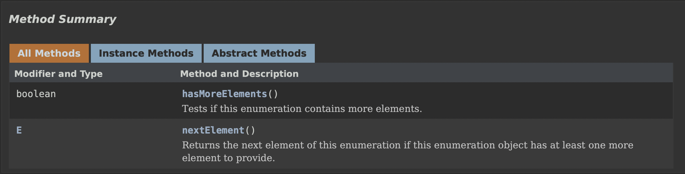

```java
Enumeration stringEnum = new StringTokenizer("a-b*c-d-e-g", "-");
    while(stringEnum.hasMoreElements()){
        Object obj = stringEnum.nextElement();System.out.println(obj); 
    }
```

### 泛型

集合容器类在设计阶段/声明阶段不能确定这个容器到底实际存的是什么类型的对象，所以**在JDK1.5之前只能把元素类型设计为Object，JDK1.5之后使用泛型来解决**。因为这个时候除了元素的类型不确定，其他的部分是确定的，例如关于这个元素确定的保存与管理等，因此此时**把元素的类型设计成一个参数，这个类型参数叫做泛型**。Collection，List，ArrayList 这个就是类型参数，即泛型。若集合没有泛型则会出现任何类型都可以添加在集合中的情况导致类型不安全，且读取出来的对象需要强转，不但繁琐还可能出现 ClassCastException。

#### 集合中使用泛型

泛型类型必须是类，不能是基本数据类型。需要用到基本数据类型的位置，拿包装类替换。

```java
import org.junit.Test;

import java.util.*;

/**
 * 在集合中使用泛型总结
 *  ①集合接口或集合类在jdk5.0时都修改为带泛型的结构。
 *  ②在实例化集合类时，可以指明具体的泛型类型
 *  ③指明完以后，在集合类或接口中凡是定义类或接口时，内部结构（比如：方法、构造器、属性等）使用到类的泛型的位置，都指定为实例化的泛型类型。
 *    比如：add(E e)  --->实例化以后：add(Integer e)
 *  ④注意点：泛型的类型必须是类，不能是基本数据类型。需要用到基本数据类型的位置，拿包装类替换
 *  ⑤如果实例化时，没有指明泛型的类型。默认类型为java.lang.Object类型。
 */
public class GenericTest {

    //在集合中使用泛型的情况：以HashMap为例
    @Test
    public void test1(){
//        Map<String,Integer> map = new HashMap<String,Integer>();
        // jdk7新特性：类型推断
        Map<String,Integer> map = new HashMap<>();

        map.put("Tom",87);
        map.put("Tone",81);
        map.put("Jack",64);

//        map.put(123,"ABC");

        // 泛型的嵌套
        Set<Map.Entry<String,Integer>> entry = map.entrySet();
        Iterator<Map.Entry<String, Integer>> iterator = entry.iterator();

        while(iterator.hasNext()){
            Map.Entry<String, Integer> e = iterator.next();
            String key = e.getKey();
            Integer value = e.getValue();
            System.out.println(key + "----" + value);
        }
    }

    // 在集合中使用泛型的情况：以ArrayList为例
    @Test
    public void test2(){
        ArrayList<Integer> list = new ArrayList<Integer>();

        list.add(78);
        list.add(49);
        list.add(72);
        list.add(81);
        list.add(89);
        //编译时，就会进行类型检查，保证数据的安全
//        list.add("Tom");

        //方式一：
//        for(Integer score :list){
//            //避免了强转的操作
//            int stuScore = score;
//
//            System.out.println(stuScore);
//        }

        //方式二：
        Iterator<Integer> iterator = list.iterator();
        while(iterator.hasNext()){
            int stuScore = iterator.next();
            System.out.println(stuScore);
        }
    }
}
```

#### 自定义泛型结构

自定义泛型结构应该从泛型类、泛型接口、泛型方法三方面进行考虑。泛型类可能有多个参数，此时应将多个参数一起放在尖括号内 <E1,E2,E3>。泛型类的构造器应该是 `public GenericClass(){}`。 而并非 `public GenericClass<E>(){}`。实例化后，操作原来泛型位置的结构必须与指定的泛型类型一致。泛型不同的引用不能相互赋值。泛型如果不指定，将被擦除，泛型对应的类型均按照 Object 处理，但不等价于 Object。如果泛型结构是一个接口或抽象类，则不可创建泛型类的对象。JDK7.0 后由于存在类型推断，范型可以省略 new 的范型尖括号内容 `ArrayList<Fruit> flist = new ArrayList<>();`。在类/接口上声明的泛型，在本类或本接口中即代表某种类型，可以作为非静态属性的类型、非静态方法的参数类型、非静态方法的返回值类型。但在静态方法中不能使用类的泛型。 异常类不能是泛型的。不能使用 `new E[]`。但是可以 `E[] elements = (E[])new Object[capacity];`，参考 ArrayList 源码中声明 `Object[] elementData`，而非泛型参数类型数组。

```java
import java.util.ArrayList;
import java.util.List;

/**
 * 自定义泛型类
 */
public class OrderTest<T> {

    String orderName;
    int orderId;

    // 类的内部结构就可以使用类的泛型
    T orderT;

    public OrderTest(){

    };

    public OrderTest(String orderName,int orderId,T orderT){
        this.orderName = orderName;
        this.orderId = orderId;
        this.orderT = orderT;
    }

    // 如下的三个方法都不是泛型方法
    public T getOrderT(){
        return orderT;
    }

    public void setOrderT(T orderT){
        this.orderT = orderT;
    }

    @Override
    public String toString() {
        return "Order{" +
                "orderName='" + orderName + '\'' +
                ", orderId=" + orderId +
                ", orderT=" + orderT +
                '}';
    }

    // 泛型方法是在方法中出现了泛型的结构,泛型参数与类的泛型参数没有任何关系
    // 换句话说,泛型方法所属的类是不是泛型类都没有关系
    // 泛型方法可以声明为静态的.原因是泛型参数是在调用方法时确定的,并非在实例化类时确定
    public static <E> List<E> copyFromArrayToList(E[] arr){
        ArrayList<E> list = new ArrayList<>();
        for(E e : arr){
            list.add(e);
        }
        return list;
    }
}
```

```java
public class SubOrder extends OrderTest<Integer>{ // SubOrder 不是泛型类
}
```

```java
public class SubOrder1<T> extends OrderTest<T> { // SubOrder1<T> 仍然是泛型类
}
```

```java
import org.junit.Test;

/**
 * 自定义泛型结构：泛型类、泛型接口、泛型方法
 */
public class GenericTest1 {

    @Test
    public void test1(){
        // 如果定义了泛型类,实例化没有指明类的泛型,则认为此泛型类型为Object类型,故若定义了类是带泛型的,建议在实例化时要指明类的泛型
        OrderTest order = new OrderTest();
        order.setOrderT(123);
        System.out.println(order);
        order.setOrderT("ABC");
        System.out.println(order);

        // 建议实例化时指明类的泛型
        OrderTest<String> order1 = new OrderTest<String>("orderAA",1001,"order:AA");
        order1.setOrderT("AA:hello");
        System.out.println(order1);
    }

    @Test
    public void test2(){
        SubOrder sub1 = new SubOrder();
        sub1.setOrderT(1122);
        System.out.println(sub1);

        // 由于子类在继承带泛型的父类时指明了泛型类型,则实例化子类对象时不再需要指明泛型
        SubOrder1<String> sub2 = new SubOrder1<>();
        sub2.setOrderT("order2...");
        System.out.println(sub2);
    }
}
```

若父类有泛型，则子类可以选择保留泛型也可以选择指定泛型类型。

```java
class Father<T1, T2> {
}
// 子类不保留父类的泛型
// 1)没有类型 擦除
class Son1 extends Father { // 等价于class Son extends Father<Object,Object>{
}
// 2)具体类型
class Son2 extends Father<Integer, String> {
}
// 子类保留父类的泛型
// 1)全部保留
class Son3<T1, T2> extends Father<T1, T2> {
}
// 2)部分保留
class Son4<T2> extends Father<Integer, T2> {
}
```

方法也可以被泛型化，不管此时定义在其中的类是不是泛型类。在泛型方法中可以定义泛型参数，此时参数的类型就是传入数据的类型。

```java
 // [访问权限] 返回类型 方法名([泛型标识 参数名称]) 抛出的异常
 public static <E>  List<E> copyFromArrayToList(E[] arr)　throws  Exception{ }
```

泛型在继承方面的体现于虽然类 A 是类 B 的父类，但是 `G<A>` 和 `G<B>` 二者不具备子父类关系，二者是并列关系。值得注意的有类 A 是类 B 的父类，那么 `A<G>` 是 `B<G>` 的父类。

```java
import org.junit.Test;

import java.util.*;

public class GenericTest {
    @Test
    public void test3(){

        Object obj = null;
        String str = null;
        obj = str;

        Object[] arr1 = null;
        String[] arr2 = null;
        arr1 = arr2;
//      编译不通过
//      Date date = new Date();
//      str = date;
        List<Object> list1 = null;
        List<String> list2 = new ArrayList<String>();
//      此时的list1和list2的类型不具有子父类关系,编译不通过
//      list1 = list2;
        /**
         * 反证法假设list1 = list2;list1.add(123);导致混入非String的数据。出错。
         */
        show(list1);
        show2(list2);
    }

    public void show2(List<String> list){

    }

    public void show(List<Object> list){

    }

    @Test
    public void test4(){
        AbstractList<String> list1 = null;
        List<String> list2 = null;
        ArrayList<String> list3 = null;

        list1 = list3;
        list2 = list3;

        List<String> list4 = new ArrayList<>();
    }
}
```

#### 通配符的使用

通配符 ? 常使用于 List<?>、Map<?,?> 等之流，可看作所有 List、Map 等泛型的父类，在读取通配符泛型容器中的元素是安全的，因不论容器中的真实类型，包含的都是 Object。但是在写入元素时由于不知道元素类型故不能向其中添加对象，当然出了 null 例外，因其是所有类型的成员。

类 A 是类 B 的父类，`G<A>` 和 `G<B>` 是没有关系的，但是两者有共同的父类 `G<?>`。

```java
Collection<?> c = new ArrayList();
c.add(new Object()); // 编译时错误
```

使用通配符泛型导致<u>编译错误</u>的情况通常有三种，分别是泛型方法声明的返回值前 `<>`、泛型类的声明、创建对象。

```java
public static <?> void test(ArrayList<?> list){}
class GenericTypeClass<?>{}
ArrayList<?> list2 = new ArrayList<?>();
```

```java
import org.junit.Test;

import java.util.*;

public class GenericTest {

    @Test
    public void test5(){
        List<?> list = null;
        List<String> list3 = new ArrayList<>();
        list3.add("AA");
        list3.add("BB");
        list3.add("CC");
        list = list3;
        list.add(null);
        // 获取(读取):允许读取数据,读取的数据类型为Object
        Object o = list.get(0);
        System.out.println(o);
        System.out.println(list);
    }
}
```

`<?>` 允许所有泛型的引用调用。在需通配符指定上限的需求下可使用 extends，指定的类型必须继承某个类或接口，即可完成 <= 效果；若需要通配符指定下限则可使用 super，指定的类型不能小于操作的类，即可完成 >= 效果。

```java
<? extends Number> (无穷小, Number] => 只允许泛型为Number及Number子类的引用调用
<? super Number> [Number, 无穷大) => 只允许泛型为Number及Number父类的引用调用
<? extends Comparable> => 只允许泛型为实现Comparable接口的实现类的引用调用
```

```java
public class Person {}
```

```java
public class Dev extends Person{}
```

```java
import org.junit.Test;

import java.util.*;

public class GenericTest {
    @Test
    public void test6(){
        List<? extends Person> list1 = null;
        List<? super Person> list2 = null;

        List<Dev> list3 = new ArrayList<Dev>();
        List<Person> list4 = new ArrayList<Person>();
        List<Object> list5 = new ArrayList<Object>();

//      只允许 Person 与其子类调用
        list1 = list3;
        list1 = list4;
//        list1 = list5;

//      只允许 Person 与其父类调用
//        list2 = list3;
        list2 = list4;
        list2 = list5;

//      读取数据
        list1 = list3;
        Person p = list1.get(0);
//      编译不通过
//      Dev s = list1.get(0);

        list2 = list4;
        Object obj = list2.get(0);
//      编译不通过
//      Person obj = list2.get(0);

//      写入数据
//      编译不通过
//      list1.add(new Dev());

//      编译通过
        list2.add(new Person());
        list2.add(new Dev());
    }
}
```

#### 泛型嵌套

```java
public static void main(String[] args) {
    HashMap<String, ArrayList<Citizen>> map= new HashMap<String, ArrayList<Citizen>>();
    ArrayList<Citizen> list= new ArrayList<Citizen>();
    list.add(new Citizen("D"));
    list.add(new Citizen("M"));
    list.add(new Citizen("S"));
    map.put("D", list);
    Set<Entry<String, ArrayList<Citizen>>> entrySet= map.entrySet();
    Iterator<Entry<String, ArrayList<Citizen>>> iterator= entrySet.iterator();
    while(iterator.hasNext()) {
        Entry<String, ArrayList<Citizen>> entry= iterator.next();
        String key= entry.getKey();
        ArrayList<Citizen> value= entry.getValue();
        System.out.println("户主："+ key);
        System.out.println("家庭成员："+ value);
    }
}
```

### IO流

#### File 类使用

* 实例化

java.io.File 类的一个对象，<u>代表一个文件或文件目录</u>，与平台无关。File 能新建、删除、重命名文件和目录，但 File 不能访问文件内容本身。如果需要访问文件内容本身，则需要使用输入/输出流。想要在 Java 程序中表示一个真实存在的文件或目录，那么必须有一个 File 对象，但是 Java 程序中的一个 File 对象，可能没有一个真实存在的文件或目录。File 对象可以作为参数传递给流的构造器。

```java
import org.junit.Test;
import java.io.File;

public class FileTest {
    /**
     * ```java
     * // 创建file类的实例
     * File(String filePath) => 以filePath为路径创建File对象.可以是绝对路径或者相对路径
     * File(String parentPath, String childPath) => 以parentPath为父路径,childPath为子路径创建File对象
     * File(File parentFile, String childPath) => 根据一个父File对象和子文件路径创建File对象
     * ```
     */
    @Test
    public void test1(){
        // 构造器1
        File file1 = new File("hello.txt"); // 相对于当前module
        File file2 = new File("/Users/.../IdeaProjects/zszy/src/com/.../IO/helloIO.txt");

        System.out.println(file1); // hello.txt
        System.out.println(file2); // /Users/xieziyi/IdeaProjects/zszy/src/com/.../IO/helloIO.txt

        // 构造器2
        File file3 = new File("/Users/.../IdeaProjects/zszy/src/com/.../IO/","JavaIO");
        System.out.println(file3); // /Users/xieziyi/IdeaProjects/zszy/src/com/.../IO/JavaIO

        // 构造器3
        File file4 = new File(file3,"hi.txt");
        System.out.println(file4); // /Users/.../IdeaProjects/zszy/src/com/.../IO/JavaIO/hi.txt
    }
}
```

由于 Java 程序支持跨平台运行，因此路径分隔符存在区别，windows 为 \\\，Unix 是 /。为解决此隐患，File 类提供一个常量 separator 可根据操作系统动态提供分隔符。

```java
// public  static final String separator
// 等价于 File file = ("d:\\Backend\\info.txt");
File file = new File("d:" + File.separator + "Backend" + File.separator + "info.txt");
```

* File 类的常用方法

```java
import org.junit.Test;
import java.io.File;
import java.util.Date;

public class FileTest {
    /**
     * public String getAbsolutePath() => 获取绝对路径。
     * public String getPath() => 获取路径。
     * public String getName() => 获取名称。
     * public String getParent() => 获取上层文件目录路径。若无，返回null
     * public long length() => 获取文件长度（字节数）。不能获取目录的长度。
     * public long lastModified() => 获取最后一次的修改时间，毫秒值。
     *
     * 适用于文件目录方法
     * public String[] list() => 获取指定目录下的所有文件或者文件目录的名称数组。
     * public File[] listFiles() => 获取指定目录下的所有文件或者文件目录的File数组。
     */
    @Test
    public void test2(){
        File file = new File("Hello.txt");
        File file2 = new File("/Users/.../IdeaProjects/zszy/src/com/.../IO/JavaIO/hi.txt");

        System.out.println(file.getAbsolutePath()); // /Users/.../IdeaProjects/zszy/Hello.txt
        System.out.println(file.getPath()); // Hello.txt
        System.out.println(file.getName()); // Hello.txt
        System.out.println(file.getParent()); // null
        System.out.println(file.length()); // 0
        System.out.println(new Date(file.lastModified())); // Thu Jan 01 08:00:00 CST 1970

        System.out.println();

        System.out.println(file2.getAbsolutePath()); // /Users/.../IdeaProjects/zszy/src/com/.../IO/JavaIO/hi.txt
        System.out.println(file2.getPath()); // /Users/.../IdeaProjects/zszy/src/com/.../IO/JavaIO/hi.txt
        System.out.println(file2.getName()); // hi.txt
        System.out.println(file2.getParent()); // /Users/.../IdeaProjects/zszy/src/com/.../IO/JavaIO
        System.out.println(file2.length()); // 0
        System.out.println(file2.lastModified()); // 0
    }

    @Test
    public void test3(){
        // 文件需存在！！！
        File file = new File("/Users/.../IdeaProjects/zszy/src/com/.../IO");

        // list() => Returns an array of strings naming the files and directories in the directory denoted by this abstract pathname.
        String[] list = file.list();
        for(String s : list){
            System.out.println(s); // 遍历文件夹下所有文件(相对路径)
        }

//        System.out.println();

        // listFiles() => Returns an array of abstract pathnames denoting the files in the directory denoted by this abstract pathname.
        File[] files = file.listFiles();
        for(File f : files){
            System.out.println(f); // 遍历文件夹下所有文件(绝对路径)
        }
    }

    /**
     * File类的重命名
     * public boolean renameTo(File dest) => 把文件重命名为指定的文件路径
     * file1.renameTo(file2) =>  要想保证返回true,需要file1在硬盘中是存在的,且file2不能在硬盘中存在
     */
    @Test
    public void test4(){
        File file1 = new File("/Users/.../IdeaProjects/zszy/src/com/.../IO/helloIO.txt");
        File file2 = new File("/Users/.../IdeaProjects/zszy/src/com/.../IO/hiIO.txt");

        boolean renameTo = file1.renameTo(file2);
        System.out.println(renameTo);
    }
    /**
     * File类中涉及到关于文件或文件目录的创建、删除、重命名、修改时间、文件大小等方法,并未涉及到写入或读取文件内容的操作.如果需要读取或写入文件内容,必须使用IO流来完成
     * 后续File类的对象常会作为参数传递到流的构造器中,指明读取或写入的"终点".
     * public boolean isDirectory() => 判断是否是文件目录
     * public boolean isFile() => 判断是否是文件
     * public boolean exists() => 判断是否存在
     * public boolean canRead() => 判断是否可读
     * public boolean canWrite() => 判断是否可写
     * public boolean isHidden() => 判断是否隐藏
     */
    @Test
    public void test5(){

        File file1 = new File("./src/com/.../IO/helloIO.txt");

        System.out.println(file1.isDirectory());
        System.out.println(file1.isFile());
        System.out.println(file1.exists());
        System.out.println(file1.canRead());
        System.out.println(file1.canWrite());
        System.out.println(file1.isHidden());
    }

    /**
     * 创建硬盘中对应的文件或文件目录
     * public boolean createNewFile() => 创建文件,若文件存在,则不创建,返回false
     * public boolean mkdir() => 创建文件目录.如果此文件目录存在,就不创建了.如果此文件目录的上层目录不存在,也不创建
     * public boolean mkdirs() => 创建文件目录.如果此文件目录存在,就不创建了.如果上层文件目录不存在,一并创建
     *
     * 删除磁盘中的文件或文件目录
     * public boolean delete() => 删除文件或者文件夹
     * 删除注意事项  =>  Java中的删除不走回收站
     */
    @Test
    public void test6() throws IOException {
        File file1 = new File("hi.txt");
        if(!file1.exists()){
            // 文件的创建
            file1.createNewFile();
            System.out.println("创建成功");
        }else{ // 文件存在
            file1.delete();
            System.out.println("删除成功");
        }
    }

    @Test
    public void test7(){
        // 文件目录的创建
        File file1 = new File("./src/com/.../IO/IOmkdir");

        boolean mkdir = file1.mkdir();
        if(mkdir){
            System.out.println("创建成功1");
        }

        File file2 = new File("./src/com/.../IO/IOmkdirP/IOmkdirs");

        boolean mkdir1 = file2.mkdirs();
        if(mkdir1){
            System.out.println("创建成功2");
        }
        // 要想删除成功,文件目录下不能有子目录或文件
        File file3 = new File("./src/com/.../IO/IOmkdir");
        System.out.println(file3.delete());
        File file4 = new File("./src/com/.../IO/IOmkdirP/IOmkdirs");
        System.out.println(file4.delete());
        File file5 = new File("./src/com/.../IO/IOmkdirP");
        System.out.println(file5.delete());
    }
}
```

#### IO 流原理及流的分类

* IO 流原理

I/O 用于处理设备之间的数据传输。如读/写文件，网络通讯等。Java 中对于数据的输入/输出操作以“流(stream)”的方式进行。java.io包下提供了各种“流”类和接口，用以获取不同种类的数据，并通过标准的方法输入或输出数据。输入 input 读取外部数据（磁盘、光盘等存储设备的数据）到程序（内存）中。输出 output 将程序（内存）数据输出到磁盘、光盘等存储设备中。

* 流的分类

按操作**数据单位**不同分为8 bit字节流，16 bit字符流；按数据流的**流向**不同分为输入流，输出流；按流的**角色**的不同分为节点流，处理流。

| 抽象基类 | 字节流          | 字符流    |
| ---- | ------------ | ------ |
| 输入流  | InputStream  | Reader |
| 输出流  | OutputStream | Writer |

Java 的 IO 流共涉及40多个类，实际上非常规则，都是从4个抽象基类派生的。由这四个类派生出来的子类名称都是以其父类名作为子类名后缀。

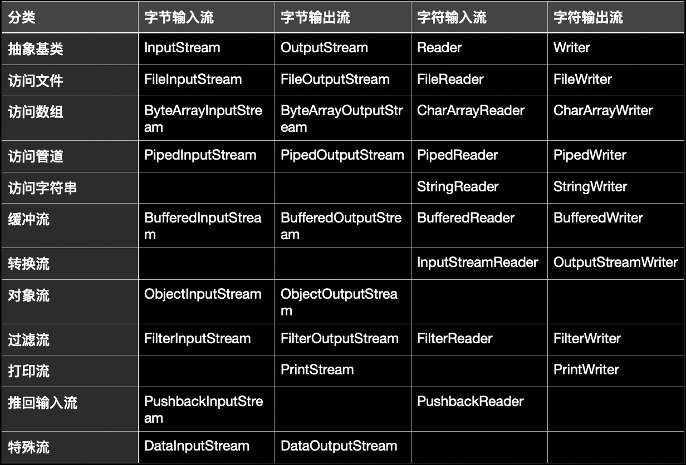

#### 节点流|文件流

* FileReader 读入数据

```java
// 建立一个流对象,将已存在的一个文件加载进流
FileReader fr= new FileReader(new File("Test.txt"));
// 创建一个临时存放数据的数组
char[] ch= new char[1024];
// 调用流对象的读取方法将流中的数据读入到数组中
// read()返回读入的一个字符.如果达到文件末尾,返回-1.
// read(char[] cbuf)返回每次读入cbuf数组中的字符的个数.如果达到文件末尾,返回-1.
fr.read(ch);
// 关闭资源
fr.close();
```

垃圾回收机制只回收 JVM 对内存的对象空间。对于其他的数据库、输入输出流、Socket物理连接无力，故需要手动关闭。

在抛出异常时，建议使用 try-catch，因在使用流时，若因调用 read 导致阻塞出现，可能出现 IOExcerption 异常，在创建异常对象后因是运行时异常就会抛出，导致后面程序不执行，那么就会使流未关闭，存在资源浪费的泄漏问题。

```java
import org.junit.Test;

import java.io.*;

/**
 * 一、流的分类
 * 1.操作数据单位:字节流、字符流
 * 2.数据的流向:输入流、输出流
 * 3.流的角色:节点流、处理流
 *
 * 二、流的体系结构
 * 抽象基类         节点流(或文件流)                                  缓冲流(处理流的一种)
 * InputStream     FileInputStream   (read(byte[] buffer))        BufferedInputStream (read(byte[] buffer))
 * OutputStream    FileOutputStream  (write(byte[] buffer,0,len)  BufferedOutputStream (write(byte[] buffer,0,len) / flush()
 * Reader          FileReader (read(char[] cbuf))                 BufferedReader (read(char[] cbuf) / readLine())
 * Writer          FileWriter (write(char[] cbuf,0,len)           BufferedWriter (write(char[] cbuf,0,len) / flush()
 */
public class FileReaderWriterTest {

    /**
     * 1. read()返回读入的一个字符.如果达到文件末尾,返回-1
     * 2. 异常的处理:为了保证流资源一定可以执行关闭操作.需要使用try-catch-finally处理
     * 3. 读入的文件一定要存在,否则就会报FileNotFoundException
     */
    @Test
    public void test1(){
        FileReader fr = null;
        try {
            // 实例化File对象,指明要操作的文件
            File file = new File("./src/com/.../IO/helloIO.txt");
            // 提供具体的流
            fr = new FileReader(file);

            // 3.数据的读入过程
            // read()返回读入的一个字符,如果达到文件末尾,返回-1.
            // 方式一:
        int data = fr.read();
        while(data != -1){
            System.out.print((char) data);
            data = fr.read();
        }

            // 方式二:语法上针对于方式一的修改
//            int data;
//            while((data = fr.read()) != -1){
//                System.out.print((char) data);
//            }
        } catch (IOException e) {
            e.printStackTrace();
        }finally {
            // 流的关闭操作
//            try {
//                if(fr != null)
            // 此时若 fr 对象未实例化就 close 会出现空指针问题
//                    fr.close();
//            } catch (IOException e) {
//                e.printStackTrace();
//            }

            // 或
            if(fr != null){
                try {
                    fr.close();
                } catch (IOException e) {
                    e.printStackTrace();
                }
            }

        }
    }

    // 对read()操作升级 => 使用read的重载方法
    @Test
    public void test2(){
        FileReader fr = null;
        try {
            // 1.File类的实例化
            File file = new File("./src/com/.../IO/helloIO.txt");

            // 2.FileReader流的实例化
            fr = new FileReader(file);

            // 3.读入的操作
            // read(char[] cbuf) => 返回每次读入cbuf数组中的字符的个数.如果达到文件末尾,返回-1
            char[] cbuf = new char[5];
            // char类型也对应一个int类型 => a = 97
            int len;

            while((len = fr.read(cbuf)) != -1){
                // 方式一
                // 错误的写法 => 若len不足cbuf.length会导致上次部分索引处数据未覆盖而读出
//                for(int i = 0;i < cbuf.length;i++){
//                    System.out.print(cbuf[i]);
//                }
                // 正确的写法
//                for(int i = 0;i < len;i++){
//                    System.out.print(cbuf[i]);
//                }

                // 方式二
                // 错误的写法,对应着方式一的错误的写法
//                String str = new String(cbuf);
//                System.out.print(str);
                // 正确的写法
                String str = new String(cbuf,0,len);
                System.out.print(str);
            }
        } catch (IOException e) {
            e.printStackTrace();
        }finally {
            if(fr != null){
                // 4.资源的关闭
                try {
                    fr.close();
                } catch (IOException e) {
                    e.printStackTrace();
                }

            }
        }
    }
}
```

* FileWriter 写出数据

```java
// 创建流对象,建立数据存放文件
FileWriterfw= new FileWriter(new File("Test.txt"));
// 调用流对象的写入方法，将数据写入流
fw.write("write something");
// 关闭流资源,并将流中的数据清空到文件中
fw.close();
```

```java
import org.junit.Test;

import java.io.*;

public class FileReaderWriterTest {
    /**
     * 从内存中写出数据到硬盘的文件里
     * 说明:
     * 1.输出操作,对应的File可以不存在,并不会报异常
     * 2.
     *   File对应的硬盘中的文件如果不存在,在输出的过程中,会自动创建此文件.
     *   File对应的硬盘中的文件如果存在
     *       如果流使用的构造器 => FileWriter(file,false) / FileWriter(file):对原有文件的覆盖
     *       如果流使用的构造器是 => FileWriter(file,true):不会对原有文件覆盖,而是在原有文件基础上追加内容
     */
    @Test
    public void test3(){
        FileWriter fw = null;
        try {
            // 提供File类的对象,指明写出到的文件
            File file = new File("./src/com/.../IO/helloIO.txt");

            // 提供FileWriter的对象,用于数据的写出
            fw = new FileWriter(file,true);

            // 写出的操作
            fw.write("I have a dream!\n");
            fw.write("you need to have a dream!");
        } catch (IOException e) {
            e.printStackTrace();
        } finally {
            // 流资源的关闭
            if(fw != null){
                try {
                    fw.close();
                } catch (IOException e) {
                    e.printStackTrace();
                }
            }
        }
    }
}
```

* FileReader 和 FileWriter 实现文本文件的复制

```java
import org.junit.Test;

import java.io.*;

public class FileReaderWriterTest {
    // 使用FileInputStream和FileOutputStream读写非文本文件
    @Test
    public void test4() {
        FileReader fr = null;
        FileWriter fw = null;
        try {
            // 1.创建File类的对象，指明读入和写出的文件
            File srcFile = new File("./src/com/.../IO/helloIO.txt");
            File srcFile2 = new File("./src/com/.../IO/helloIO.txt");

            // 不能使用字符流来处理图片等字节数据
//            File srcFile = new File("假装有图片.jpg");
//            File srcFile2 = new File("假装有图片1.jpg");

            // 2.创建输入流和输出流的对象
            fr = new FileReader(srcFile);
            fw = new FileWriter(srcFile2);

            //3.数据的读入和写出操作
            char[] cbuf = new char[5];
            int len; // 记录每次读入到cbuf数组中的字符的个数
            while((len = fr.read(cbuf)) != -1){
                // 每次写出len个字符
                fw.write(cbuf,0,len);
            }
        } catch (IOException e) {
            e.printStackTrace();
        } finally {
            // 4.关闭流资源
            // 方式一
//            try {
//                if(fw != null)
//                    fw.close();
//            } catch (IOException e) {
//                e.printStackTrace();
//            }finally{
//                try {
//                    if(fr != null)
//                        fr.close();
//                } catch (IOException e) {
//                    e.printStackTrace();
//                }
//            }
            // 方式二
            try {
                if(fw != null){
                    fw.close();}
            } catch (IOException e) {
                e.printStackTrace();
            }

            try {
                if(fr != null){
                    fr.close();}
            } catch (IOException e) {
                e.printStackTrace();
            }
        }
    }
}
```

* 使用FileInputStream不能读取文本文件

```java
import org.junit.Test;

import java.io.*;

public class FileReaderWriterTest {
    /**
     * 测试FileInputStream和FileOutputStream的使用
     *
     * 结论
     *    1. 对于文本文件(.txt,.java,.c,.cpp)，使用字符流处理
     *    2. 对于非文本文件(.jpg,.mp3,.mp4,.avi,.doc,.ppt,...)，使用字节流处理
     */
    @Test
    public void testFileInputStream(){
        FileInputStream fis = null;
        try {
            // 1.造文件
            File file = new File("./src/com/.../IO/helloIO.txt");

            // 2.造流
            fis = new FileInputStream(file);

            // 3.读数据
            byte[] buffer = new byte[5];
            int len; // 记录每次读取的字节的个数
            while((len = fis.read(buffer)) != -1){
                String str = new String(buffer,0,len);
                // 中文三个字节,英文一个字节 => 有中文则有概率乱码
                System.out.print(str);
            }
        } catch (IOException e) {
            e.printStackTrace();
        }finally {
            if(fis != null) {
                //4.关闭资源
                try {
                    fis.close();
                } catch (IOException e) {
                    e.printStackTrace();
                }
            }
        }
    }
}
```

* FileInputStream 和 FileOutputStream 读写非文本文件

```java
import org.junit.Test;

import java.io.*;

public class FileReaderWriterTest {
    /**
     * 实现对图片的复制操作
     */
    @Test
    public void testFileInputOutputStream()  {
        FileInputStream fis = null;
        FileOutputStream fos = null;
        try {
            // 1.造文件
            File srcFile = new File("./src/com/.../IO/假装有图片.jpeg");
            File destFile = new File("./src/com/.../IO/假装有图片2.jpeg");

            // 2.造流
            fis = new FileInputStream(srcFile);
            fos = new FileOutputStream(destFile);

            // 3.复制的过程
            byte[] buffer = new byte[5];
            int len;
            //4.读数据
            while((len = fis.read(buffer)) != -1){
                fos.write(buffer,0,len);
            }
            System.out.println("复制成功");
        } catch (IOException e) {
            e.printStackTrace();
        } finally {
            if(fos != null){
                //5.关闭资源
                try {
                    fos.close();
                } catch (IOException e) {
                    e.printStackTrace();
                }
            }
            if(fis != null){
                try {
                    fis.close();
                } catch (IOException e) {
                    e.printStackTrace();
                }

            }
        }
    }
}
```

#### 缓冲流

为提高数据读写的速度，Java API 提供了带缓冲功能的流类，在使用这些流类时，会创建一个内部缓冲区数组，缺省使用8192个字节(8Kb)的缓冲区。

```java
public class BufferedInputStream extends FilterInputStream {
    private static int DEFAULT_BUFFER_SIZE = 8192;
}
```

冲流要“套接”在相应的节点流之上，根据数据操作单位可以把缓冲流分为 BufferedInputStream 和 BufferedOutputStream 组和 BufferedReader 和 BufferedWriter 组。当读取数据时，数据按块读入缓冲区，其后的读操作则直接访问缓冲区。当使用 BufferedInputStream 读取字节文件时，BufferedInputStream 会一次性从文件中读取8192个(8Kb)，存在缓冲区中，直到缓冲区装满了，才重新从文件中读取下一个8192个字节数组。向流中写入字节时，不会直接写到文件，先写到缓冲区中直到缓冲区写满，BufferedOutputStream 才会把缓冲区中的数据一次性写到文件里。使用方法 `flush()` 可以强制将缓冲区的内容全部写入输出流。关闭流的顺序和打开流的顺序相反。只要关闭最外层流即可，关闭最外层流也会相应关闭内层节点流。`flush()` 方法的使用是手动将 buffer 中内容写入文件。如果是带缓冲区的流对象的 `close()` 方法，不但会关闭流，还会在关闭流之前刷新缓冲区，关闭后不能再写出。

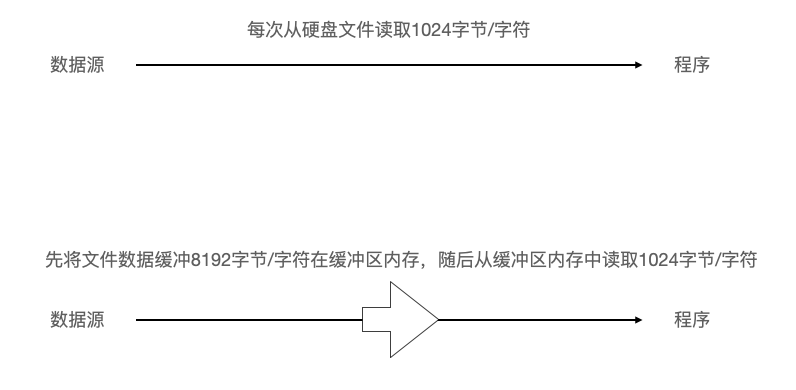

* 缓冲流(字节型)实现非文本文件的复制

```java
import org.junit.Test;

import java.io.*;

/**
 * 处理流之缓冲流的使用
 *
 *  1.缓冲流
 *  BufferedInputStream
 *  BufferedOutputStream
 *  BufferedReader
 *  BufferedWriter
 */
public class BufferedTest {
    /**
     * 实现非文本文件的复制
     */
    @Test
    public void BufferedStreamTest(){
        BufferedInputStream bis = null;
        BufferedOutputStream bos = null;
        try {
            // 1.造文件
            File srcFile = new File("./src/com/.../IO/假装有图片.jpeg");
            File destFile = new File("./src/com/.../IO/假装有图片3.jpeg");
            // 2.造流
            // 2.1 造节点流
            FileInputStream fis = new FileInputStream((srcFile));
            FileOutputStream fos = new FileOutputStream(destFile);
            // 2.2 造缓冲流
            bis = new BufferedInputStream(fis);
            bos = new BufferedOutputStream(fos);

            // 3.复制 => 读取、写入
            byte[] buffer = new byte[10];
            int len;
            while((len = bis.read(buffer)) != -1){
                bos.write(buffer,0,len);
//                bos.flush();//刷新缓冲区
            }
        } catch (IOException e) {
            e.printStackTrace();
        } finally {
            //4.资源关闭
            //要求：先关闭外层的流，再关闭内层的流
            if(bos != null){
                try {
                    bos.close();
                } catch (IOException e) {
                    e.printStackTrace();
                }

            }
            if(bis != null){
                try {
                    bis.close();
                } catch (IOException e) {
                    e.printStackTrace();
                }
            }
            // 关闭外层流的同时,内层流也会自动的进行关闭.内层流的关闭可以省略.
//        fos.close();
//        fis.close();
        }
    }
}
```

* 缓冲流(字符型)实现文本文件的复制

```java
import org.junit.Test;

import java.io.*;

public class BufferedTest {
    @Test
    public void copyTest(){
        BufferedReader br = null;
        BufferedWriter bw = null;
        try {
            // 创建文件和相应的流
            br = new BufferedReader(new FileReader(new File("./src/com/.../IO/helloIO.txt")));
            bw = new BufferedWriter(new FileWriter(new File("./src/com/.../IO/helloIO1.txt")));

            // 读写操作
            // 方式一 => 使用char[]数组
//            char[] cbuf = new char[1024];
//            int len;
//            while((len = br.read(cbuf)) != -1){
//                bw.write(cbuf,0,len);
//    //            bw.flush();
//            }

            // 方式二 => 使用String
            String data;
            while((data = br.readLine()) != null){
                // 方法一
//                bw.write(data + "\n"); // data中不包含换行符
                // 方法二
                bw.write(data); // data中不包含换行符
                bw.newLine(); // 提供换行的操作
            }

        } catch (IOException e) {
            e.printStackTrace();
        } finally {
            //关闭资源
            if(bw != null){
                try {
                    bw.close();
                } catch (IOException e) {
                    e.printStackTrace();
                }
            }
            if(br != null){
                try {
                    br.close();
                } catch (IOException e) {
                    e.printStackTrace();
                }
            }
        }
    }
}
```

#### 转换流

转换流提供了在字节流和字符流之间的转换。InputStreamReader 将 InputStream转换为Reader 实现将字节的输入流按指定字符集转换为字符的输入流，需要和 InputStream “套接”。OutputStreamWriter 将 Writer 转换为 OutputStream 实现将字符的输出流按指定字符集转换为字节的输出流，需要和 OutputStream “套接”。

```java
public InputStreamReader(InputStream);
public InputStreamReader(InputStream, Charset);
public OutputStreamWriter(OutputStream)
public OutputSreamWriter(OutputStream, Charset);
```

字节流中的数据都是字符时，转成字符流操作更高效。很多时候使用转换流来处理文件乱码问题。实现编码和解码的功能。

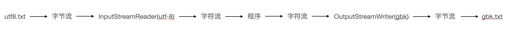

```java
import org.junit.Test;

import java.io.*;

/**
 * 处理流之转换流的使用
 * 1.转换流属于字符流
 *      InputStreamReader => 将一个字节的输入流转换为字符的输入流
 *      OutputStreamWriter => 将一个字符的输出流转换为字节的输出流
 *
 * 2.提供字节流与字符流之间的转换
 *
 * 3.解码：字节、字节数组 => 字符数组、字符串
 *   编码：字符数组、字符串 => 字节、字节数组
 *
 * 4.字符集
 */
public class InputStreamReaderTest {
    /**
     * 此时处理异常的话，仍然应该使用try-catch-finally
     * 综合使用InputStreamReader和OutputStreamWriter
     */
    @Test
    public void test1() throws IOException {
        // 1.造文件、造流
        File file1 = new File("./src/com/.../IO/helloIO.txt");
        File file2 = new File("./src/com/.../IO/helloIO1.txt");

        FileInputStream fis = new FileInputStream(file1);
        FileOutputStream fos = new FileOutputStream(file2);

        InputStreamReader isr = new InputStreamReader(fis,"utf-8");
        OutputStreamWriter osw = new OutputStreamWriter(fos,"gbk");

        // 2.读写过程
        char[] cbuf = new char[20];
        int len;
        while((len = isr.read(cbuf)) != -1){
            osw.write(cbuf,0,len);
        }

        // 3.关闭资源
        isr.close();
        osw.close();
    }
}
```

* 字符编码集

计算机只识别二进制数据，早期由来是电信号。为了方便应用计算机识别各个国家的文字,就将各个国家的文字用数字来一一对应表示，形成一张表。这就是编码表。

ASCII 占一个字节，即8位。其实只使用7位，即128个数。在 GB2312 和 GBK 都兼容 ASCII，GBK 包含繁体等其他更多的文字。在判断整体代表一个字符或者两个字符时，根据首字节的首位如果是0则8位表示一个字符，如果最高位是1，代表一个字节不够，使用两个字节表示一个字符。世界各国的字符集 Unicode 融入所有语言涉及到的字符，让其都有对应的数值。为每个字符分配唯一的字符码，所有文字都用两个字节表示。在内存层面存储 Unicode 没有问题，但是具体在底层文件中存在问题。在纯中文情况下可以考虑使用最高位判断，但在聚集全球所有文字的情况下，两字节需要消耗一位去判断字符会导致存放不够，即2^16可行，2^15不可行。

面向传输的 UTF (UCS Transfer Format) 标准顾名思义，UTF-8 每次8个位传输数据，而 UTF-16 就是每次16个位。这是为传输而设计的编码，并使编码无国界，这样就可以显示全世界上所有文化的字符了。Unicode只是定义了一个庞大的、全球通用的字符集，并为每个字符规定了唯一确定的编号，具体存储成什么样的字节流，取决于字符编码方案。推荐的 Unicode 编码是 UTF-8 和 UTF-16。一个汉字在 utf-8 里是三个字节存储。

```java
/**
  * 字符集
  *  ASCII：美国标准信息交换码。
  *     用一个字节的7位可以表示。
  *  ISO8859-1：拉丁码表。欧洲码表
  *     用一个字节的8位表示。
  *  GB2312：中国的中文编码表。最多两个字节编码所有字符
  *  GBK：中国的中文编码表升级，融合了更多的中文文字符号。最多两个字节编码
  *  Unicode：国际标准码，融合了目前人类使用的所有字符。为每个字符分配唯一的字符码。所有的文字都用两个字节来表示。
  *  UTF-8：变长的编码方式，可用1-4个字节来表示一个字符。
  */

```

```java
Unicode 符号范围 => 十六进制 | UTF-8 编码 => 二进制
0000 0000-0000 007F | 0xxxxxxx(兼容原ASCII)
0000 0080-0000 07FF | 110xxxxx 10xxxxxx
0000 0800-0000 FFFF | 1110xxx 10xxxxxx 10xxxxxx
0001 0000-0010 FFFF | 11110xxx 10xxxxxx 10xxxxxx 10xxxxxx
```

```java
逸 => Unicode 编码值:\u9038 => 十六进制:9038 => 二进制:1001000000111000
UTF-8编码:111010011000000010111000
```

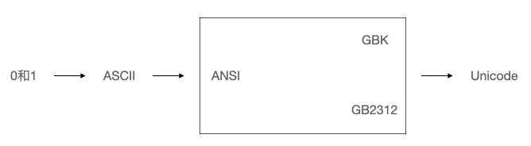

ANSI 编码通常指的平台默认编码，例如英文操作系统的 ISO-8859-1，中文系统是 GBK。Unicode 字符集只是定义字符和集合的唯一编号。Unicode 编码则是对 UTF-8、UCS-2/UTF-16 等具体编码方案的统称而已，并非具体编码方案。

#### 标准输入|输出流

System.in 和 System.out 分别代表了系统标准的输入和输出设备。默认输入设备是键盘，输出设备是显示器。System.in 的类型是 InputStream；System.out 的类型是 PrintStream，其是 OutputStream 的子类 FilterOutputStream 的子类。重定向即通过 System 类的 setIn，setOut 方法对默认设备进行改变。

```java
public static void setIn(InputStreamin)
public static void setOut(PrintStreamout)
```

```java
import org.junit.Test;

import java.io.BufferedReader;
import java.io.IOException;
import java.io.InputStreamReader;

/**
 * 其他流的使用
 * 1.标准的输入、输出流
 * 2.打印流
 * 3.数据流
 */
public class OtherStreamTest {

    /**
     * 1.标准的输入、输出流
     *   1.1
     *     System.in => 标准的输入流默认从键盘输入
     *     System.out => 标准的输出流默认从控制台输出
     *   1.2
     *     System类的setIn(InputStream is) / setOut(PrintStream ps)方式重新指定输入和输出的流。
     *
     *   1.3
     *     从键盘输入字符串,要求将读取到的整行字符串转成大写输出.然后继续进行输入操作,直至当输入“e”或者“exit”时，退出程序.
     *
     *   方法一 => 使用Scanner实现,调用next()返回一个字符串
     *   方法二 => 使用System.in实现.System.in --->  转换流 ---> BufferedReader的readLine()
     */
    @Test
    public void test(){
        BufferedReader br = null;
        try {
            InputStreamReader isr = new InputStreamReader(System.in);
            br = new BufferedReader(isr);

            while (true) {
                System.out.println("请输入字符串：");
                String data = br.readLine();
                if ("e".equalsIgnoreCase(data) || "exit".equalsIgnoreCase(data)) {
                    System.out.println("程序结束");
                    break;
                }

                String upperCase = data.toUpperCase();
                System.out.println(upperCase);

            }
        } catch (IOException e) {
            e.printStackTrace();
        } finally {
            if (br != null) {
                try {
                    br.close();
                } catch (IOException e) {
                    e.printStackTrace();
                }

            }
        }
    }
}
```

#### 打印流

实现将基本数据类型的数据格式转化为字符串输出。打印流 PrintStream 和 PrintWriter 提供一系列重载的 `print()` 和 `println()` 方法，用于多种数据类型的输出。PrintStream 和 PrintWriter 的输出不会抛出 IOException 异常。PrintStream 和 PrintWriter 有自动 flush 功能。PrintStream 打印的所有字符都使用平台的默认字符编码转换为字节。在需要写入字符而不是写入字节的情况下，应该使用 PrintWriter 类。System.out 返回的是 PrintStream 的实例。

```java
import org.junit.Test;

import java.io.*;

public class OtherStreamTest {
    /**
     *  打印流 PrintStream 和PrintWriter 提供了一系列重载的print() 和 println()
     */
    @Test
    public void test2(){
        PrintStream ps = null;
        try {
            FileOutputStream fos = new FileOutputStream(new File("./src/com/.../IO/helloIO.txt"));
            // 创建打印输出流,设置为自动刷新模式(写入换行符或字节 '\n' 时都会刷新输出缓冲区)
            ps = new PrintStream(fos, true);
            if (ps != null) { // 把标准输出流(控制台输出)改成文件
                System.setOut(ps);
            }

            for (int i = 0; i <= 255; i++) { // 输出ASCII字符
                System.out.print((char) i);
                if (i % 50 == 0) { // 每50个数据一行
                    System.out.println(); // 换行
                }
            }

        } catch (FileNotFoundException e) {
            e.printStackTrace();
        } finally {
            if (ps != null) {
                ps.close();
            }
        }
    }
}
```

#### 数据流

为方便操作 Java 语言的基本数据类型和 String 的数据，可以使用数据流。数据流有两个类，DataInputStream 和 DataOutputStream，分别“套接”在 InputStream 和 OutputStream 子类的流上，用于读取和写出基本数据类型与 String 类的数据。

```java
// DataInputStream 中的方法
boolean readBoolean()	byte readByte()
char readChar()	float readFloat()
double readDouble()	short readShort()
long readLong()	int readInt()
String readUTF()	void readFully(byte[s] b)
// DataOutputStream 中的方法
boolean writeBoolean()	byte writeByte()
char writeChar()	float writeFloat()
double writeDouble()	short writeShort()
long writeLong()	int writeInt()
String writeUTF()	void writeFully(byte[s] b)
```

```java
import org.junit.Test;

import java.io.*;

public class OtherStreamTest {
    /**
     * 数据流
     * DataInputStream 和 DataOutputStream 用于读取或写出基本数据类型的变量或字符串
     * 处理异常的话，仍然应该使用try-catch-finally.
     */
    @Test
    public void test3() throws IOException {
        // 将内存中的字符串、基本数据类型的变量写出到文件中
        DataOutputStream dos = new DataOutputStream(new FileOutputStream("./src/com/.../IO/DataOutputStreamTest.txt"));
        dos.writeUTF("zs");
        dos.flush(); // 刷新操作，将内存中的数据写入文件
        dos.writeInt(21);
        dos.flush();
        dos.writeBoolean(true);
        dos.flush();
        dos.close();
    }

    /**
     * 将文件中存储的基本数据类型变量和字符串读取到内存中保存在变量中。
     * 读取不同类型的数据的顺序要与当初写入文件时保存的数据的顺序一致！
     */
    @Test
    public void test4() throws IOException {
        DataInputStream dis = new DataInputStream(new FileInputStream("./src/com/.../IO/DataOutputStreamTest.txt"));
        String name = dis.readUTF();
        int age = dis.readInt();
        boolean isMale = dis.readBoolean();

        System.out.println("name = " + name);
        System.out.println("age = " + age);
        System.out.println("isMale = " + isMale);

        dis.close();
    }
}
```

#### 对象流

* 对象序列化机制

OjbectOutputSteam 和 ObjectInputStream 是用于写入存储和读取基本数据类型数据或对象的处理流。序列化即用 ObjectOutputStream 类写入基本类型数据或对象的机制，反序列化即用 ObjectInputStream 类读取基本类型数据或对象的机制。ObjectOutputStream 和 ObjectInputStream 不能序列化 static 和 transient 修饰的成员变量。对象序列化机制允许把内存中的 Java 对象转换成平台无关的二进制流，从而持久地保存在磁盘上；或通过网络将这种二进制流传输到另一个网络节点。当其它程序获取了这种二进制流，就可以恢复成原来的 Java 对象。序列化的好处在于可将任何实现了 Serializable 接口的对象转化为字节数据，使其在保存和传输时可被还原。序列化是 RMI(Remote Method Invoke 远程方法调用)过程中参数和返回值都必须实现的机制，而 RMI 是 JavaEE 的基础。因此序列化机制是 JavaEE 平台的基础。

如需让某个对象支持序列化机制，则必须对象所属的类及其属性是可序列化的。为让某个类可序列化，则该类必须实现 Serializable、Externalizable 两个接口之一，否则会抛出 NotSerializableException 异常。

```java
import org.junit.Test;

import java.io.*;

/**
 * 对象流的使用
 * 1.ObjectInputStream 和 ObjectOutputStream
 * 2.用于存储和读取基本数据类型数据或对象的处理流.把Java中的对象写入到数据源中,也能把对象从数据源中还原回来.
 */
public class ObjectTest {
    /**
     * 序列化过程：将内存中的java对象保存到磁盘中或通过网络传输出去
     * 使用ObjectOutputStream实现
     */
    @Test
    public void test1(){
        ObjectOutputStream oos = null;
        try {
            // 创造流
            oos = new ObjectOutputStream(new FileOutputStream("./src/com/.../IO/ObjInputOutputStreamTest.tmp"));
            // 制造对象
            oos.writeObject(new String("天官赐福"));
            // 刷新操作
            oos.flush();
        } catch (IOException e) {
            e.printStackTrace();
        } finally {
            if(oos != null){
                //3.关闭流
                try {
                    oos.close();
                } catch (IOException e) {
                    e.printStackTrace();
                }
            }
        }
    }
    /**
     * 反序列化：将磁盘文件中的对象还原为内存中的一个java对象
     * 使用ObjectInputStream来实现
     */
    @Test
    public void test2(){
        ObjectInputStream ois = null;
        try {
            ois = new ObjectInputStream(new FileInputStream("./src/com/.../IO/ObjInputOutputStreamTest.tmp"));
            Object obj = ois.readObject();
            String str = (String) obj;
            System.out.println(str);
        } catch (IOException e) {
            e.printStackTrace();
        } catch (ClassNotFoundException e) {
            e.printStackTrace();
        } finally {
            if(ois != null){
                try {
                    ois.close();
                } catch (IOException e) {
                    e.printStackTrace();
                }
            }
        }
    }
}
```

* 自定义类实现序列化与反序列化

若某个类实现 Serializable 接口，该类的对象就是可序列化的。创建一个 ObjectOutputStream，调用 ObjectOutputStream 对象的 writeObject(对象) 方法输出可序列化对象。注意写出一次，操作 `flush()` 一次。这是由于 `flush()` 方法可以强迫输出流(或缓冲的流)发送数据，即使此时缓冲区还没有填满，以此来打破这种死锁的状态。当使用输出流发送数据时，数据不能填满输出流的缓冲区时，这些数据就会被存储在输出流的缓冲区中。若此时调用关闭(close)输出流，存储在输出流的缓冲区中的数据就会丢失。反序列化应创建一个 ObjectInputStream 对象调用 `readObject()` 方法读取流中的对象。值得一提的是，若某个类的属性不是基本数据类型或 String 类型，而是引用类型，那么这个引用类型必须是可序列化的，否则拥有该类型的 Field 的类也不能序列化。

```java
import org.junit.Test;

import java.io.*;
public class ObjectTest {
    @Test
    public void test1(){
        ObjectOutputStream oos = null;
        try {
            // 创造流
            oos = new ObjectOutputStream(new FileOutputStream("./src/com/.../IO/ObjInputOutputStreamTest.tmp"));
            // 制造对象
            oos.writeObject(new String("天官赐福"));
            // 刷新操作
            oos.flush();
            // custom class serialization
            oos.writeObject(new Person("zs",21));
            oos.flush();
        } catch (IOException e) {
            e.printStackTrace();
        } finally {
            if(oos != null){
                //3.关闭流
                try {
                    oos.close();
                } catch (IOException e) {
                    e.printStackTrace();
                }
            }
        }
    }
    /**
     * 反序列化：将磁盘文件中的对象还原为内存中的一个java对象
     * 使用ObjectInputStream来实现
     */
    @Test
    public void test2(){
        ObjectInputStream ois = null;
        try {
            ois = new ObjectInputStream(new FileInputStream("./src/com/.../IO/ObjInputOutputStreamTest.tmp"));
            Object obj = ois.readObject();
            String str = (String) obj;
            System.out.println(str);
            Person p = (Person) ois.readObject();
            System.out.println(p);
        } catch (IOException e) {
            e.printStackTrace();
        } catch (ClassNotFoundException e) {
            e.printStackTrace();
        } finally {
            if(ois != null){
                try {
                    ois.close();
                } catch (IOException e) {
                    e.printStackTrace();
                }
            }
        }
    }
}
```

* serialVersionUID 的理解

凡是实现 Serializable 接口的类都有一个表示序列化版本标识符的静态变量 serialVersionUID 用来表明类的不同版本间的兼容性。简言之其目的是以序列化对象进行版本控制，有关各版本反序列化时是否兼容。

若类没有显示定义这个静态常量，那么其值是 Java 运行时环境根据类的内部细节自动生成的。若类的实例变量做了修改，serialVersionUID 可能发生变化。故建议显式声明。

简单来说，Java 的序列化机制是通过在运行时判断类的 serialVersionUID 来验证版本一致性的。在进行反序列化时，JVM 会把传来的字节流中的 serialVersionUID 与本地相应实体类的 serialVersionUID 进行比较，如果相同就认为是一致的，可以进行反序列化，否则就会出现序列化版本不一致的异常 InvalidCastException。

#### 随机存取文件流

RandomAccessFile 声明在 java.io 包下，但直接继承于 java.lang.Object 类。其实现了 DataInput、DataOutput 这两个接口，也就意味着这个类既可以读也可以写。RandomAccessFile 类支持“随机访问” 的方式，程序可以直接跳到文件的任意地方来读、写文件，这就使其具有支持只访问文件部分内容与可追加内容的应用性。

RandomAccessFile 对象包含一个记录指针，用以标示当前读写处的位置。RandomAccessFile 类对象可以使用获取文件记录指针的当前位置的 `long getFilePointer()` 方法和将文件记录指针定位到pos位置的 `void seek(long pos)` 方法自由操作记录指针。

```java
// 构造器
RandomAccessFile(File file, String mode)
RandomAccessFile(String name, String mode)
// mode参数
r => 以只读方式打开
rw => 打开以便读取和写入
rwd => 打开以便读取和写入；同步文件内容的更新
rws => 打开以便读取和写入；同步文件内容和元数据的更新
```

如果模式为只读 r。则不会创建文件，而是会去读取一个已经存在的文件，如果读取的文件不存在则会出现异常。如果模式为 rw 读写。如果文件不存在则会去创建文件，如果存在则不会创建。

```java
import org.junit.Test;

import java.io.File;
import java.io.IOException;
import java.io.RandomAccessFile;

/**
 * RandomAccessFile的使用
 * RandomAccessFile直接继承于java.lang.Object类,实现了DataInput和DataOutput接口,既可以作为一个输入流,又可以作为一个输出流
 * 如果RandomAccessFile作为输出流时,写出到的文件如果不存在,则在执行过程中自动创建.如果写出到的文件存在,则会对原有文件内容进行覆盖
 */
public class RandomAccessFileTest {
    @Test
    public void test1(){
        RandomAccessFile raf1 = null;
        RandomAccessFile raf2 = null;
        try {
            raf1 = new RandomAccessFile(new File("./src/com/.../IO/假装有图片.jpeg"),"r");
            raf2 = new RandomAccessFile(new File("./src/com/.../IO/假装有图片11.jpeg"),"rw");

            byte[] buffer = new byte[1024];
            int len;
            while((len = raf1.read(buffer)) != -1){
                raf2.write(buffer,0,len);
            }
        } catch (IOException e) {
            e.printStackTrace();
        } finally {
            if(raf1 != null){
                try {
                    raf1.close();
                } catch (IOException e) {
                    e.printStackTrace();
                }
            }
            if(raf2 != null){
                try {
                    raf2.close();
                } catch (IOException e) {
                    e.printStackTrace();
                }
            }
        }
    }

    @Test
    public void test2() throws IOException {
        RandomAccessFile raf1 = new RandomAccessFile("./src/com/.../IO/randomhello.txt","rw");
        raf1.write("abcdefg".getBytes());
        raf1.close();
    }

    /**
     * 使用RandomAccessFile实现数据的插入效果
     */
    @Test
    public void test3() throws IOException {
        RandomAccessFile raf1 = new RandomAccessFile("./src/com/.../IO/randomhello.txt","rw");

        raf1.seek(3);//将指针调到角标为3的位置
        // 保存指针3后面的所有数据到StringBuilder中
        StringBuilder builder = new StringBuilder((int) new File("./src/com/.../IO/randomhello.txt").length());
        byte[] buffer = new byte[20];
        int len;
        while((len = raf1.read(buffer)) != -1){
            builder.append(new String(buffer,0,len)) ;
        }
        // 调回指针，写入“xyz”
        raf1.seek(3);
        raf1.write("xyz".getBytes());

        // 将StringBuilder中的数据写入到文件中
        raf1.write(builder.toString().getBytes());
        raf1.close();
    }
}
```

#### NIO.2中Path、Paths、Files类的使用

Java NIO (New IO，Non-Blocking IO) 是从Java 1.4版本开始引入的一套新的IO API，可以替代标准的 Java IO API。NIO 与原来的 IO 有同样的作用和目的，但使用的方式完全不同，NIO 支持面向缓冲区的(IO是面向流的)、基于通道的 IO 操作。NIO 将以更加高效的方式进行文件的读写操作。Java API 中提供了两套 NIO，一套是针对标准输入输出 NIO，另一套就是网络编程 NIO。

```java
|-----java.nio.channels.Channel
    |-----FileChannel => 处理本地文件
    |-----SocketChannell => TCP网络编程的客户端的Channel
    |-----ServerSocketChannell => TCP网络编程的服务器端的Channel
    |-----DatagramChannell => UDP网络编程中发送端和接收端的Channel
```

随着 JDK 7 的发布，Java 对 NIO 进行了极大的扩展，增强了对文件处理和文件系统特性的支持，以至于称为 NIO.2。因为 NIO 提供的一些功能，NIO 已经成为文件处理中越来越重要的部分。早期的 Java 只提供了一个 File 类来访问文件系统，但 File 类的功能比较有限，所提供的方法性能也不高。而且大多数方法在出错时仅返回失败，并不会提供异常信息。NIO.2 为弥补这种不足，引入了 Path 接口，代表一个平台无关的平台路径，描述了目录结构中文件的位置。Path 可以看成是 File 类的升级版本，实际引用的资源也可以不存在。

```java
// 以前IO操作
import java.io.File;
File file = new File(“index.html”);
// Java7
import java.nio.file.Path;
import java.nio.file.Paths;
Path path = Paths.get(“index.html”);
```

同时，NIO.2 在 java.nio.file 包下还提供 Files、Paths 工具类，Files 包含了大量静态的工具方法来操作文件；Paths 则包含了两个返回 Path 的静态工厂方法。

```java
static Pathget(String first, String … more); // 用于将多个字符串串连成路径
static Path get(URI uri); // 返回指定uri对应的Path路径
```

### 网络编程

Java 是 Internet 上的语言，从语言级上提供了对网络应用程序的支持，程序员能够很容易开发常见的网络应用程序。Java 提供的网络类库，可以实现简易的网络连接，联网的底层细节被隐藏在 Java 的本机安装系统里，由 JVM 进行控制。并且 Java 实现了一个跨平台的网络库，程序员面对的是一个统一的网络编程环境。

计算机网络可以认为是把分布在不同地理区域的计算机与专门的外部设备用通信线路互连成一个规模大、功能强的网络系统，从而使众多的计算机可以方便地互相传递信息、共享硬件、软件、数据信息等资源。

网络编程的目的在于直接或间接地通过网络协议与其它计算机实现数据交换，进行通讯。但网络编程中存在两个主要的问题，如何准确地定位网络上一台或多台主机或特定的应用以及找到主机后如何可靠高效地进行数据传输。

#### 网络通信要素

通信双方地址要求 IP 和端口号，以及一定的规则，即网络通信协议的 OSI 参考模型和
 TCP/IP 参考模型。

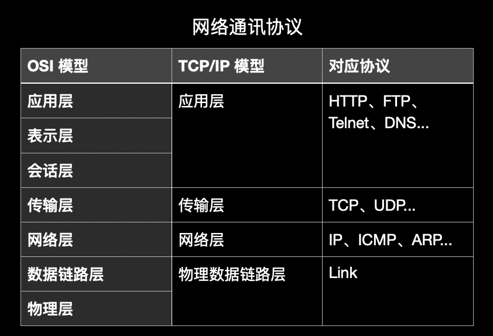

* IP的理解与InetAddress类的实例化

IP 地址即 InetAddress，是Internet 上的计算机的唯一的标识（通信实体）。本地回环地址 hostAddress 127.0.0.1 的主机名 hostName 是 localhost。

IP地址可分类为 IPV4 和 IPV6。IPV4 由4个字节组成，4个0-255。大概有42亿，30亿都在北美，亚洲4亿。2011年初已经用尽，以点分十进制表示，如192.168.0.1。IPV6 有128位（16个字节），写成8个无符号整数，每个整数用四个十六进制位表示，数之间用冒号分开，如 3ffe:3201:1401:1280:c8af:fe4d:db39:1684。

IP 地址也可分类为万维网使用的公网地址和局域网使用的私有地址。192.168. 开头的就是私有地址，范围即 192.168.0.0–192.168.255.255，专门为组织机构内部使用。

Internet 上的主机可使用使用域名或者 IP 表示地址。域名容易记忆，当在连接网络时输入一个主机的域名后，域名服务器 DNS 负责将域名转化成 IP 地址，这样才能和主机建立连接。

InetAddress 类主要表示IP地址，其有两个子类 Inet4Address 与 Inet6Address。InetAddress 类对象含有Internet 主机地址的域名与IP地址。

hosts 作用在于先在本地 etc/hosts 找域名对应 IP 地址，找不到才会进行 DNS 解析。

```java
import java.net.InetAddress;
import java.net.UnknownHostException;

/**
 * 在Java中使用InetAddress类代表IP
 *
 * 实例化InetAddress的两个常用方法 => getByName(String host) 、getLocalHost()
 *        两个常用方法：getHostName() / getHostAddress()
 *
 * 端口号即正在计算机上运行的进程,要求不同的进程有不同的端口号,规定为一个 16 位的整数 0~65535
 *
 * 端口号与IP地址的组合得出一个网络套接字：Socket
 */
public class InetAddressTest {
    public static void main(String[] args) {
        try {
            // 传入目标主机的名字 InetAddress 会尝试做连接DNS服务器并且获取IP地址的操作
            InetAddress inet1 = InetAddress.getByName("192.168.04.22");
            System.out.println(inet1);
            InetAddress inet2 = InetAddress.getByName("www.google.com");
            System.out.println(inet2);

            // 获取本地ip
            InetAddress inet4 = InetAddress.getLocalHost();
            System.out.println(inet4);
            // getHostName()
            System.out.println(inet2.getHostName());
            // getHostAddress()
            System.out.println(inet2.getHostAddress());
        } catch (UnknownHostException e) {
            e.printStackTrace();
        }
    }
}
```

* 端口号

端口号标识正在计算机上运行的进程（程序），不同的进程有不同的端口号。规定为一个 16 位的整数 0~65535。

被预先定义的服务通信公认端口 0-1023（HTTP占用端口80，FTP占用端口21，Telnet占用端口23）；分配给用户进程或应用程序的注册端口 1024-49151（Tomcat占用端口8080，MySQL占用端口3306，Oracle占用端口1521）；以及动态/私有端口 49152-65535。端口号与IP地址的组合得出一个网络套接字 Socket。

#### 网络协议

计算机网络中实现通信必须有一些约定，即通信协议，对速率、传输代码、代码结构、传输控制步骤、出错控制等制定标准。

传输层协议中有两个非常重要的协议，传输控制协议 TCP(Transmission Control Protocol) 和用户数据报协议 UDP(User Datagram Protocol)。

TCP/IP 以其传输控制协议(TCP)和网络互联协议(IP)而得名，实际上是一组协议，包括多个具有不同功能且互为关联的协议。IP(Internet Protocol) 协议是网络层的主要协议，支持网间互连的数据通信。TCP/IP协议模型从更实用的角度出发，形成了高效的四层体系结构，即物理链路层、IP层、传输层和应用层。

使用 TCP 协议前，须先建立 TCP 连接，形成传输数据通道。传输前，采用“三次握手”方式，点对点通信，是可靠的。TCP协议进行通信的两个应用进程是客户端、服务端。在连接中可进行大数据量的传输，传输完毕需释放已建立的连接，效率低。

UDP 协议将数据、源、目的封装成数据包，不需要建立连接。每个数据报的大小限制在64K内。发送时不管对方是否准备好与接受到，故是不可靠的，但发送数据结束时无需释放资源，开销小，速度快。

#### TCP 网络编程

```java
import org.junit.Test;

import java.io.*;
import java.net.InetAddress;
import java.net.ServerSocket;
import java.net.Socket;

/**
 * TCP的网络编程
 * 客户端发送信息给服务端，服务端将数据显示在控制台上
 */
public class TCPTest {

    // 客户端
    @Test
    public void client()  {
        Socket socket = null;
        OutputStream os = null;
        try {
            // 1.创建Socket对象指明服务器端的ip和端口号
            InetAddress inet = InetAddress.getByName("127.0.0.1");
            socket = new Socket(inet,8899);
            // 2.获取一个输出流用于输出数据
            os = socket.getOutputStream();
            // 3.写出数据的操作
            os.write("你好，我是客户端aa".getBytes());
        } catch (IOException e) {
            e.printStackTrace();
        } finally {
            // 4.资源的关闭
            if(os != null){
                try {
                    os.close();
                } catch (IOException e) {
                    e.printStackTrace();
                }
            }
            if(socket != null){
                try {
                    socket.close();
                } catch (IOException e) {
                    e.printStackTrace();
                }

            }
        }
    }
    // 服务端
    @Test
    public void server()  {
        ServerSocket ss = null;
        Socket socket = null;
        InputStream is = null;
        ByteArrayOutputStream baos = null;
        try {
            // 1.创建服务器端的ServerSocket指明自己的端口号
            ss = new ServerSocket(8899);
            // 2.调用accept()表示接收来自于客户端的socket
            socket = ss.accept();
            // 3.获取输入流
            is = socket.getInputStream();

            // 不建议这样写，可能会有乱码
//        byte[] buffer = new byte[1024];
//        int len;
//        while((len = is.read(buffer)) != -1){
//            String str = new String(buffer,0,len);
//            System.out.print(str);
//        }
            // 4.读取输入流中的数据
            baos = new ByteArrayOutputStream();
            byte[] buffer = new byte[5];
            int len;
            while((len = is.read(buffer)) != -1){
                baos.write(buffer,0,len);
            }

            System.out.println(baos.toString());
            System.out.println("收到了来自于：" + socket.getInetAddress().getHostAddress() + "的数据");

        } catch (IOException e) {
            e.printStackTrace();
        } finally {
            if(baos != null){
                // 5.关闭资源
                try {
                    baos.close();
                } catch (IOException e) {
                    e.printStackTrace();
                }
            }
            if(is != null){
                try {
                    is.close();
                } catch (IOException e) {
                    e.printStackTrace();
                }
            }
            if(socket != null){
                try {
                    socket.close();
                } catch (IOException e) {
                    e.printStackTrace();
                }
            }
            if(ss != null){
                try {
                    ss.close();
                } catch (IOException e) {
                    e.printStackTrace();
                }
            }
        }
    }

    /**
     * 实现TCP的网络编程
     * 从客户端发送文件给服务端,服务端保存到本地,并返回“发送成功”给客户端,最后关闭相应的连接.
     */
    @Test
    public void test1() throws IOException {
        Socket socket = new Socket(InetAddress.getByName("127.0.0.1"),9090);
        OutputStream os = socket.getOutputStream();
        FileInputStream fis = new FileInputStream(new File("./src/com/.../networkProgramming/changsha.JPEG"));
        byte[] buffer = new byte[1024];
        int len;
        while((len = fis.read(buffer)) != -1){
            os.write(buffer,0,len);
        }
        // 关闭数据的输出
        socket.shutdownOutput();

        // 接收来自于服务器端的数据,并显示到控制台上
        InputStream is = socket.getInputStream();
        ByteArrayOutputStream baos = new ByteArrayOutputStream();
        byte[] bufferr = new byte[20];
        int len1;
        while((len1 = is.read(buffer)) != -1){
            baos.write(buffer,0,len1);
        }
        System.out.println(baos.toString());

        fis.close();
        os.close();
        socket.close();
        baos.close();
    }

    @Test
    public void test2() throws IOException {
        ServerSocket ss = new ServerSocket(9090);
        Socket socket = ss.accept();
        InputStream is = socket.getInputStream();
        FileOutputStream fos = new FileOutputStream(new File("./src/com/.../networkProgramming/changsha1.JPEG"));
        byte[] buffer = new byte[1024];
        int len;
        while((len = is.read(buffer)) != -1){
            fos.write(buffer,0,len);
        }

        System.out.println("图片传输完成");

        // 服务器端给予客户端反馈
        OutputStream os = socket.getOutputStream();
        os.write("你好，照片我已收到，风景不错！".getBytes());

        fos.close();
        is.close();
        socket.close();
        ss.close();
        os.close();
    }
}
```

#### UDP 网络编程

类 DatagramSocket 和 DatagramPacket 实现了基于 UDP 协议网络程序。UDP 数据报通过数据报套接字 DatagramSocket 发送和接收，系统不保证 UDP 数据报一定能够安全送到目的地，也不能确定什么时候可以抵达。DatagramPacket 对象封装 UDP 数据报，在数据报中包含了发送端的 IP 地址和端口号以及接收端的 IP 地址和端口号。UDP 协议中每个数据报都给出完整的地址信息，因此无须建立发送方和接收方的连接。如同发快递包裹一样。

流程是 DatagramSocket 与 DatagramPacket => 建立发送端与接收端 => 建立数据包 => 调用 Socket 的发送、接收方法 => 关闭 Socket。

```java
import org.junit.Test;

import java.io.IOException;
import java.net.DatagramPacket;
import java.net.DatagramSocket;
import java.net.InetAddress;

/**
 * UDP协议的网络编程
 */
public class UDPTest {

    // 发送端
    @Test
    public void sender() throws IOException {
        DatagramSocket socket = new DatagramSocket();
        String str = "UDP发送端数据";
        byte[] data = str.getBytes();
        InetAddress inet = InetAddress.getLocalHost();
        DatagramPacket packet = new DatagramPacket(data,0,data.length,inet,9090);
        socket.send(packet);
        socket.close();
    }

    // 接收端
    @Test
    public void receiver() throws IOException {
        DatagramSocket socket = new DatagramSocket(9090);
        byte[] buffer = new byte[100];
        DatagramPacket packet = new DatagramPacket(buffer,0,buffer.length);
        socket.receive(packet);
        System.out.println(new String(packet.getData(),0,packet.getLength()));
        socket.close();
    }
}
```

#### URL 编程

* URI、URL 和 URN 的区别

URI uniform resource identifier 统一资源标识符，用来唯一的标识一个资源。而 URL uniform resource locator 统一资源定位符是一种具体的 URI，即 URL 可以用来标识一个资源，而且还指明了如何 locate 这个资源。而 URN uniform resource name 统一资源命名是通过名字来标识资源，比如 mailto:java-net@java.sun.com。也就是说，URI 是以一种抽象的，高层次概念定义统一资源标识，而 URL 和 URN 则是具体的资源标识的方式。URL 和 URN 都是一种 URI。在 Java 的 URI 中，一个 URI 实例可以代表绝对的，也可以是相对的，只要符合 URI 的语法规则。而 URL 类则不仅符合语义，还包含了定位该资源的信息，因此它不能是相对的。

* URL 的理解与实例化

```java
import java.net.MalformedURLException;
import java.net.URL;

public class URLTest {
    public static void main(String[] args) {
        try {
            URL url = new URL("https://www.google.com.hk/images/branding/googlelogo/1x/googlelogo_light_color_272x92dp.png");

//          public String getProtocol() => 获取该URL的协议名
            System.out.println(url.getProtocol());
//          public String getHost() => 获取该URL的主机名
            System.out.println(url.getHost());
//          public String getPort() => 获取该URL的端口号
            System.out.println(url.getPort());
//          public String getPath() => 获取该URL的文件路径
            System.out.println(url.getPath());
//          public String getFile() => 获取该URL的文件名
            System.out.println(url.getFile());
//          public String getQuery() => 获取该URL的查询名
            System.out.println(url.getQuery());
        } catch (MalformedURLException e) {
            e.printStackTrace();
        }
    }
}
```

* URL 网络编程实现 Tomcat 服务端数据下载

```java
import java.io.FileOutputStream;
import java.io.IOException;
import java.io.InputStream;
import java.net.HttpURLConnection;
import java.net.URL;

public class URLTest1 {
    public static void main(String[] args) {
        HttpURLConnection urlConnection = null;
        InputStream is = null;
        FileOutputStream fos = null;
        try {
            URL url = new URL("http://127.0.0.1:8080/networkprogramming/p.jpg");

            urlConnection = (HttpURLConnection) url.openConnection();

            urlConnection.connect();

            is = urlConnection.getInputStream();
            fos = new FileOutputStream("./p.jpg");

            byte[] buffer = new byte[1024];
            int len;
            while((len = is.read(buffer)) != -1){
                fos.write(buffer,0,len);
            }

            System.out.println("下载完成");
        } catch (IOException e) {
            e.printStackTrace();
        } finally {
            // 关闭资源
            if(is != null){
                try {
                    is.close();
                } catch (IOException e) {
                    e.printStackTrace();
                }
            }
            if(fos != null){
                try {
                    fos.close();
                } catch (IOException e) {
                    e.printStackTrace();
                }
            }
            if(urlConnection != null){
                urlConnection.disconnect();
            }
        }
    }
}
```

### 反射与动态代理

#### Java反射机制概述

Reflection 反射是被视为动态语言的关键，反射机制允许程序在执行期借助于 Reflection API 取得任何类的内部信息，并能直接操作任意对象的内部属性及方法。动态语言在运行代码时可根据某些条件改变自身结构，相应的运行时结构不可改变的语言就是静态语言。

加载完类之后，在堆内存的方法区中就产生了一个 Class 类型的对象（一个类只有一个Class对象），这个对象就包含了完整的类的结构信息，可以通过这个对象看到类的结构。这个对象就像一面镜子，透过这个镜子看到类的结构，形象的称之为反射。

在正常情况下，首先引入需要的"包类"名称，通过 new 实例化取得实例化对象。在反射的方式下，通过实例化对象的 `getClass()` 方法得到完整的"包类"情况。

由上述可知，在运行时判断任意一个对象所属的类，在运行时构造任意一个类的对象，在运行时判断任意一个类所具有的成员变量和方法，在运行时获取泛型信息，在运行时调用任意一个对象的成员变量和方法，在运行时处理注解，以及生成动态代理都可以由反射机制提供支持。

```java
// 反射相关的主要API
java.lang.Class => 代表一个类
java.lang.reflect.Method => 代表类的方法
java.lang.reflect.Field => 代表类的成员变量
java.lang.reflect.Constructor => 代表类的构造器
```

```java
import org.junit.Test;

import java.lang.reflect.Constructor;
import java.lang.reflect.Field;
import java.lang.reflect.Method;

public class ReflectionTest {

    // 反射操作
    @Test
    public void test1() throws Exception{
        // Class clazz = Person.class; => Person.class 表示类本身充当 Class 实例,Java 中的 Person 更多的看作一个类型,故需要 .class
        Class clazz = Person.class;
        // 1.通过反射创建Person类的对象
        Constructor cons = clazz.getConstructor(String.class,int.class); // 只返回参数类型访问权限是public的构造器
        Object obj = cons.newInstance("zs",21);
        Person p = (Person) obj;
        System.out.println(p.toString());
        // 2.通过反射调用对象指定的属性和方法
        // 调用属性
        Field age = clazz.getDeclaredField("age");
        age.set(p,22);
        System.out.println(p.toString());
        // 调用方法
        Method show = clazz.getDeclaredMethod("show");
        show.invoke(p);

        // 通过反射可以调用类的私有结构的
        // 调用私有的构造器
        Constructor cons2 = clazz.getDeclaredConstructor(String.class); // 返回参数类型的所有构造器
        // setAccessible是启用和禁用访问安全检查的开关
        cons2.setAccessible(true); // setAccessible具体的用处主要有方法上 method.setAccessible(true) 和属性上 field.setAccessible(true);
        Person p1 = (Person) cons2.newInstance("gz");
        System.out.println(p1);

        // 调用私有的属性
        Field name = clazz.getDeclaredField("name");
        name.setAccessible(true);
        name.set(p1,"jr");
        System.out.println(p1);

        // 调用私有的方法
        Method showNation = clazz.getDeclaredMethod("showNation", String.class);
        showNation.setAccessible(true);
        String nation = (String) showNation.invoke(p1,"US");
        // 相当于String nation = p1.showNation("US")
        System.out.println(nation);
    }
}
```

通过直接 new 的方式或反射的方式都可以调用公共的结构，开发中更多直接使用直接 new 的方式。

射机制与面向对象中的封装性不是矛盾的。封装性只是说建议去使用指定暴露的，并非说完全禁止私有结构属性。在能够完成操作或者更好地完成操作情况下，没有必要再通过反射去获取私有结构或者重复再造出单例的另一个对象，总的来说能够实现功能，效果相同甚至更好，就没有必要再通过反射去获取没那么有意义的结构属性或者对象。一个是解决建议怎么调用的问题，一个是能不能调用的问题。


#### 理解Class类并获取Class实例

经过 Javac 命令后，会生成一个或多个字节码文件(.class)，接着使用 java 命令对字节码文件进行解释运行。某个字节码文件加载到内存中的过程称为类的加载。加载到内存中的类，称为运行时类，此运行时类，就作为 Class 的一个实例。换句话说，Class 的实例就对应着一个运行时类。以前通过类去造对象，现在类本身也是对象，是 Class 的对象。

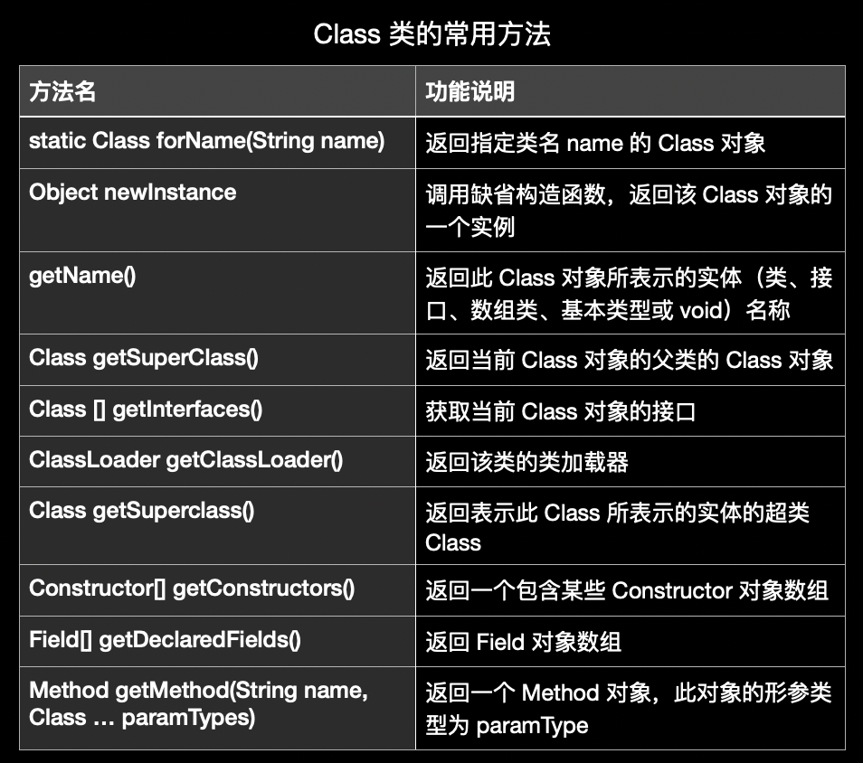

```java
import org.junit.Test;

import java.lang.reflect.Constructor;
import java.lang.reflect.Field;
import java.lang.reflect.Method;

public class ReflectionTest {
    /**
     * 获取Class实例的4种方式
     */
    @Test
    public void test2() throws ClassNotFoundException {
        // 方式一 => .class
        Class c1 = Person.class;
        System.out.println(c1);

        // 方式二 => 通过运行时类的对象,调用getClass()
        Person p1 = new Person();
        Class c2 = p1.getClass();
        System.out.println(c2);

        // 方式三 => 调用Class的静态方法forName(String classPath)
        Class c3 = Class.forName("com.....reflection.Person");
        System.out.println(c3);

        System.out.println(c1 == c2);
        System.out.println(c1 == c3);

        // 方式四 => 使用类的加载器 ClassLoader (了解)
        ClassLoader classLoader = ReflectionTest.class.getClassLoader();
        Class c4 = classLoader.loadClass("com.....reflection.Person");
        System.out.println(c4);

        System.out.println(c1 == c4);
    }
}
```

Class 除对应的运行时类外，存在其他结构也可作为 Class 实例。不论外部类或是内部类、接口、数组、枚举、注解或者基本数据类型，甚至 void 也算是 Class 实例。

```java
import org.junit.Test;

import java.lang.annotation.ElementType;
import java.lang.reflect.Constructor;
import java.lang.reflect.Field;
import java.lang.reflect.Method;

public class ReflectionTest {
    /**
     * Class实例
     */
    @Test
    public void test4() {
        Class s1 = Object.class;
        Class s2 = Comparable.class;
        Class s3 = String[].class;
        Class s4 = int[][].class;
        Class s5 = ElementType.class;
        Class s6 = Override.class;
        Class s7 = int.class;
        Class s8 = void.class;
        Class s9 = Class.class;

        int[] a = new int[10];
        int[] b = new int[100];
        Class s10 = a.getClass();
        Class s11 = b.getClass();
        // 只要数组的元素类型与维度一样就是同一个Class
        System.out.println(s10 == s11);
    }
}
```

#### 类的加载与 ClassLoader

当程序主动使用某个类时，该类还未被加载到内存中，则系统会通过三个步骤来对该类进行初始化。首先进行的是<u>类的加载(Load)</u>，将类的 class 文件读入内存，并为之创建一个 java.lang.Class 对象，此过程由类加载器完成。随后进行<u>类的链接(Link)</u>，将类的二进制数据合并到 JRE 中。最后是<u>类的初始化(Initialize)</u>，即 JVM 负责对类进行初始化。

ClassLoader 就是将类 class 文件字节码内容加载到内存的存在。ClassLoader 又分为四类。引导类加载器，是 JVM 自带的类加载器，负责 Java 平台核心库，常见于 String，无法直接读取。扩展类加载器负责 jre/lib/ext 目录下的 jar 包或 -D java.ext.dirs 指定目录下的 jar 包装入工作库。系统类加载器负责 java -classpath 或 -D java.class.path 所指的目录下的类与 jar 包装入工作，是最常用的加载器（包括自定义的类）。最后还有自定义类加载器。

```java
import org.junit.Test;

/**
 * 类的加载器
 */
public class ClassLoaderTest {

    @Test
    public void test1(){
        // 对于自定义类 => 使用系统类加载器进行加载
        ClassLoader classLoader = ClassLoaderTest.class.getClassLoader();
        System.out.println(classLoader);
        // 调用系统类加载器的getParent() => 获取扩展类加载器
        ClassLoader classLoader1 = classLoader.getParent();
        System.out.println(classLoader1);
        // 调用扩展类加载器的getParent() => 无法获取引导类加载器
        ClassLoader classLoader2 = classLoader1.getParent();
        System.out.println(classLoader2);
        // 引导类加载器主要负责加载java的核心类库
        ClassLoader classLoader3 = String.class.getClassLoader();
        System.out.println(classLoader3);
    }
}
```

```java
import org.junit.Test;

import java.io.FileInputStream;
import java.io.InputStream;
import java.util.Properties;

/**
 * 类的加载器
 */
public class ClassLoaderTest {
    // 使用 io 和 ClassLoader 加载的区别
    @Test
    public void test2() throws Exception {
        Properties pros = new Properties();
        // 此时的文件默认在当前的module下
        // 读取配置文件的方式一 => IO
//        FileInputStream fis = new FileInputStream("jdbcio.properties");
//        pros.load(fis);

        // 读取配置文件的方式二 => ClassLoader
        // 配置文件默认识别为：当前module的src下
        ClassLoader classLoader = ClassLoaderTest.class.getClassLoader();
        InputStream is = classLoader.getResourceAsStream("jdbc.properties");
        pros.load(is);

        String user = pros.getProperty("user");
        String age = pros.getProperty("age");
        System.out.println("user = " + user + ",age = " + age);
    }
}
```

#### 通过反射创建运行时类的对象

```java
import org.junit.Test;

/**
 * 通过反射创建对应的运行时类的对象
 */
public class NewInstanceTest {
    @Test
    public void test() throws Exception {
        Class<Person> clazz = Person.class;
        /**
         * newInstance() => 创建对应的运行时类的对象,内部调用了运行时类的空参的构造器
         *
         * 要想此方法正常的创建运行时类的对象要求 => 1.运行时类必须提供空参的构造器 2.空参的构造器的访问权限足够,通常设置为public
         *
         * 在javabean中要求提供一个public的空参构造器 => 1.便于通过反射创建运行时类的对象 2.便于子类继承此运行时类时,默认调用super()时保证父类有此构造器
         */
        Person obj = clazz.newInstance(); // 对应Person类的对象
        System.out.println(obj);
    }
}
```

```java
import org.junit.Test;

import java.util.Random;

/**
 * 通过反射创建对应的运行时类的对象 => 动态性
 */
public class NewInstanceTest {
    @Test
    public void test2(){
        for(int i = 0;i < 100;i++){
            int num = new Random().nextInt(3); // 0,1,2
            String classPath = "";
            switch(num){
                case 0:
                    classPath = "java.util.Date";
                    break;
                case 1:
                    classPath = "java.lang.Object";
                    break;
                case 2:
                    classPath = "com.....reflection.Person";
                    break;
                default:break;
            }
            try {
                Object obj = getInstance(classPath);
                System.out.println(obj);
            } catch (Exception e) {
                e.printStackTrace();
            }
        }
    }

    /**
     * @param classPath
     * @return
     * @throws Exception
     */
    public Object getInstance(String classPath) throws Exception {
        Class clazz =  Class.forName(classPath);
        return clazz.newInstance();
    }
}
```

#### 获取运行时类的完整结构

